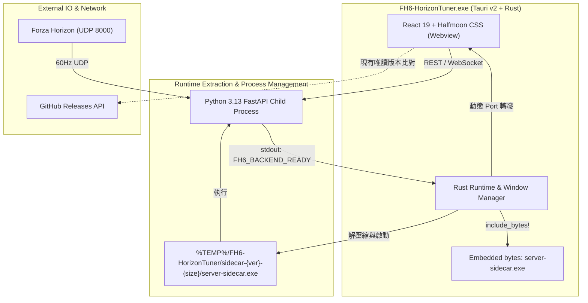
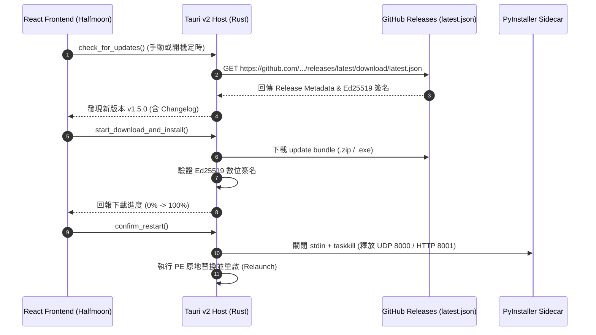

# FH6-HorizonTuner OTA (Over-The-Air) 自動更新機制技術研究與架構評估報告

---

## 1. 執行摘要 (Executive Summary)

本報告針對 **FH6-HorizonTuner**（基於 Tauri v2 + Rust Host + 內嵌 Python 3.13 FastAPI PyInstaller Sidecar + React 19 前端）之現有軟體架構，深度評估導入 **OTA (Over-The-Air Update) 自動更新機制** 的可行性、技術挑戰、安全性設計與實作選項。

本專案具備「單一獨立可執行檔 (Standalone Portable Single Exe)」、「內嵌二進位 Sidecar (Embedded Binary Sidecar)」、「60Hz 高頻 UDP 遙測通訊」等特殊架構約束。本報告提出 **三大實作方案**，並提供架構圖、安全性分析、生命週期控管、發行流程改變與上線驗證建議。

---

## 2. 現況架構深度剖析 (Current Architecture Analysis)

### 2.1 關鍵元件與相依性
1. **主程式 (Tauri v2 Host)**：
   - 使用 Rust `include_bytes!` 將 `server-sidecar-x86_64-pc-windows-msvc.exe` 直接編譯封裝進 `FH6-HorizonTuner.exe`。
   - 啟動時解壓至 `%TEMP%\FH6-HorizonTuner\sidecar-<CARGO_PKG_VERSION>-<size>\` 並管理子行程生命週期。
2. **後端 (Python 3.13 Sidecar)**：
   - 負責 60Hz UDP 封包解構、車輛資料庫、MoTeC 匯出、WebSocket 廣播與 MCP 服務。
   - 透過標準輸入（stdin）關閉信號進行優雅關閉（Graceful Shutdown），並由 Rust 使用 `taskkill /PID /T /F` 保證子行程 worker 釋放。
3. **前端 (React 19 + Vite + Halfmoon CSS v2)**：
   - 純前端靜態 SPA，打包進 Tauri 資源。
   - 目前 `Navigation.tsx` 的 `GitInfoBadge` 僅做唯讀的 GitHub Release 比較，無下載與覆蓋功能。
4. **構建與發行 (Build & Distribution)**：
   - `build_all.bat` 與 GitHub Actions CI 產生單一 Portable 檔 `dist\FH6-HorizonTuner.exe`。
   - 支援 `--no-bundle` 便攜版與 NSIS 安裝版。

---

## 3. OTA 機制核心挑戰與邊界限制 (Technical Challenges & Boundaries)

### 3.1 Windows File Lock（執行檔鎖定限制）
- **現象**：Windows NT 核心會對正在執行的 PE 可執行檔上鎖（Exclusive File Handle），不允許直接對原檔進行 `write` 或 `delete`。
- **解法**：
  - **PE 重命名替換 (Rename-and-Replace Pattern)**：Windows 允許對正在執行的檔案進行 `MoveFile` / `Rename`。因此可將 `FH6-HorizonTuner.exe` 暫時更名為 `FH6-HorizonTuner.old`，將新版寫入原檔名位置，下次啟動時清理 `.old`。
  - **輔助更新進程 (Updater Helper Process)**：在主程式退出前啟動輕量 Updater Process（如 PowerShell 批次或微型 Rust binary），主程式完全結束釋放鎖後執行覆蓋並重啟。
  - **Tauri v2 原生 Updater 處理**：Tauri 2 的 `tauri-plugin-updater` 在 Windows 上已內建處理 Portable EXE 與 NSIS 的替換機制。

### 3.2 Sidecar 行程生命週期與連接埠殘留 (Port & Process Cleanup)
- **風險**：若更新觸發重新啟動（Restart），但 Python 後端子行程或 PyInstaller worker 未被徹底銷毀，會導致：
  1. UDP Port `8000` 殘留佔用，新版無法綁定 Socket。
  2. HTTP Port `8001` 衝突，觸發隨機分配高位 port。
- **規範對策**：
  - 必須在 OTA 執行替換與 `app.restart()` 前，強制呼叫 `stop_backend_process(app_handle)`。
  - 確保標準輸入關閉（Graceful Exit）與 `taskkill /PID /T /F` 完成，待 socket 完全關閉後才執行重啟。

### 3.3 契約一致性保證 (Contract & Schema Consistency)
- **前端 vs 後端版本漂移 (Version Drift)**：
  - 若僅更新前端（Webview 熱更新），若新前端依賴了新的後端 API 端點或 WebSocket 資料結構，而後端仍為舊版，將導致執行期崩潰。
  - **原則**：**全量二進位更新 (Full Binary OTA)** 是最具備原子性（Atomic）的方案，保證 Rust Host、Python Sidecar 與 Frontend 同步升級。

### 3.4 安全性與供應鏈防護 (Security Architecture)
- **非對稱數位簽章 (Ed25519 / Minisign)**：
  - 所有發行產物（Release Assets）必須在 GitHub Actions CI 端使用 Ed25519 私鑰進行簽署。
  - 客戶端內嵌 Ed25519 公鑰，更新下載後必須先驗證簽章與 SHA-256，簽章不符立即拋棄，防止中間人篡改或惡意伺服器下發惡意二進位。
- **防降級攻擊 (Anti-Rollback / Downgrade Protection)**：
  - 嚴格校驗 SemVer 版本號，若遠端版本 $\le$ 本地版本，拒絕執行更新流程。
- **GitHub API Rate Limit 防禦**：
  - 避免前端頻繁調用 `api.github.com/repos/...`（未認證每小時 60 次）。
  - 改用靜態託管的 `latest.json` Manifest（透過 GitHub Releases Asset 或 CDN 託管），完全繞過 API 頻率限制。

---

## 4. 三大 OTA 實作方案評估與對比 (Comparison Matrix)

| 評估維度 | 方案 A：Tauri v2 官方 Updater 插件 (推薦) | 方案 B：In-App 自研更新器 (GitHub REST + Helper) | 方案 C：雙軌 OTA (全量更新 + 資料/HUD 熱更新) |
| :--- | :--- | :--- | :--- |
| **架構整合度** | ⭐️⭐️⭐️⭐️⭐️ (原生支援 Tauri 2 生態) | ⭐️⭐️⭐️ (需自建檔案置換與重啟邏輯) | ⭐️⭐️⭐️⭐️ (雙層機制，彈性最高) |
| **安全性保障** | ⭐️⭐️⭐️⭐️⭐️ (內建 Ed25519 簽章驗證) | ⭐️⭐️⭐️ (需自寫 SHA-256 / GPG 驗證) | ⭐️⭐️⭐️⭐️⭐️ (Ed25519 + Asset 哈希校驗) |
| **維護成本** | ⭐️⭐️⭐️⭐️⭐️ (官方持續維護，極少客製碼) | ⭐️⭐️ (需長期維護 Windows 腳本與權限問題) | ⭐️⭐️⭐️ (需維護兩套更新管道與相容協議) |
| **更新顆粒度** | 全量二進位 (Single Portable Exe / NSIS) | 全量二進位 (Single Portable Exe) | 雙軌：二進位全量 + HUD/資料包增量 |
| **網路流量** | 每次約 30~50 MB | 每次約 30~50 MB | 小更新 < 1 MB；大版本 30~50 MB |
| **使用者體驗** | 背景下載、即時通知、一鍵重啟套用 | 下載進度條、彈窗重啟 | 最平滑 (小更新免重啟，大更新一鍵重啟) |
| **實作工期預估** | 1~2 週 (標準化 CI/CD + 前端 UI) | 2~3 週 (包含各類 Windows 邊界狀況測試) | 3~4 週 (包含動態資產加載器重構) |

---

## 5. 方案深入解析與架構設計

### 5.1 方案 A (推薦首選)：Tauri v2 官方 Updater (`tauri-plugin-updater`)

#### 架構流程

#### 關鍵技術特點
1. **官方插件標準化**：
   - Rust 依賴 `tauri-plugin-updater = "2"`。
   - 前端依賴 `@tauri-apps/plugin-updater` 與 `@tauri-apps/plugin-process`。
2. **端到端 Ed25519 簽名**：
   - CI Pipeline 產生密鑰對，私鑰存放在 GitHub Secrets `TAURI_SIGNING_PRIVATE_KEY`。
   - 公鑰寫入 `tauri.conf.json` 的 `plugins.updater.pubkey`。
3. **靜態 Manifest (`latest.json`)**：
   - 每次 Release 自動生成包含版本號、平台產物 URL、SHA-256 與 Signature 的 JSON 檔，避免 GitHub REST API Rate Limit。

---

### 5.2 方案 B：In-App 自研更新器 (GitHub REST API + Custom Helper)

#### 架構流程
- 前端透過標準 fetch 或後端 FastAPI 請求 GitHub Releases API 比較 Tag。
- 點擊更新後，Rust 下載資產到 `%TEMP%\FH6-HorizonTuner\downloads\FH6-HorizonTuner-new.exe`。
- 驗證下載檔案之 SHA-256 哈希值。
- 啟動內建的一行 PowerShell Helper 腳本（例如等待原 PID 結束後執行 `Move-Item -Force` 並 `Start-Process`）。
- 主程式呼叫 `stop_backend_process` 並退出。

---

### 5.3 方案 C：雙軌 OTA (全量二進位 + HUD/車輛資料庫增量更新)

#### 架構流程
- **軌道 1 (Core Binary OTA)**：採用方案 A 處理 EXE、Rust、Sidecar、核心通訊協定升級。
- **軌道 2 (Data/Asset Hot OTA)**：
  - 將 `hud_overlay/`、`lang/`、`car_database.json` 抽離為動態資產。
  - 應用程式啟動時檢查遠端 `assets-manifest.json`，若有新的車輛參數或 HUD 儀表樣式，直接背景同步下載到 `%APPDATA%\FH6-HorizonTuner\assets\`。
  - 前端與後端優先載入 `%APPDATA%` 中的資產，實現零重啟微更新。

---

## 6. 未來發布 Release 流程轉變與確保正確推送之驗證機制 (Release Evolution & Validation Gate)

導入 OTA 後，發行流程已升級為「**網頁端手動建立 Release -> 全自動 CI 編譯、Ed25519 簽署與自動補齊 Release Assets**」：

### 6.1 發布流程之轉變
1. **版本號嚴格聯動**：必須同步更新 `Cargo.toml`、`tauri.conf.json`、`package.json` 與 `SECURITY.md`，保持版本號唯一真實來源。
2. **GitHub 網頁端手動發布為唯一觸發途徑 (`on: release`)**：
   - 移除過往依賴 `git tag` 命名的多重觸發方式，統一以 GitHub 倉庫網頁「Draft a new release」作為唯一觸發入口。
   - 維護者填寫版本 Tag（如 `v1.5.0`）與更新說明後，直接點擊「Publish release」，不需手動上傳任何二進位檔案。
3. **CI/CD 自動打包與補齊資產**：`.github/workflows/release.yml` 自動被喚醒，在 Windows 環境下編譯 Python Sidecar、打包 Tauri Host、進行 Ed25519 數位簽章，並全自動將 `FH6-HorizonTuner.exe`、`FH6-HorizonTuner.exe.sig`、`FH6-HorizonTuner-*.zip` 與 `latest.json` 附加至該 Release。

### 6.2 確保正確推送更新的發布後 3 步驗證關卡 (Post-Release Verification Gate)
1. **Asset 完整性檢驗**：確認 Release 頁面已被 Actions 自動附加 4 個核心資產（EXE、.sig、Portable ZIP 與 `latest.json`）。
2. **端點連通性測試**：檢查 `curl https://github.com/eddie772tw/FH6-HorizonTuner/releases/latest/download/latest.json` 回傳 HTTP 200 與有效簽名。
3. **舊版客戶端實機升級測試 (Smoke Test)**：使用前一版本客戶端開啟軟體，確認能接收更新彈窗、順利下載、簽名校驗通過並安全重啟。

---

## 7. 結論與演進路徑建議 (Recommendation & Roadmap)

**建議採用「兩階段演進策略」：**

- **第一階段（MVP 首選）：落地方案 A (Tauri v2 官方 Updater 全量 OTA)**
  - 優先保證 Host + Sidecar + Frontend 的原子一致性與 Ed25519 安全簽章。
  - 在「設定 (Settings)」頁面提供優雅的 Glassmorphism 更新卡片與啟動背景檢查。
  - 在 GitHub Actions CI 自動化產生簽名與 `latest.json`。
- **第二階段（未來擴充）：演進至方案 C (雙軌 Asset OTA)**
  - 當車輛資料庫或社群 HUD 擴充量增大時，建立動態資產加載器，提供即時 HUD 樣式熱更新。
