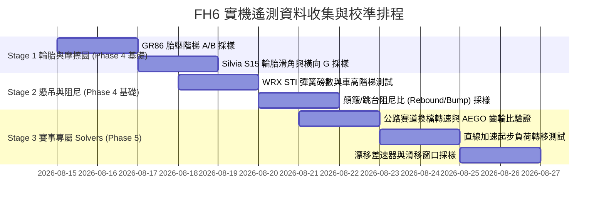

# FH6 實機測試工作表與車輛矩陣規劃 (In-Game Test Schedule & Matrix)

本文件制定 Phase 4（輪胎/懸吊共用物理模型）與 Phase 5（專屬賽事 Solvers）所需收集的實機測試車輛矩陣、路線規劃與分階段收集工作表。

---

## 1. 測試車輛梯隊 (Vehicle Matrix)

為涵蓋不同驅動形式、軸重分佈、重心高度與動力特性，選定以下代表性車款作為測試基準組：

| 梯隊編號 | 驅動形式 | 建議代表車款 | 整備質量 / 配重 | 測試核心目標 |
|---|---|---|---|---|
| **Group A (公路/賽道 FR)** | RWD (前置後驅) | Toyota GR86 / Nissan Silvia S15 / Mazda RX-7 | ~1,250 kg (53:47) | 輪胎摩擦圓 (Friction Ellipse)、橫向 G 值極限、轉向不足/過度轉移 |
| **Group B (拉力/全地形 AWD)** | AWD (全時四驅) | Subaru WRX STI / Mitsubishi Lancer Evo IX | ~1,500 kg (58:42) | 砂石路面滑角、前後差速器鎖定率分配、跳台觸底率 (Bottoming) |
| **Group C (前驅鋼砲 FWD)** | FWD (前置前驅) | Honda Civic Type R (EK9 / FK8) | ~1,200 kg (62:38) | 前輪縱橫向複合滑移 (Combined Slip)、前防傾桿抑制側傾效果 |
| **Group D (直線加速 Drag)** | RWD / AWD 大馬力 | Ford Mustang GT / Dodge Viper / Porsche 911 Turbo | ~1,600 kg (54:46) | 起步軸荷轉移 ($\Delta F_z$)、1/4 英里齒輪比銜接、換檔轉速落差 |
| **Group E (漂移專用 Drift)** | RWD 大馬力後驅 | Nissan Silvia S14/S15 (Drift Spec) / BMW M3 E92 | ~1,250 kg (50:50) | 車身漂移角 (Sideslip) vs 輪胎滑角、大轉向角下穩定度、差速器 100/100 響應 |

---

## 2. 測試路線與賽道推薦 (Track & Surface Matrix)

| 測試項目 | 建議賽道路線 / 地點 | 測試路面 | 採樣重點指標 |
|---|---|---|---|
| **輪胎極限與橫向 G 值** | 嘉年華環道 (Circuit) / 寬闊平整環形道 | 乾柏油 (Dry Tarmac) | 最大側向 G、四輪滑角 (Slip Angle)、內中外胎溫分佈 |
| **懸吊壓縮與臨界阻尼** | 顛簸街道賽道 / 連續減速坡 / 快速 S 彎 | 柏油顛簸 (Bumpy Tarmac) | 懸吊行程比率 (0~1.0)、煞車點頭 (Pitch)、轉向側傾 (Roll) |
| **拉力砂石與跳台落地** | 越野拉力賽道 (Gravel Trail) / 包含危險標誌跳台 | 砂石路 (Gravel) / 越野泥地 | 觸底警示率 (Bottoming Count)、落地瞬間衝擊垂直 G、滑移比 |
| **直線加速齒輪比** | 嘉年華直線加速跑道 (Drag Strip 400m / 800m) | 乾柏油跑道 (Strip) | 0-100 km/h 時間、60-ft 時間、終點轉速/極速錨點 |
| **漂移角度與連續轉移** | 山路漂移區間 (Touge / Drift Zone) | 柏油山路 | 漂移維持時間 (Drift Time)、轉向角 (Steer Angle)、車身橫擺率 (Yaw Rate) |

---

## 3. 分階段資料收集工作排程 (Phased Collection Schedule)

### 詳細工作項目與執行步驟

### 【第 1 階段：輪胎模型與摩擦圓校準】（支撐 Phase 4）
- [ ] **Task 1.1 - 胎壓階梯測試**：
  - 車款：Toyota GR86
  - 胎壓設定：28.0 PSI → 30.0 PSI → 32.0 PSI → 34.0 PSI
  - 驗證重點：找出達到最佳抓地力時的熱胎壓目標值（驗證 32.0 PSI 假說）。
- [ ] **Task 1.2 - 輪胎外傾角 (Camber) 溫差測試**：
  - 前輪傾角：-1.0° → -1.5° → -2.0° → -2.5°
  - 驗證重點：彎中內側胎溫與外側胎溫之溫差梯度（目標內側比外側高約 3~5°C）。

### 【第 2 階段：底盤懸吊與臨界阻尼校準】（支撐 Phase 4）
- [ ] **Task 2.1 - 簧上質量與固有頻率 (Natural Frequency) 驗證**：
  - 車款：Subaru WRX STI (AWD) 與 Toyota GR86 (RWD)
  - 驗證重點：公路 2.2~2.4 Hz vs 拉力 1.6~1.7 Hz 下懸吊壓縮行程的振盪衰減次數。
- [ ] **Task 2.2 - 阻尼比 (Rebound / Bump Damping Ratio) 測試**：
  - 阻尼比率：回彈 65% : 壓縮 35% vs 50% : 50%
  - 驗證重點：行經路緣石與顛簸路面時的車身平穩性與抓地力損失時間。

### 【第 3 階段：賽事專屬 Solver 與閉環診斷校準】（支撐 Phase 5 & Phase 6）
- [ ] **Task 3.1 - AEGO 齒輪比幾何等比與扭力帶驗證**：
  - 車款：Ford Mustang GT (大扭力) vs EK9 Civic Type R (高轉速 NA)
  - 驗證重點：升檔後轉速精準落在最大馬力點與最大扭力點區間。
- [ ] **Task 3.2 - 直線加速 (Drag) 起步軸荷轉移驗證**：
  - 驗證重點：不同懸吊硬度與差速器鎖定下，起步瞬間後輪縱向滑移比 (Slip Ratio) 與 60-ft 秒數。
- [ ] **Task 3.3 - 漂移 (Drift) 滑移窗口與差速器鎖定率測試**：
  - 加速側鎖定率：80% vs 90% vs 100%
  - 驗證重點：大角度滑移時的車身姿態可控度與手煞車切入瞬間的反應。
