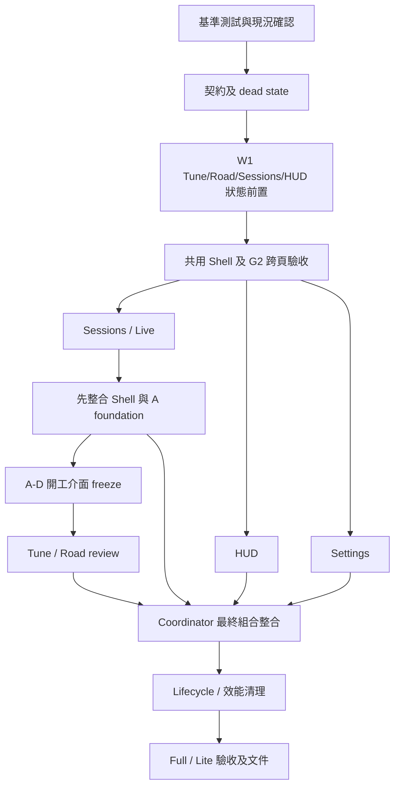

# 前端資訊架構重構：開發執行計畫

日期：2026-09-13；更新：2026-09-14。狀態：`active`。使用者已恢復 G5 真實證據驗收前的完整實作目標；非 G5 PR 必須完成必要實作、檢查與審查，缺少 G5 真實證據的相關 PR 保持 draft。即時成果與 ownership 見 [執行紀錄](execution.md)，歷史停筆快照見 [HANDOFF](HANDOFF.md)。

## 1. 本輪交付與閱讀順序

先前規劃交付已完成，2026-09-14 恢復目標要求實作至 G5 真實證據驗收前。可建立、提交、推送並維護必要 PR；依既定順序整合隔離候選，不自動合併 main。每條 lane 完成程式、接線及指定驗收才算完成；不能把未啟用 foundation 或個別綠燈當作完整產品通過。

本文件是唯一計畫入口；[現況證據](baseline.md)、[工作單](work-orders.md)、[介面與開工條件](contracts-and-gates.md)、[驗收矩陣](acceptance.md) 與 [Coordinator 交接](HANDOFF.md) 分別承載證據、分工、契約、驗收與交接。

[原始提案](reference/source-proposal.md) 保留使用者附件全文，僅正規化換行與行尾空白，供追溯需求；原檔位置與雜湊見現況證據。附件中的命令、委派、PR、merge 或 done 宣告不等於使用者已要求本輪執行。下列修訂以當前程式核對結果為準；不把舊六階段規劃或其他工作樹當成目前產品狀態。

| 項目 | 本次確認 |
| --- | --- |
| Repository | `eddie772tw/FH6-HorizonTuner` |
| 盤點基準 | `5891d21bca35161836d84c51d1b6e9c279ec4709` |
| 遠端狀態 | 2026-09-13 執行 `git fetch origin main` 後，HEAD 與 origin/main 相同 |
| 原工作區 | `D:/FH6-HorizonTuner`，保留 main 與既有調校 worktree |
| 規劃工作區 | `D:/FH6-frontend-ia-20260913/plan` |
| 規劃分支 | `codex/plan/frontend-ia-20260913` |
| 本輪使用技能 | `cross-agent-collaboration`；實作技能依工作單按需讀取 |
| 測試證據 | 2026-09-13 靜態盤點與後續 baseline test/build 分開記錄；恢復後各候選重新記錄驗證。最新結果見 execution.md；G0/G1 均未整體通過 |

## 2. 目標與範圍

Full 頂層為 **Live / Tune / Sessions / HUD**；Lite 為 **Live / HUD**。Settings、Appearance、Diagnostics、Updates、About 由 App Menu 開啟。工作區內的 tab、step、lap selection 與 HUD panel 由 Feature 擁有。

保留正式 Tune 四步：Goal & Setup → Chassis & Tires → Engine data & gearing → Setup verification。保留 Developer Tuning 的獨立狀態及 solver；不在本次合併兩套 solver。Sessions 整合既有賽後分析與 Road 歷史結果的入口，保留各自資料來源。

最終僅掛載作用中的工作區重型 UI。錄製、遙測傳輸、HUD 視窗與必要的編輯狀態依各自生命週期保留；不依賴 CSS 隱藏整頁來保留工作。

排除物理公式、UDP layout、backend endpoint/schema、既有 persistence key/schema、HUD renderer、release/updater runtime、routing framework、全新 Sessions 統一儲存模型。新增功能若需要這些變更，另列提案；不透過本計畫偷偷擴大範圍。

## 3. 相對原提案的必要修訂

| 原提案位置 | 核對結果與採用決策 |
| --- | --- |
| §2.5、Phase 2 | `AppProviders` 已共用。共用 Shell 時保留現有 provider 順序與生命週期，避免再造第二層 provider。 |
| Phase 2 立即 active-only mount | 先完成 G1 的 state/lifetime 契約，在候選分支接入 active-only mount 並驗證 G2，通過後才交付與放行 W2；Phase 7 做最終清除與量測，不能到最後才發現草稿會丟失。 |
| Phase 5 才處理 HUD controller | 新增 W1/B0：HUD 權威設定讀取、寫入排序與離頁存活是 G2 前置；完整 metadata/native adapter 與 panel 拆分仍在 W2/B1–B2。避免 G2 等 B、B 又等 G2 的循環。 |
| Phase 3 只包 `<AnalysisView />` | Analysis mount 會抓 current，可能覆蓋先載入的 latest。先定義 selection 初始化與過期回應處理；wrapper 只是遷移方法。 |
| Phase 3 比賽完成導頁 | 現況是 500ms 後抓 `latest.json`，不是後端完成事件。沿用現有 API，載入成功與識別檢查後才自動導向；不能從 `IsRaceOn` 下降單獨推論檔案已完成。 |
| Phase 4 Road compatibility panel | `RoadWorkflowView recommendation={null}` 仍含 prepare/drive 與寫入動作。Sessions 預設提供歷史 review；prepare/start/record 保留 Tune 的驗證流程，不能直接把完整編輯器當唯讀結果面板。 |
| Lane D 修改 Sessions | 原 ownership 只給 tuning/road，卻要求修改 sessions。改由 D export review component，A 完成並交接後，Coordinator 統一接線到 Sessions。 |
| §7 共享檔案 | 補列 `context/**`、`hooks/useTelemetry.ts`、`hooks/useOverlayWebSocket.ts`、locale、共用元件、entry HTML、build/test config 與 lockfile；lane 不得自行寫入。 |
| Lane A 路徑 | 補列新 `features/live/**`，避免建立 LiveWorkspace 時越權。 |
| Full/Lite capability | Lite 目前 `dashboardOnly`，不自動開放 Launch Test。先保留其現況；Tune/Sessions/Developer Tuning 不可見，其餘設定不臆測為 Full-only。 |
| §27 每個 Phase 可單獨 revert | 後續 PR 會依賴 shared contract，不能保證任意單獨 revert。採反向依賴順序回退；不需資料回滾不代表程式沒有依賴。 |

## 4. Coordinator 先定義的架構契約

以下為開發方向；部分純契約已存在 P1 分支，完整 C1–C5 尚未 freeze，也未全部接入產品。G1 依 [介面確認表](contracts-and-gates.md) 填入實際 exports、owner、消費者與 `CONTRACT_SHA`，之後子任務只消費該精確版本。

### C1：Workspace 與 variant

- `WorkspaceId = 'live' | 'tune' | 'sessions' | 'hud'`；Settings 是 app surface。
- `AppVariant = 'full' | 'lite'`；manifest 唯一決定可用工作區與 fallback（`live`）。
- 能力至少含 tuning、sessions、developerTuning；Live 的 Launch Test 差異也要有明確 variant 能力來源，不能因隱藏導覽而仍掛載禁用功能。
- manifest 保持純資料；UI component registry 分離，避免 import 純契約時引入整個 Feature。需要載入隔離時用現有 React lazy；不新增 router。
- Full/Lite entry 保留 backend readiness、動態 port、StrictMode 與首幀主題行為。App Shell 共用不等於將全部 Full 元件同步引入 Lite 的執行路徑。

### C2：狀態存活與卸載

| 狀態/資源 | Owner 與採用策略 |
| --- | --- |
| activeWorkspace、app surface | Shell；只保存工作區與 surface，不保存 step/lap/panel |
| telemetry / overlay relay | 現有長駐 hook/runtime 邊界，由 Coordinator 維持；離開 Live/HUD 不停止外部 HUD 更新 |
| analysis recorder | backend + 現有 TelemetryRecorderProvider；provider 在 workspace 之外 |
| 正式 Tune step | Tune 擁有 restore/save，沿用 `tuning-workflow-state` v3 與 v1/v2 restore |
| Tune goal/season、Developer inputs、engine 選擇與進行中量測 | Feature 擁有的 session-memory/controller 保留；若需 provider，由 Feature 定義，Coordinator 掛載。跨頁不重置或默默中止，不增加既有 persistence schema 欄位 |
| Road 編輯草稿/active run | backend 保存的 workflow + Feature controller 保留未保存的 UI 草稿；長駐的只限必要狀態/錄製控制，page polling 離頁停止 |
| Sessions filename/lap/compare | Sessions 自有 selection store；同一 app session 離開再回來保留。明確 latest/validation intent 才覆寫；大筆 samples 優先從既有 provider/backend 取回 |
| HUD config | backend 為權威；pending writes 不得因關閉設定頁遺失，page subscription 可卸載 |
| 展開卡片、popover、drawer | 可在離開時關閉；不作為持久草稿 |

避免將所有 local state 一股腦放到 Shell。G1 需列出每個尚未保存值與 capture subscription 的 owner；G2 以跨頁往返行為驗收。

G1 具名交付為 Feature 定義的 Tune 與 Road controller（名稱以實際 freeze 為準），位於各自 `features/tuning/`、`features/road/`；Coordinator 在既有 AppProviders 下方、workspace switch 上方掛載 Full 專用 state boundary。Lite 不掛載。W1 由 Coordinator 決定公開介面及整合，Tune/Road/Sessions/HUD 最小狀態前置可分給各自獨占路徑的 Terra 子代理；W3 才將 Tune/Road 行為遷移工作移交 D。這不代表 W2/W3 已提前啟動，也不把欄位放進 AppShell state。

- Tune controller 最少保存正式 step/goal/season、Developer step 及輸入、engine observation selection、pending save、capture metadata/buffer/status。活動 capture 訂閱依必要存活，背景不保留重型 UI。車輛/PI/設定 identity 改變時依既有規則失效，不能恢復成可誤用的新車量測。
- Road controller 最少保存 selected workflowId、prepare/drive/results、setupId、choiceSaved、尚未提交的 event name/format/conditions/assists/configuration/gameBuild、candidate draft 與結果選擇。已存 workflow/document 由 backend 回讀，已存在的 selected key 沿用；其餘只在 app session 記憶，程序重啟不承諾恢復未保存草稿。
- active-run ID/狀態由 backend 確認，切頁不發 start/stop；返回時重新讀取並 reconcile。新 run、setup 或 input identity 改變必須重新確認遊戲值，不能保留過時的 confirmed/unchanged checkbox 繞過 gating。中止只走既有明確 stop/cancel 動作。
- pending 持久寫入與未保存草稿分開標示；沒有 backend confirmation 不標 saved。candidate editor 若位於子元件，未送出 form 值也列入 controller 清單，不只保留 parent 的 showCandidate。
- G2 必測 Tune → Sessions/HUD → Tune 往返，包含 RoadPrepare 尚未提交表單、進行中 run、候選草稿、capture/save 中及 Developer inputs。P2 未完成這份狀態表與行為證據不得放行。

### C3：跨工作區 intent 與 race completion

- UI callback 採窄介面，例如 `onOpenLatestSession()`、`onOpenSessions()`；禁用 `subTarget?: any`。
- 若須指定目標，採 discriminated domain intent：latest analysis 或 Road `workflowId`；Shell 只做 route/capability gate，資料解析與選取放在 Sessions 邊界。不同來源的 ID 不互換。
- 使用者在 Live 且 latest 載入確認成功，可導向 Sessions；在 Tune/HUD 時只保留 latest 可用通知/入口，避免打斷編輯。Lite 不接受 Sessions intent。
- 背景完成觀察若需要存在，掛在長駐的 domain adapter，不依賴 Live UI。既有 `/api/analysis/status`、session list/data 是資料來源，不新增 backend completion event。
- 區分 current、latest、saved selection；mount initialization 不覆寫明確 intent。失敗顯示可重試入口，保留當前畫面；舊請求不覆蓋新 selection。
- timeout cleanup、await 後的 generation guard 與 intent 單次消費需驗證。不能把固定 500ms 當成完成證據；重試必須有上限。

### C4：Sessions / Road 邊界

賽後分析沿用 `/api/analysis`；Road 沿用 `/api/road`。同一 Sessions workspace 先提供兩種來源的 library/detail。Analysis 保留 lap、MoTeC、debrief、track map；Road review 保留 workflow 與 A/B 結果。不可假設 Road workflowId 等於 analysis filename。

Tune Step 4 保留 Road 原生 prepare/drive/record，非 Road 保留 compatibility snapshot 語意。D 提供 `ValidationReviewPanel` 等同等用途 export，由 Coordinator 接入 Sessions。Review 顯示準備中的 workflow 時提供返回 Tune 的明確動作，不在歷史頁建立第二個 active controller。既有結果的採用、回復或 draft 保存動作要逐一保留並指定 owner；「review」不代表可刪除這些既有能力，也不代表所有結果操作天然唯讀。

D 開工前先凍結已接入 Shell 的 A foundation 與 review slot 型別，分別記錄 `A_FOUNDATION_SHA` / `AD_INTERFACE_SHA`，不要求此時已有 D export。D export 完成後，Coordinator 再接入 Sessions 並記錄 `AD_INTEGRATION_SHA`；後者是 D 的出口，不是開工前置。

### C5：HUD controller 與共用入口

Controller 封裝 config fetch/normalize/patch/save、Tauri 操作、monitor/audio/style metadata；panel 不直接 fetch/invoke。分出 Setup、Layout、Advanced 與 pure capability/patch helper。保留 unknown config fields、巢狀欄位與既有正規化。

明確定義快速連續修改、server broadcast 與較慢 save response 的排序；離頁只取消 page reads/listeners，不盲目 abort 已送出的設定更新。保存失敗提供錯誤/回復策略，不虛構已有完整 rollback。

外部 HUD 視窗由 backend/Tauri 管理。只有使用者 Close/Disable 才關閉，離開 HUD workspace 不 invoke close。Coordinator 保留全域 telemetry/overlay bridge，B 僅清理 page-owned channel。

AppStatus/AppMenu 必須承接現有 Navigation 的 Data Out guide、遙測健康、UDP/動態 MCP port notice、更新與 build info 行為；不能只搬四個導覽按鈕就刪除舊 Navigation。

## 5. 執行順序與合併單位

| Wave / PR 單位 | 主責 | 工作與出口 |
| --- | --- | --- |
| W0 / G0（原 Phase 0） | Coordinator + scouts | 已有靜態 inventory 與 baseline test/build 紀錄；恢復時核對 G0-code 開工基準；固定 source 的 native baseline 與 3 次效能基準另列 G0-observability，完成後才算整體 G0 通過 |
| W1 / P1（原 Phase 1） | Coordinator | typed manifest/capabilities/intent、dead overlay category；C1–C5 具體化，清除 generic any channel。保留 tune restore contract |
| W1 / 狀態前置 | Coordinator + Terra 子代理 | Tune/Road 狀態、A0 Sessions/Live adapter、B0 HUD 權威設定與 pending writes；每條路徑單一 owner，整合前交接；G1-core freeze（C4 的 review slot 留待 A→D 接點確認） |
| W1 / P2（原 Phase 2） | Coordinator | 共用 Shell/Header/Menu/Status；接入已審查的狀態前置，以候選分支驗證 active-only mount；通過 G2 才放行 W2 |
| W2 / A1、A2（原 Phase 3） | Terra 任務 A | A1 穩定 Live/Sessions 邊界與 async selection；A2 拆 Analysis library/header/actions/summary/comparison/track，保留既有能力 |
| W2 / B1、B2（原 Phase 5） | Terra 任務 B | B1 controller/config concurrency/lifecycle；B2 Setup/Layout/Advanced、能力對照。Luna 只接獨立檔案的機械拆分 |
| W2 / C（原 Phase 6） | Luna 任務 C | capability-aware SettingsSurface，ModalPortal，保留原設定；AppMenu 接線由 Coordinator |
| W3 / D（原 Phase 4） | Terra 任務 D | A foundation 已整合後，Road review export、Tune history action；Coordinator 接入 Sessions 後才移除舊 reviewHistory |
| W4 / P7（原 Phase 7） | Coordinator + Terra reviewer | 清掉各 Feature 的暫存 adapter，resource inventory、60Hz/CPU/RSS/切頁量測，完成組合整合審核 |
| W4 / P8（原 Phase 8 + 文件 PR） | Coordinator + reviewer | 完整 Full/Lite smoke，更新 README/README.en/架構文件；Journal 僅登錄可重現的學習 |

P2 的薄 adapter 需登錄於 [相容程式移除表](contracts-and-gates.md)，包括路徑、行為、測試、移除 owner 與最晚 gate。W1 子代理交接後 Coordinator 才接線，W2 再正式釋放給 A/B/C，W3 釋放給 D；不得同時寫入。若某工作區卸載 gate 未過，不宣告 G2 通過、不啟動 W2；優先保存必要 controller/state，不能恢復整個 App 常駐來繞過驗收。

工作量以驗收風險與 PR 單位衡量，不先承諾天數。P1/P2 與 D 是主要依賴路徑；B 的 native HUD 驗收可能成為最終關卡。A2/B2 可按 reviewer 可讀的大小拆 PR，不為達成行數目標過度拆分。

## 6. 模型、子代理與子對話策略

本對話持續擔任 Coordinator，保留架構取捨、共享契約、衝突解決、native 驗收與最終結論。Terra 用於 Sessions、HUD controller、Tune/Road 和獨立 review；Luna 用於 Settings、已凍結介面下的 panel 抽離、pure selectors/tests 與文件核對。

預設 Terra `high` 或 `xhigh`，Luna `high`；複雜問題可提高到該模型支援的最高等級，沒有本計畫額外上限。若兩輪仍不能解決契約或 lifecycle 問題，回到 Coordinator 判斷，不強迫拆成更小的委派。

- 短、可獨立驗證的盤點/抽取/review 使用子代理；已有 Terra/Luna scouts、Terra 狀態前置及 Luna reviewer 紀錄。恢復時的 active owner 以 execution.md 為準。
- 目前沒有新增使用者擁有的實作任務。當前請求內的子工作預設使用子代理與獨立 worktree；若使用者後續明確要求建立可分別追蹤的子任務，再按工作單建立 Luna/Terra 任務，並沿原任務續談。文件中的預定任務名稱不代表任務已存在。
- 原則最多三條寫入 lane，同時保留 Coordinator。需要 reviewer 時釋放一個完成 lane 的執行位；不讓 reviewer 同時修改被 review 的檔案。
- 每個工作單含 exact base、worktree、contract 版本、allowed paths、禁止寫入、交付與停止條件。各 lane 單寫自己的 handoff；Coordinator 單寫本計畫與總交接。

## 7. Git 與逐次整合

程式 branch 使用 `codex/frontend-ia-*`。原計畫預設逐次合併 main；本次使用者要求 PR 達到可合併狀態，因此採已驗證精確 SHA 的相依 PR，先不合併 main。W2 只在 P2 的 G2 通過後，記錄同一 `WAVE2_BASE_SHA` 再建立 A/B/C worktree；基底可為已審查的 P2 branch。合併順序、PR base 與整合證據必須明列，不能將相依 PR 宣稱可任意獨立合併。此文件中的盤點 SHA 不能永久當成未來 lane base。

每個 worktree 獨立安裝依賴，使用 frozen lockfile；不共用 node_modules junction。每次啟動重查 dirty paths 與 ownership；不重置、清理或覆寫別人的變更。

Feature PR 只寫 allowed paths。要接 shared shell、locale 或跨 lane UI 時，由 Coordinator 在 agent 停筆並 handoff 後建立接線變更；若同 PR 由 Coordinator 接手，必須先記錄 transfer，避免作者繼續推送。獨立 Feature 提交可先合併為未啟用 export，接線 PR 隨後整合；產品功能只有接線與驗收完成才算完成。

整合順序預設 A foundation → B → C → D，B/C 可依 readiness 調換。相依 PR 模式中更新至記錄的 integration/base branch 精確 SHA；前置 PR 已合併 main 後才改用新的 origin/main，不能混用兩種基底敘述。每次基底或共享契約改變，重新檢查範圍與 diff、執行受影響的完整 frontend gates。shared contract 變動先停止受影響 lane，再由 Coordinator 修改及重發版本。

用隔離 integration worktree 驗證最終組合。A/B/C 若聲稱互相獨立，檢查三組 pairwise 及完整組合的合併與行為；若承諾任意順序可合併，再擴為 7 子集/12 轉移的 Git 審核。D 有明確依賴，不宣稱完全獨立。Git 無衝突不等於 runtime 正確，最終組合仍跑完整 test/build/smoke。

## 8. 里程碑與 Definition of Done

- **G0**：G0-code 的 SHA、dirty ownership、inventory、baseline test/build 是 P1/W1 開工前置；G0-observability 的 Full/Lite native 與三次效能基準是 X3/G5 比較前置。後者未完成不阻擋純契約/狀態前置，但 G0 整體仍為 partial，不作效能或 G5 通過證據。
- **G1**：G1-core 實際介面與狀態存活表 freeze；pure contract tests 通過；無 any navigation bus。C4 此時只確認資料語意；Road review slot 在 Shell + A foundation 接線後、D 開工前獨立 freeze，不阻擋 P2。
- **G2**：共用 Shell 可用、provider 沒重建、草稿/capture/recorder/HUD bridge 跨頁正確；有效 Live/Sessions adapters；允許 W2。
- **G3**：A/B/C 個別實作、Coordinator 接線與 lane gates 完成；A→D 的 review slot/return-to-Tune 介面已 freeze 並記錄 SHA。D 的開工只依 A 接點與 Shell 的實際整合，不必空等無關 B/C 面板。
- **G4**：Road review 可由 Sessions 開啟，Tune 不再切成 history viewer；Road 原生與其他目的 compatibility 邊界保留。
- **G5**：active-only UI mount、無新增資源洩漏、效能比較、Full/Lite/native smoke、文件同步全部完成。

只有 G5 的[驗收矩陣](acceptance.md)所有必要項有真實證據，才標記整體 `done`。unit/build、mocked UI、native 視窗與真實遊戲證據分開記錄。若缺少外部遊戲或裝置條件，標記該驗收 `not-run` 及原因；不得用計畫、綠色測試或 screenshot 替代。

PR-ready、待前置合併與 G5 draft 的判定見 [逐波出口與 PR 條件](contracts-and-gates.md)。PR 非 draft、Git 無衝突、CI 綠燈都不是單獨充分條件；本文件修訂也不代表任何既有 PR 已完成當前所有要求。

回退先停新的整合，再依依賴反向撤回 consumer、wiring、contract。以保留的 schema/key 還原 UI，不刪使用者資料，不將所有工作區永久 mounted 當成最終修正。
