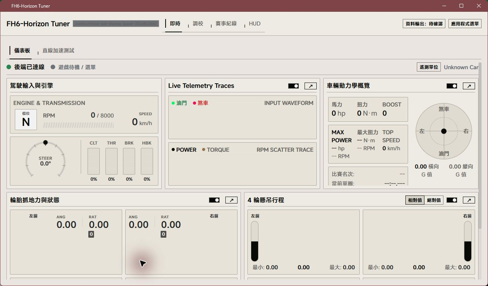

# Rhine Lab 本地驗收紀錄

日期：2026-10-06。基準：`35cdb26b`；實作位於 `codex/rhine-lab-theme`。最終交付經使用者確認收斂為純 2D，保留紙頁版面、字體、刻度、短暫動畫與共用對話框改善。

## 已完成的自動檢查

| 檢查 | 結果 |
| --- | --- |
| `pnpm -C frontend run test` | 189 files passed、1 skipped；1,698 tests passed、1 skipped |
| `pnpm -C frontend run build` | TypeScript 與 Vite 通過，含 Full／Lite／Companion 入口 |
| `pnpm install --frozen-lockfile --ignore-scripts` | 通過；不新增執行期相依 |
| `git diff --check` | 通過 |
| 主題契約 | 七 Core × 明暗模式的首幀／React 一致性，配色保留、預設三色模式轉換及 JSON schema 2 往返 |
| 共用對話框 | 事件未觸發的保護、只關閉一次、退出期間背景隔離、焦點還原、reduced motion／零 transition |
| 素材 | 匯入器鎖定來源提交；376 份原始字體分片逐一比對來源 SHA-256，匯入 manifest 的 382 個檔案雜湊再次通過 |
| 治理 | 13 個 canonical skill ID 與索引一致；修改的技能通過 validator；變更 Markdown 本地連結及 tracked path 大小寫檢查通過 |

已完整刪除實驗背景的場景程式、開關、localStorage 讀寫、三語文案、專用測試、GLB、Three.js 及其型別相依、專用 chunk、授權與操作文件。最終 source／manifest／lockfile 搜尋及 `dist` 清點沒有實驗背景殘留；資產匯入器只處理字體及署名，不再產生模型。

## 已完成的互動檢查

- Edge 154：七 Core 明暗切換、Rhine／Swiss 預覽隔離，資料見 [theme-matrix.json](assets/rhine-lab/theme-matrix.json)。
- 設定視窗：繁中／英／日測量未發現內容新增水平溢出；另在 transition 完成後複核 320、768、1024、1280×720、1920×1080 的邊界，見 [layout-settled.json](assets/rhine-lab/layout-settled.json)。前兩者保留抽屜，後三者置中並保留至少 24px 邊距。
- Escape：實際瀏覽器關閉後，`#root` 解除 inert，焦點回到「應用程式選單」。這項檢查找出原生 inert 會提早清除焦點的問題，已改為先保存觸發元素再隔離背景。
- 補驗修正：設定的共用 CSS 延後載入時會以同等優先序覆蓋 Rhine 的單欄規則；限定到設定對話框後，實際 computed grid 與明暗畫面均確認為單欄。附 [淺色設定](assets/rhine-lab/settings-light.jpg)及[暗色設定](assets/rhine-lab/settings-dark.jpg)。
- 狀態保留：在隔離後端以合成 UDP 錄製 26 個樣本，選取已儲存 Session 並捲至下方，再依序切換 Halfmoon／Swiss Editorial／Rhine；Session ID、26 筆資料與閱讀位置均保留。底部的 scrollTop 隨字體版面高度微調，沒有回到頁首，見 [session-theme-state.json](assets/rhine-lab/session-theme-state.json)。
- Windows WebView2 **154.0.4258.53**：現有 debug Tauri host 載入目前開發前端，確認 1280×720 內容區的 Rhine 淺色儀表；[原生畫面](assets/rhine-lab/webview-live-light.png)。不是 release EXE 驗收。
- Companion 的既有 `/assets/` HTTP 路由可回傳 Rhine WOFF2（HTTP 200、`font/woff2`）；未修改後端 API。Android 實機尚未驗收。
- 原專案 `D:/RhineLabUI` 未修改。字體協議、分包工具授權及來源署名分別保留。

新增的六個主選單紙頁面板均已透過 Edge 開啟、Escape 關閉並檢查背景 inert；沒有水平溢出。重新量測 transition 完成後的尺寸，設定寬 1040px、外觀 864px、診斷 928px、Companion 960px、MCP 800px、關於 608px（小數四捨五入），在 1422×800 內容區保留至少 24px 邊距，見 [menu-paper-dialogs.json](assets/rhine-lab/menu-paper-dialogs.json)。外觀／診斷保持掛載，共用關閉保護。附[外觀暗色畫面](assets/rhine-lab/appearance-dark.jpg)。寬度與關閉驗證仍需在窄畫面及 WebView2 複核。

五卡 Canvas 已以隔離後端 600 個合成封包驗證：RPM／方向、踏板、動力散點、胎況與懸吊皆收到資料；懸吊顯示 0.20 至 0.80 的合成變化範圍。套用 Rhine 三色後無需再發送封包即可重畫；附[淺色](assets/rhine-lab/canvas-light.jpg)與[暗色](assets/rhine-lab/canvas-dark.jpg)。五卡逐元素研究由使用者指定的 Sol 子代理完成，見[設計研究](rhine-telemetry-design.md)。

Sol 獨立核對找出停用／重啟輪胎圖表會重設 effect 區域樣本，造成 Canvas 與保留讀值矛盾。最新輪胎樣本及原始時間、RPM／alert、散點轉速上限已改存 ref；重新訂閱後從同一份資料重畫。回歸測試涵蓋收到 230°F／1.1 ratio／1.2 angle 後停止封包，關閉／開啟圖表並切換至 Celsius，仍顯示 110°C 與原抓地讀值。

Sol 已在 `1ead368749cd7ea31086c15af4d59df286e951b9` 重新執行原 P2 情境，另核對原始樣本時間、RPM 9000／上限 10000／alert、動力圖上限 10000 與既有歷史均保留。這是 React／jsdom 的資料生命週期複驗，不替代原生畫面驗收。

字體載入失敗：隔離靜態伺服器讓全部 WOFF2 請求回傳 HTTP 404，server log 確認 regular／demibold 分片確實請求失敗。Edge 的 Rhine 繁中遙測與設定仍使用系統回退字體可讀；設定可開啟、Escape 關閉，背景 inert 還原，未出現水平溢出。附[字體失敗時的設定畫面](assets/rhine-lab/font-fallback.png)。此項只涵蓋瀏覽器、目前可見文字及字體失敗，不代表離線 API、三語完整字形或 WebView2 已驗收。

## 對比與包體

基礎色值的 WCAG 對比計算見 [contrast.json](assets/rhine-lab/contrast.json)：淺色三種表面上的輔助文字最低 **4.63:1**、主要文字最低 **15.50:1**；深色分別最低 **5.60:1**、**9.58:1**。必要控制項邊界在六種表面最低 **3.60:1**。這不代表任意使用者自訂三色都達標，也不取代完整畫面無障礙稽核。

以相同工具鏈建置 `35cdb26b` 與最終純 2D 工作樹，未壓縮 `dist` 清點如下；這是前端資產體積，不是安裝包大小或首屏網路下載量。詳細數據見 [bundle-sizes.json](assets/rhine-lab/bundle-sizes.json)。

| 類別 | 基準 | Rhine 2D |
| --- | ---: | ---: |
| JavaScript | 1,188,233 bytes | 1,189,447 bytes |
| CSS | 433,596 bytes | 743,420 bytes |
| WOFF2 | 0 bytes | 12,197,248 bytes |
| GLB | 0 bytes | 0 bytes |
| 全部前端檔案 | 1,629,549 bytes | 14,388,387 bytes |

JavaScript 增加 1,214 bytes；主要增量為計畫保留的 MiSans 原始分片與 unicode-range CSS。字體使用 `font-display: swap` 與系統回退。

## 效能與尚未完成的情境

使用者將 Edge 留在前景後，完成 `35cdb26b` 與 `aee773d0` 的同機配對比較。兩版使用同一分頁、淺色模式、1422×800 CSS 內容區，每個畫面各量測三輪、每輪 10 秒。Live 使用相同的 3,600 個合成 UDP 封包產生器（324 bytes、約 60Hz、RPM／踏板／輪胎／懸吊變化、120 km/h），至少預熱 10 秒後採樣；Sessions 載入同一份 26 筆合成資料並量測靜態顯示。完整每輪 frame count／p50／p95／max 見 [foreground-performance.json](assets/rhine-lab/foreground-performance.json)。

| 畫面 | 基準三輪 p95 | Rhine 三輪 p95 | 三輪 p95 中位數差異 | 最差輪 p95 差異 |
| --- | --- | --- | --- | --- |
| Live | 33.2／17.1／16.9ms | 16.9／33.3／17.1ms | 約 0% | 約 +0.3% |
| Sessions（26 筆） | 16.9／16.9／16.9ms | 16.9／16.9／16.9ms | 約 0% | 約 0% |

**這組受控 Edge 測試的中位數與最差輪 p95 比較均未超過 10% 退化門檻**。表中是每輪 p95 的比較，不是將所有幀合併後的 p95。Rhine Live 第二輪保留了一次 383.3ms 的最大間隔，未刪除該輪，也未判定其原因；Sessions 只有 26 筆，不能代表大型賽事負載。這些結果不涵蓋 WebView2 或真實遊戲。量測程式只存在忽略的 `scratch/rhine-evidence/`，不隨產品出貨。

先前沒有確認前景的配對診斷兩版均出現約 1016ms p95，已排除於正式比較；原先單次 601 幀／16.8ms 結果也不作配對結論。前景恢復後、尚未固定尺寸的三輪診斷另存於 JSON 的 `diagnosticRuns`。

調校狀態補驗：隔離 `default_car` 草稿將車重設為 1475，跨 Halfmoon／Swiss Editorial／Rhine 後保留；步驟 3 套用 Rhine 不跳回第一步，返回步驟 1 仍保留 1475，最後還原原值 1500。未繞過步驟 4 所需的引擎量測資格，見 [tuning-draft-theme-state.json](assets/rhine-lab/tuning-draft-theme-state.json)。完整四步驟及有量測資料的情境仍待驗收。

前一輪互動畫面驗收曾因使用者按 Escape 停止；後續 PR 交付階段已補驗明暗設定與 Session 切換。下列項目仍待實際操作：

- 2D 動畫短錄影；目前留存明暗瀏覽器設定與淺色原生截圖。
- 200% 縮放、OS reduced motion、離線、三語完整字形及 WebView2 字體失敗；Edge 繁中可見畫面的字體失敗回退已補驗。
- 調校草稿、各步驟及更多捲動位置的完整狀態保留驗收；已選 Session 的跨系統切換已驗證。
- WebView2 的快速開關、進入中關閉、退出中切主題、背景點擊與自訂 CSS 組合；現有單元測試不能代替這些實測。
- Windows release EXE、Companion Android 原生、獨立 HUD 及真實遊戲環境。
