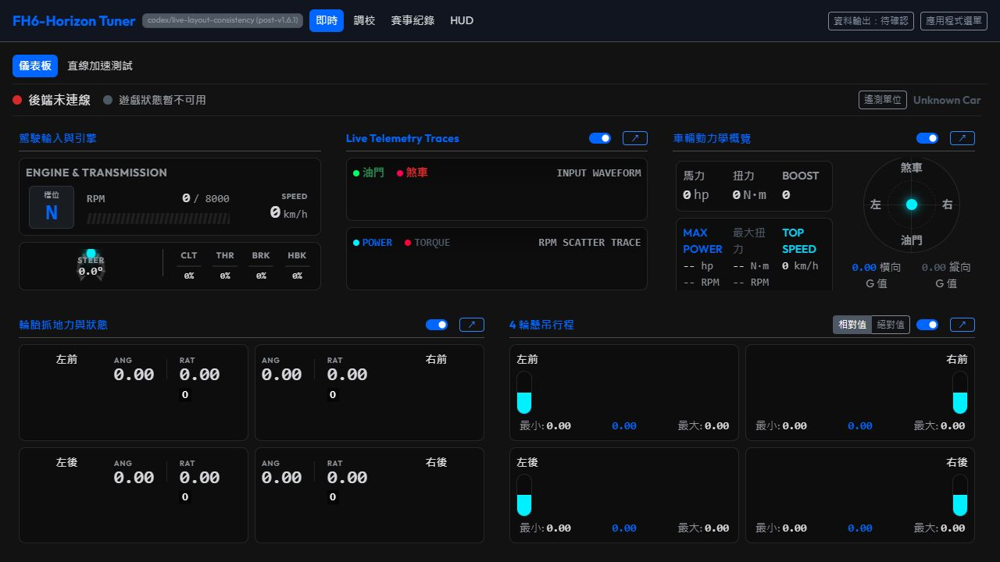
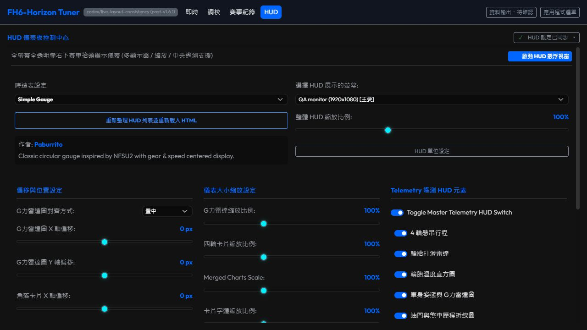
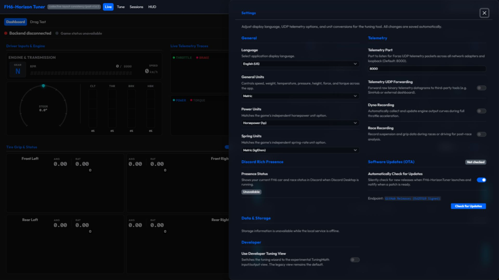
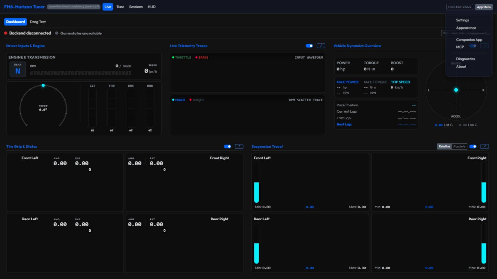
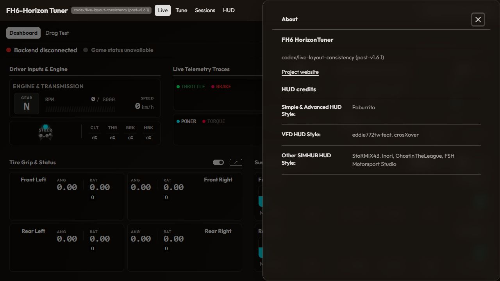

# Live 基準版型一致化：實作與驗收

日期：2026-09-24。分支：`codex/live-layout-consistency`。設計來源與工具接入見 [實作方案](ui-layout-refinement-20260924.md)。本記錄的範圍為桌面主 UI；GitHub CI 的目前結果以 PR 最新 head 的 checks 為準。

## 最終介面

- Live 保留薄工具列、透明分區、細分隔線及桌面資訊密度。Backend 與 Game 狀態採同一列的指示燈與文字；頂列只有一個 Data Out 引導入口。後端未連線時，Game 狀態顯示不可用。
- Post-Race Analysis 移至 Sessions，沿用 latest-analysis 契約。Tune 與 Drag Test 的標題、留白及表面對齊 Live。
- HUD 合併為單頁：啟動、樣式、螢幕與縮放在前，位置／大小／顯示項目接續呈現；效果、音訊及系統選項收進原生「進階設定」展開區。常駐狀態工具列在唯一主要捲動區之外。
- HUD 的載入、儲存、原生套用、已同步及需處理狀態預留相同空間。config、native、metadata、audio／monitor 問題依來源呈現；設定存檔成功不會清除其他來源尚未解決的錯誤。
- App Menu 分為偏好（Settings、Appearance）、連線（Companion、MCP）、支援（Diagnostics、About）。Companion 與 MCP 各有獨立入口，Settings 不再重複放置它們。
- OTA 併入 Settings。未取得真實檢查結果前顯示「尚未檢查」，不預先宣稱最新。Settings 區段採同一層級，按內容寬度切換單欄／雙欄；較窄欄內控制項移至標籤與說明下方。
- 六個 App Menu 抽屜都從右側進出，最大寬度為視窗 2/3；依內容上限縮短，取代先前固定 2/3 的方案。About 集中版本、專案連結與完整 HUD 製作名單；HUD 保留目前所選樣式的作者與說明。
- 桌面 shell 自行管理捲動，隱藏的 Portal 抽屜不再讓鍵盤操作帶動整份文件。一般狀態詳情不使用 modal 焦點限制；抽屜與圖表詳情有焦點範圍、Escape 及返回觸發鈕行為。

未新增前端套件，未修改調校公式、後端 API、HUD 寫入佇列、巢狀 patch 或設定檔契約。Fluent／Carbon 僅作原則參考，沿用 Halfmoon 和現有主題 tokens。

## 瀏覽器驗收

使用實際 React 頁面及瀏覽器版型；本機 QA fixture 注入可控的 HTTP 與 Tauri invoke 結果。fixture 僅保存在忽略追蹤的 `scratch/ui-layout/`，不納入前端入口或發行包。

| 檢查 | 結果 |
| --- | --- |
| Full／Lite × 英文／繁中 × 1280×720／1920×1080 × 深／淺色 × default／modern／elegant，Live 與 HUD 各一頁 | 48 組配置、96 個畫面；主要控制項沒有水平溢出，文件捲動及頁首偏移為 0，HUD 沒有殘留子分頁。 |
| HUD 單頁立即成功、1200ms 延遲、HTTP 500、注入 TimeoutError、重試、連續三筆排隊 | 控制項與狀態按鈕的前／中／後邊界相同；背景寫入保留焦點及內容捲動位置。 |
| HUD 進階區展開並捲動後修改效果 | 內容 scrollTop 727px 時，工具列 y 仍為 70px；背景寫入前後邊界及焦點不變。 |
| 原生／metadata 錯誤與 config 儲存交錯 | config 成功不掩蓋其他來源錯誤；metadata 對應重試可恢復。原生 adapter 的實際 4000ms 逾時計時亦以不完成的 invoke 驗證，按鈕不改寬。 |
| 六個選單抽屜，兩種桌面尺寸 | 12 次量測全部不超過視窗 2/3，抽屜及主要內容區無水平溢出；開啟時焦點在內、Escape 後返回 App Menu。 |
| 一般動效與 reduced motion | 一般模式六個抽屜均量到由右往左的 x 變化及 0.3s transform；減少動效模式 transition 為 0s 且仍可關閉。range／color／Canvas 不新增位置動畫。 |
| 其他互動 | Live 圖表 Portal 展開／Escape 返回、單位抽屜焦點、Tune 前三步及缺引擎資料的既有阻擋、Sessions 最新分析入口載入 20 筆合成樣本；動態 MCP port 入口關閉後返回該 port 按鈕。 |

抽屜實測寬度（px，四捨五入）：

| 介面 | 1280px 視窗 | 1920px 視窗 |
| --- | ---: | ---: |
| Settings | 853，單欄 | 1040，雙欄 |
| Appearance | 853 | 864 |
| Companion | 853 | 960 |
| MCP | 800 | 800 |
| Diagnostics | 853 | 928 |
| About | 608 | 608 |

量測 JSON 與額外截圖保存在 `scratch/ui-layout/`：`final-desktop-matrix.json`、`hud-single-measurements.json`、`drawers.json`、`drawer-motion.json`。桌面單頁的最終量測取代早期三分頁／手機探索資料。直式及行動裝置不列本次驗收。

Luna 依主代理保存的實際瀏覽器截圖獨立檢查，最終未見 P1／P2 視覺阻塞；也複驗了選中樣式作者正常載入及進階區捲動後工具列可見的畫面。靜態圖審查與主代理執行的幾何／互動量測分開，不將截圖當成原生或遊戲證據。Sol 的唯讀程式碼審查提出抽屜進退場與動態 MCP 返回焦點問題，修正後已以瀏覽器重驗。

## 本地檢查

- `pnpm -C frontend run test`：139 個檔案、989 項測試通過。
- `pnpm -C frontend run build`：TypeScript 及 Vite 正式建置通過，Full／Lite／Companion 三個入口產出成功。
- `.venv` Python 經 `uv run --no-project` 執行：Ruff check、Ruff format check、pytest（377 passed、8 deselected）、路徑大小寫及版本一致性檢查通過。
- `git diff --check` 通過。

此處的 native invoke、HTTP 失敗及遙測／分析資料為測試注入；沒有宣稱完成真實遊戲連線、原生 HUD 視窗渲染、Android 裝置連線或 OTA 安裝。Carbon MCP 仍待使用者取得官方預覽存取權；公開文件與已可用的 Microsoft Learn／MUI 文件工具提供設計參照。

## 桌面畫面

