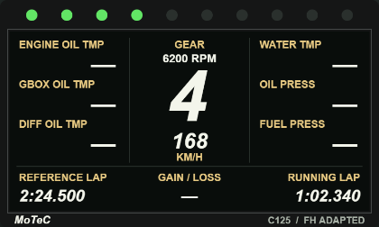
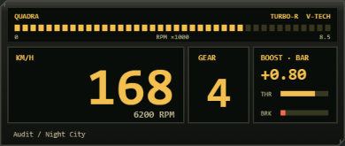
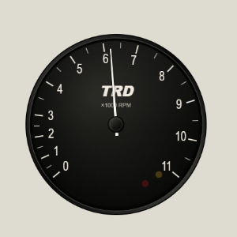

# 五款 HUD 視覺迭代實作紀錄

日期：2026-09-10。分支：`feat/add-5-new-hud-styles`。依使用者核准的方案逐款修改、驗證及提交；Defi 選用 A 方案。修改前的截圖、定位量測與原型來源保留於[視覺複審報告](hud-5-styles-visual-review-20260910.md)。本紀錄取代舊報告未有可重現依據的還原百分比。

**AE86 最終方向**：依追加指示採 ULTRA Clubman 的物理風格與原作虛構 TRD 盤面，保留低轉壓縮／11k、移除數字時速與檔顯；見下方「AE86 追加重製」。前面的 AE86 第一輪文字及圖片為歷史紀錄。

## 驗收方法與範圍

- 使用本分支實際 HTML Canvas renderer、共用 HUDCore 與全視窗 iframe，在 Edge Chromium headless 注入明確標示的合成 frame。
- 狀態包含巡航（168 km/h、6200 RPM）、怠速／N、紅線（321 km/h）、英制倒檔／手煞車，以及空資料；逐一檢查深色 `#202725`、淺色 `#dedbd0` 背景與 DPR 1／2。每款 20 組，JSON 保存 backing store、顯示尺寸與角落透明度。
- 定位另以 1920×1080、1280×720、3440×1440 與使用者 scale 0.75／1／1.5 驗證。共用 `.hud-root-wrapper` 仍為右下定位；量測的是容器，實際盤面另有內部留白。
- 每款提交前執行 Ruff lint／format、`pytest tests/`、完整前端 Vitest、TypeScript／Vite build、path-case 與 diff check。前端 gate 涵蓋當時工作樹中已完成、尚未分批提交的獨立 HUD 改動。
- 這是本地瀏覽器與合成資料的視覺驗收，沒有 Tauri 遊戲疊加、真實遊戲畫面、OS DPI 切换、效能 profiling 或像素等價認證。外部照片、遊戲截圖及概念圖的來源性質維持分開；沒有將外部影像複製進產品。

## Defi：A 方案

[修改前](assets/hud-visual-review-20260910/defi_triple-detail.png) · [完整右下畫面](assets/hud-visual-iteration-20260910/defi_triple-full-dpr1.png) · [英制倒檔狀態](assets/hud-visual-iteration-20260910/defi_triple-reverse-light.png) · [DPR 2](assets/hud-visual-iteration-20260910/defi_triple-detail-dpr2.png) · [20 組狀態量測](assets/hud-visual-iteration-20260910/defi_triple-states.json)

- 改為 380×360 邏輯畫布，右下為主轉速表，上方／左側錯落三副表。四個黑色圓盤與金屬表圈各自獨立，外部矩形背景、邊框與陰影已移除。
- 預設顯示 342×324 CSS px；主表直徑 180、副表 115.2。相較舊預設 342×126，主要收益是副表可讀性與右下配置，不宣稱顯示面積縮小。
- 細紅針、中性表圈、Defi／ADVANCE BF 字樣；数字移入刻度內側，副表標題避開英制多位刻度。靜態盤面與動態指針共用座標，重繪前清空透明畫布。
- 保留公英制切換，PSI／°F 印字同步換算；DPR 1–3 backing store，快取按需重建；Peak Hold 改為原地更新，移除每幀回傳暫態物件。
- **資料限制**：此款沿用原有油門估算增壓／真空及油溫 95°C、油壓 4.5 bar 的缺資料 fallback，不能視為實車感測值。這次視覺驗收不替它們背書；空資料截圖也會顯示這些既有行為。

驗證：Defi 聚焦 4 tests；完整 gate 的後端 285 passed／8 deselected、前端 94 files／599 passed；Ruff、format、build、path-case 通過。20 組狀態無 pageerror，外部畫布角落 alpha=0。

## AE86 TRD：保留版型，修正材質與字樣

**後續基準更新**：使用者於此版推送後指定以 ULTRA Clubman 物理風格及原作虛構刻度重製。以下含 NIPPONDENSO／數位讀值的內容保留為第一輪歷史，已由下方「AE86 追加重製」取代。

[修改前](assets/hud-visual-review-20260910/initial_d-detail.png) · [完整右下畫面](assets/hud-visual-iteration-20260910/initial_d-full-dpr1.png) · [紅線／漂移](assets/hud-visual-iteration-20260910/initial_d-redline-dark.png) · [英制倒檔](assets/hud-visual-iteration-20260910/initial_d-reverse-light.png) · [DPR 2](assets/hud-visual-iteration-20260910/initial_d-detail-dpr2.png) · [狀態量測](assets/hud-visual-iteration-20260910/initial_d-states.json)

- 主表中心／半徑、非線性轉速映射、速度／檔位／外掛燈座標、420×420 與倍率 0.95 均保留；預設仍約 299.25×299.25 CSS px。
- 以方向性明暗重建黑色烤漆金屬表圈，盤面加入低對比固定紋理與玻璃反射。直立工業数字取代原來傾斜字形，TRD／NIPPONDENSO／×1000 RPM 使用原創字樣處理。
- 細橘紅針與固定照明的金屬中心帽分開繪製；所有材質與中心帽使用靜態快取並適配 DPR。每幀清空透明區，避免超轉燈殘影。
- DRIFT 改為簡短文字置於中心帽下方空隙，不遮住廠名字樣、轉速單位或數位速度。速度單位、R／N／檔位與既有音效行為保留。

驗證：聚焦 4 tests，包含公英制、R／N／G4、漂移出現與解除、DPR backing store；完整 gate 後端 285 passed／8 deselected、前端 94 files／599 passed，其餘檢查通過。20 組瀏覽器狀態無 pageerror。盤面材質為原創 Canvas，並非特定實物的像素複製。

## FH5 Arc：原生資訊層級與細刻度

[修改前](assets/hud-visual-review-20260910/fh5_arc-detail.png) · [完整右下畫面](assets/hud-visual-iteration-20260910/fh5_arc-full-dpr1.png) · [紅線](assets/hud-visual-iteration-20260910/fh5_arc-redline-dark.png) · [英制倒檔／手煞車](assets/hud-visual-iteration-20260910/fh5_arc-reverse-light.png) · [狀態量測](assets/hud-visual-iteration-20260910/fh5_arc-states.json)

- 以細白轉速環、每千轉數字、半千轉短刻度與固定紅線段，取代粗漸層進度弧；短徑向針呈現轉速。刻度隨引擎最高轉速適配。
- 檔位移至環內中央、速度位於下方開口、單位位於中右，移除右侧膠囊。細暗底線與文字描邊維持亮背景辨識，外部仍透明。
- 媒體／踏板預設隱藏，保留 `onMedia` 與 `onElementsChange({showMedia:true, showPedals:true})` hook；本輪沒有新增設定頁控制項。真實手煞車仍可顯示警示。
- 380×380 邏輯畫布、倍率 1.0、預設 285×285 不變。靜態環／文字按最高轉速、紅線、字型及 DPR 更新，修正原啟動函式將時間誤傳為手煞車參數的問題。

驗證：聚焦 4 tests，含公英制、R／N、手煞車、媒體預設／選配與 DPR；完整 gate 後端 285 passed／8 deselected、前端 599 passed，其餘檢查通過。20 組瀏覽器狀態無 pageerror。這是參照已目視遊戲截圖的原創 Canvas 改作，非逐像素復刻。

## MoTeC：重建 C125 左右欄內容

[修改前](assets/hud-visual-review-20260910/motec_gt3-detail.png) · [完整右下畫面](assets/hud-visual-iteration-20260910/motec_gt3-full-dpr1.png) · [缺資料](assets/hud-visual-iteration-20260910/motec_gt3-missing-light.png) · [DPR 2](assets/hud-visual-iteration-20260910/motec_gt3-detail-dpr2.png) · [狀態量測](assets/hud-visual-iteration-20260910/motec_gt3-states.json)

| 區域 | 迭代後内容 | 資料邊界 |
|---|---|---|
| 左欄 | ENGINE OIL TMP／GBOX OIL TMP／DIFF OIL TMP | Forza parser 未提供，三列顯示 `—` |
| 右欄 | WATER TMP／OIL PRESS／FUEL PRESS | Forza parser 未提供，三列顯示 `—` |
| 中央 | RPM、檔位、速度及公英制單位 | 使用 canonical 遙測；這是 FH 適配，並非把官方 PAGE 5 當作檔位 |
| 下方 | REFERENCE LAP／GAIN LOSS／RUNNING LAP | BestLap、CurrentLap 以秒格式化；沒有同距離 delta，GAIN LOSS 顯示 `—` |

- 三個大區保留，取消胎溫卡片與踏板混排，改用暖色小標籤／白色大讀值及連續螢幕；10 顆 RGB LED 與 C125 硬體數量一致。移除固定 BRAKE BIAS 和把歌曲稱為 Team Radio 的處理。
- 800×480 邏輯尺寸，倍率由 0.55 調為 0.70，預設 420×252；主要側欄標籤約 11.55 CSS px。中央補回 RPM 行，主檔位與速度保持清楚分隔。
- 明確標記 C125／FH ADAPTED，author.json 同步說明；不主張此布局代表所有 GT3 車隊。無效／空資料會清除舊讀值；動畫與 DPR backing store 具生命週期處理。

驗證：聚焦 5 tests，驗證六欄缺資料、真實圈時、RPM、速度公英制、R／N 與無效值；完整 gate 後端 285 passed／8 deselected、前端 599 passed，其餘檢查通過。20 組瀏覽器狀態無 pageerror。六個空欄是資料不可用的明確呈現，不是感測器實測為零。

## Cyberpunk：Turbo-R 概念啟發的窄幅模組

[修改前](assets/hud-visual-review-20260910/cyberpunk_hud-detail.png) · [完整右下畫面](assets/hud-visual-iteration-20260910/cyberpunk_hud-full-dpr1.png) · [紅線](assets/hud-visual-iteration-20260910/cyberpunk_hud-redline-dark.png) · [缺 boost](assets/hud-visual-iteration-20260910/cyberpunk_hud-missing-light.png) · [狀態量測](assets/hud-visual-iteration-20260910/cyberpunk_hud-states.json)

- 統一 Turbo-R V-Tech 身份，移除 Type-66 混稱；以琥珀磷光字、深橄欖金屬外框及窄幅分段面板重新編排。上方 RPM、主速度／檔位、右方增壓／踏板形成明確層級。
- 移除假的 SYS.LINK／60HZ 狀態、姿態角、可見 EQ 與隨機 Glitch。媒體僅以實際收到的歌名置於底部次要文字；保留既有 hooks。缺 boost 顯示 `—`，取消油門製造的增壓數值。
- 520×220 邏輯畫布、倍率 1.0、預設 390×165；DPR 1–3 與靜態快取同步，按單位／色彩／最高轉速改變重建。
- 來源為設計者的 Quadra TURBO-R 概念圖；author.json 明確描述 Cyberpunk-inspired 原創延伸，**未聲稱最終遊戲儀表還原**。裝飾性標題仍是次要文字，視線優先順序為速度、檔位、轉速。

驗證：聚焦 4 tests，包含公英制、R／N、缺 boost 與 DPR；完整 gate 後端 285 passed／8 deselected、前端 599 passed，其餘檢查通過。20 組瀏覽器狀態無 pageerror。

## AE86 追加重製：ULTRA 物理風格、原作虛構盤面

[前一輪 TRD](assets/hud-visual-iteration-20260910/initial_d-cruise-dark.png) · [完整右下畫面](assets/hud-visual-iteration-20260910/initial_d_ultra-full-dpr1.png) · [低轉](assets/hud-visual-iteration-20260910/initial_d_ultra-idle-dark.png) · [警示燈](assets/hud-visual-iteration-20260910/initial_d_ultra-redline-dark.png) · [DPR 2](assets/hud-visual-iteration-20260910/initial_d_ultra-detail-dpr2.png) · [狀態量測](assets/hud-visual-iteration-20260910/initial_d_ultra-states.json)

採用使用者最後指定的邊界：ULTRA 是實物設計來源，原作為虛構盤面，**不能將市售線性校準套入**。TRD 識別與 ×1000 RPM 保留，NIPPONDENSO 移除；使用黑表圈、黑盤、白針與盤內右下紅／黃雙警示燈，取消外掛燈筒及原先假定的固定紅色區段。

數位時速、速度單位、檔位、DRIFT 與 80 km/h 合成鈴聲均移除；不外置附加卡片補回。畫布、主表中心與表徑、預設約 299.25×299.25 CSS px、右下定位保留。已查核設定頁沒有對應的 chime 選項，既有「Initial D AE86 TRD」名稱仍符合虛構 TRD 識別，未另改共用設定。

`initial-d-model.js` 將既有轉速到角度的純映射獨立，盤面刻度與指針共用；這是相容性保留，並非改成另一組校準：

| RPM 範圍 | 占整體 260° 掃幅 | 每千轉角度 |
|---|---:|---:|
| 0–3000 | 18% | 15.6° |
| 3000–7000 | 38% | 24.7° |
| 7000–11000 | 44% | 28.6° |

因此 1k～3k 繼續壓縮，上限固定 11k，起點 140°。黃／紅警示採現有車輛紅線的分階閾值；不宣稱模擬實物外接控制器的全部功能。DPR 快取與動畫取消／pagehide 清理一併確認。

來源：已目視 [Nengun No.1932-01 實物套裝照](https://image.nengun.com/catalogue/1024x768/nengun-4488-59341-00-ultra-series_clubman_stepping_tachometer-1a06226e.jpg) 的白針、黑圈與右下雙 LED；[官方 2011 型錄](https://www.nagaidenshi.co.jp/PDF/catalog2011new.pdf) 的搜尋索引文字支持此系列物理規格，但 PDF 本體／舊產品頁連線失敗，沒有聲稱已目視官方 PDF。市售照片只提供物理風格，**最終非線性虛構盘面與顯示要素取捨以使用者指示為準**。

驗證：本款 6 tests，包含非線性分段、低轉壓縮、11k clamp、黃紅警示與禁止附加顯示的可觀察輸出；完整 gate 後端 285 passed／8 deselected、前端 94 files／601 passed，Ruff、format、build、path-case 通過。20 組瀏覽器狀態無 pageerror，`initial-d-model.js` 實際經 HTTP 載入。

## 最終定位與逐次完整驗證

| 最終樣式 | 預設 CSS 尺寸 | 容器右／底間距 |
|---|---:|---:|
| Defi A | 342×324 | 30 / 30 px |
| AE86 TRD／ULTRA-inspired | 約 299.25×299.25 | 30 / 30 px |
| FH5 Arc | 285×285 | 30 / 30 px |
| MoTeC | 420×252 | 30 / 30 px |
| Cyberpunk | 390×165 | 30 / 30 px |

[最終 45 組定位量測](assets/hud-visual-iteration-20260910/layout-results-final.json)：3 種 viewport × 3 種 scale × 5 款，全部右下對齊且容器不越界，無 pageerror。原五款各一次推送，加上 AE86 追加重製，合計六次獨立提交／推送。各次完整 gate 的命令、退出碼與摘要保存於 [Defi](assets/hud-visual-iteration-20260910/gate-defi.json)、[AE86 第一輪](assets/hud-visual-iteration-20260910/gate-ae86.json)、[FH5](assets/hud-visual-iteration-20260910/gate-fh5.json)、[MoTeC](assets/hud-visual-iteration-20260910/gate-motec.json)、[Cyberpunk](assets/hud-visual-iteration-20260910/gate-cyberpunk.json)、[AE86 最終版](assets/hud-visual-iteration-20260910/gate-ae86-ultra.json)。

## 執行環境註記

第一次後端全套測試因另一工作區占用 8001 而失敗：sidecar 正確退到動態埠，但既有測試要求 8001。經使用者允許停用該實例後，完整測試通過。沒有修改測試以迴避此環境衝突；依使用者後續指示，不恢復該後端。
