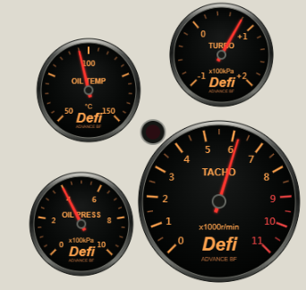
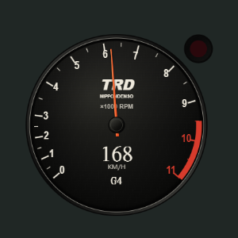
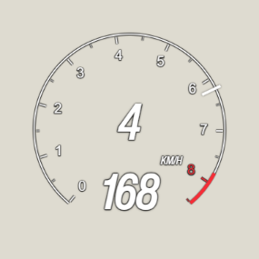

# 五款 HUD 視覺迭代實作紀錄

日期：2026-09-10。分支：`feat/add-5-new-hud-styles`。依使用者核准的方案逐款修改、驗證及提交；Defi 選用 A 方案。修改前的截圖、定位量測與原型來源保留於[視覺複審報告](hud-5-styles-visual-review-20260910.md)。本紀錄取代舊報告未有可重現依據的還原百分比。

## 驗收方法與範圍

- 使用本分支實際 HTML Canvas renderer、共用 HUDCore 與全視窗 iframe，在 Edge Chromium headless 注入明確標示的合成 frame。
- 狀態包含巡航（168 km/h、6200 RPM）、怠速／N、紅線（321 km/h）、英制倒檔／手煞車，以及空資料；逐一檢查深色 `#202725`、淺色 `#dedbd0` 背景與 DPR 1／2。每款 20 組，JSON 保存 backing store、顯示尺寸與角落透明度。
- 定位另以 1920×1080、1280×720、3440×1440 與使用者 scale 0.75／1／1.5 驗證。共用 `.hud-root-wrapper` 仍為右下定位；量測的是容器，實際盤面另有內部留白。
- 每款提交前執行 Ruff lint／format、`pytest tests/`、完整前端 Vitest、TypeScript／Vite build、path-case 與 diff check。前端 gate 涵蓋當時工作樹中已完成、尚未分批提交的獨立 HUD 改動。
- 這是本地瀏覽器與合成資料的視覺驗收，沒有 Tauri 遊戲疊加、真實遊戲畫面、OS DPI 切换、效能 profiling 或像素等價認證。外部照片、遊戲截圖及概念圖的來源性質維持分開；沒有將外部影像複製進產品。

## Defi：A 方案

[修改前](assets/hud-visual-review-20260910/defi_triple-detail.png) · [完整右下畫面](assets/hud-visual-iteration-20260910/defi_triple-full-dpr1.png) · [英制倒檔狀態](assets/hud-visual-iteration-20260910/defi_triple-reverse-light.png) · [DPR 2](assets/hud-visual-iteration-20260910/defi_triple-detail-dpr2.png) · [20 組狀態量測](assets/hud-visual-iteration-20260910/defi_triple-states.json)

- 改為 380×360 邏輯畫布，右下為主轉速表，上方／左側錯落三副表。四個黑色圓盤與金屬表圈各自獨立，外部矩形背景、邊框與陰影已移除。
- 預設顯示 342×324 CSS px；主表直徑 180、副表 115.2。相較舊預設 342×126，主要收益是副表可讀性與右下配置，不宣稱顯示面積縮小。
- 細紅針、中性表圈、Defi／ADVANCE BF 字樣；数字移入刻度內側，副表標題避開英制多位刻度。靜態盤面與動態指針共用座標，重繪前清空透明畫布。
- 保留公英制切換，PSI／°F 印字同步換算；DPR 1–3 backing store，快取按需重建；Peak Hold 改為原地更新，移除每幀回傳暫態物件。
- **資料限制**：此款沿用原有油門估算增壓／真空及油溫 95°C、油壓 4.5 bar 的缺資料 fallback，不能視為實車感測值。這次視覺驗收不替它們背書；空資料截圖也會顯示這些既有行為。

驗證：Defi 聚焦 4 tests；完整 gate 的後端 285 passed／8 deselected、前端 94 files／599 passed；Ruff、format、build、path-case 通過。20 組狀態無 pageerror，外部畫布角落 alpha=0。

## AE86 TRD：保留版型，修正材質與字樣

[修改前](assets/hud-visual-review-20260910/initial_d-detail.png) · [完整右下畫面](assets/hud-visual-iteration-20260910/initial_d-full-dpr1.png) · [紅線／漂移](assets/hud-visual-iteration-20260910/initial_d-redline-dark.png) · [英制倒檔](assets/hud-visual-iteration-20260910/initial_d-reverse-light.png) · [DPR 2](assets/hud-visual-iteration-20260910/initial_d-detail-dpr2.png) · [狀態量測](assets/hud-visual-iteration-20260910/initial_d-states.json)

- 主表中心／半徑、非線性轉速映射、速度／檔位／外掛燈座標、420×420 與倍率 0.95 均保留；預設仍約 299.25×299.25 CSS px。
- 以方向性明暗重建黑色烤漆金屬表圈，盤面加入低對比固定紋理與玻璃反射。直立工業数字取代原來傾斜字形，TRD／NIPPONDENSO／×1000 RPM 使用原創字樣處理。
- 細橘紅針與固定照明的金屬中心帽分開繪製；所有材質與中心帽使用靜態快取並適配 DPR。每幀清空透明區，避免超轉燈殘影。
- DRIFT 改為簡短文字置於中心帽下方空隙，不遮住廠名字樣、轉速單位或數位速度。速度單位、R／N／檔位與既有音效行為保留。

驗證：聚焦 4 tests，包含公英制、R／N／G4、漂移出現與解除、DPR backing store；完整 gate 後端 285 passed／8 deselected、前端 94 files／599 passed，其餘檢查通過。20 組瀏覽器狀態無 pageerror。盤面材質為原創 Canvas，並非特定實物的像素複製。

## FH5 Arc：原生資訊層級與細刻度

[修改前](assets/hud-visual-review-20260910/fh5_arc-detail.png) · [完整右下畫面](assets/hud-visual-iteration-20260910/fh5_arc-full-dpr1.png) · [紅線](assets/hud-visual-iteration-20260910/fh5_arc-redline-dark.png) · [英制倒檔／手煞車](assets/hud-visual-iteration-20260910/fh5_arc-reverse-light.png) · [狀態量測](assets/hud-visual-iteration-20260910/fh5_arc-states.json)

- 以細白轉速環、每千轉數字、半千轉短刻度與固定紅線段，取代粗漸層進度弧；短徑向針呈現轉速。刻度隨引擎最高轉速適配。
- 檔位移至環內中央、速度位於下方開口、單位位於中右，移除右侧膠囊。細暗底線與文字描邊維持亮背景辨識，外部仍透明。
- 媒體／踏板預設隱藏，保留 `onMedia` 與 `onElementsChange({showMedia:true, showPedals:true})` hook；本輪沒有新增設定頁控制項。真實手煞車仍可顯示警示。
- 380×380 邏輯畫布、倍率 1.0、預設 285×285 不變。靜態環／文字按最高轉速、紅線、字型及 DPR 更新，修正原啟動函式將時間誤傳為手煞車參數的問題。

驗證：聚焦 4 tests，含公英制、R／N、手煞車、媒體預設／選配與 DPR；完整 gate 後端 285 passed／8 deselected、前端 599 passed，其餘檢查通過。20 組瀏覽器狀態無 pageerror。這是參照已目視遊戲截圖的原創 Canvas 改作，非逐像素復刻。

## 執行環境註記

第一次後端全套測試因另一工作區占用 8001 而失敗：sidecar 正確退到動態埠，但既有測試要求 8001。經使用者允許停用該實例後，完整測試通過。沒有修改測試以迴避此環境衝突；依使用者後續指示，不恢復該後端。
