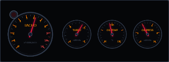
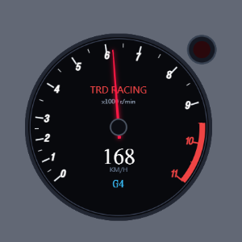
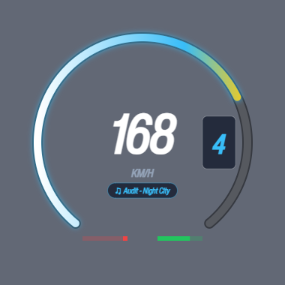
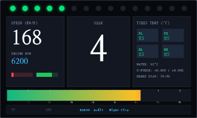
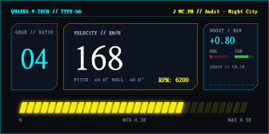

# 五款 HUD 視覺複審與修正方案

日期：2026-09-10。審查版本：`feat/add-5-new-hud-styles` / `7fc5fee`。本輪交付為視覺審查、定位證據與修正方案；未修改 HUD renderer。

後續使用者已核准實作，Defi 選用 A 方案；進度與修改後證據見[視覺迭代實作紀錄](hud-5-styles-visual-iteration-20260910.md)。本頁保留修改前基準。

## 結論與已確認方向

- 五款主儀表均為右下角定位。三種 viewport、三種使用者縮放共 45 組，主容器距右／底各 30 CSS px，均未越界。
- 目前不能以「99% 還原」或「Production Ready」驗收。舊報告引用的 `ref/real_references/` 與 `ref/audit_screenshots/` 不存在於本次 checkout，Git 也未追蹤這些路徑；沒有可重現的像素比較方法或評分依據。
- 使用者確認：**Defi 的整塊黑底錯誤，橫排不美觀、空間效率差，優先重排。**保留四個圓表內部的黑色盤面，移除圓表外的黑色矩形。
- 使用者確認：**AE86 TRD Racing 版型 OK，保留版型。**只迭代材質、盤面字體、字樣；不移動主表、速度、檔位或外掛燈的位置。
- 使用者確認：**MoTeC 大致分區正確，但左右欄內容與真車差異很大。**保留三區骨架，以真實 MoTeC 硬體顯示頁重設左右欄資訊，不將問題縮減為字體太小。
- 其餘三款依下列方案處理。外部參考的產品照、遊戲截圖、概念圖與社群模組各有不同證據強度，不互相冒充。

## 定位與預設尺寸

`shared/hud-base.css` 的 `.hud-root-wrapper` 使用 column flex、`align-items: flex-end`、`justify-content: flex-end` 與 30px padding。五款都使用此 wrapper；Launcher 的 iframe 填滿 host。`HUDCore` 最終縮放為使用者 scale × baseline × 樣式倍率 × 0.75。

| 樣式 | 設計畫布 | scale=1 的實際容器尺寸 | 右／底間距 |
|---|---:|---:|---:|
| motec_gt3 | 800 × 480 | 330 × 198 | 30 / 30 |
| defi_triple | 760 × 280 | 342 × 126 | 30 / 30 |
| fh5_arc | 380 × 380 | 285 × 285 | 30 / 30 |
| initial_d | 420 × 420 | 約 299.25 × 299.25 | 30 / 30 |
| cyberpunk_hud | 640 × 320 | 336 × 168 | 30 / 30 |

畫布內仍有透明留白，因此圓表可見邊緣不一定距螢幕恰好 30px。這不構成置中。此次驗證為 Edge Chromium、DPR=1、合成 telemetry、直接載入目前樣式與共用 HUDCore 的全視窗 iframe；未啟動真實遊戲、Tauri overlay 或作業系統 DPI 切換測試，也未驗證 host 中央遙測卡片與儀表的動態避讓。

測試矩陣：1920×1080、1280×720、3440×1440；scale=0.75、1、1.5；5 款。45/45 通過右下錨定與 viewport 邊界檢查，無 pageerror。[原始量測 JSON](assets/hud-visual-review-20260910/layout-results.json)。初期 Edge CLI 截圖有啟動 viewport 變化，已以明確固定 viewport 的 Playwright 截圖取代，以下收錄均為後者。

## Defi：優先修正透明背景與布局

[1920×1080 完整定位畫面](assets/hud-visual-review-20260910/defi_triple.png)

### 現況問題

1. `#defiCanvas` 明確設定 `background: #050608`、矩形 border、border-radius 與整塊 box-shadow。這些形成錯誤的面板底板；`html/body` 透明不能抵消 canvas 自己的背景。
2. 主表直徑 200、副表 128，在最終 zoom=0.45 時只剩約 90px／57.6px；副表 11–12px 設計字體變成約 5px，難以實際閱讀。
3. 四表共用水平中心线，大主表後接三小表；上方有大量空白，主副表間距不一致。把整條放大雖可改善字體，卻會向畫面中央延伸。
4. 邊框目前為薄灰線、針軸為偏藍的扁平圓點，欠缺實體 Defi 的金屬表圈、黑面玻璃與細長紅針特徵。
5. `renderCluster()` 每幀直接以透明 offscreenDial `drawImage()` 覆蓋，沒有先清空主 canvas。移除底板／重排時必須同步加入每幀 `clearRect()`；透明像素不會抹除上一幀指針，否則可能保留殘影。這是程式碼風險，尚未以動態捕捉量化。

### 外部參考與可借用部分

| 參考 | 已核對內容 | 適合借用 | 不宜直接照搬 |
|---|---|---|---|
| [Defi ADVANCE BF 官方](https://defi.nippon-seiki.co.jp/products/advance_bf/) | 官方產品照已目視；黑盤、獨立表圈、紅針、外掛 shift light；官方列出 60mm／80mm 與三種背光產品 | 圓表外透明、表體材質、主副表辨識 | 實車安裝受擋風玻璃／方向盤約束，不等於右下 HUD 排列 |
| [DRiFT MAFIA：Assetto Corsa Defi Extra Gauges](https://driftmafia.nl/downloads/mod-parts/defi-extra-gauges-assetto-corsa/) | 已目視三個獨立表體與偏斜排列的 showroom 圖 | 獨立金屬表圈、三副表同一家族外觀、空隙可透視背景 | 3D showroom 的透視縮短、底座與地面陰影；它不是四表 2D HUD 驗收圖 |
| [Vegetable Tsai：Initial D Arcade Tachometer](https://www.overtake.gg/downloads/initial-d-arcade-tachometer.21199/) 與 [Boost Gauge](https://www.overtake.gg/downloads/initial-d-arcade-boost-gauge.17575/) | 作者頁確認為獨立 Assetto Corsa apps，可搭配使用 | 高頻主表／低頻副表分級、模組化顯示 | 未取得可核對的完整配置截圖，不能宣称此作者採用本報告的四表坐標 |
| [XMOD：GTA V NFS gauge](https://www.gta5-mods.com/scripts/nfsgauge-rpm-gear-speedometer) | 作者頁確認多皮膚、位置縮放設定；矩形背景為 custom skin 的可選項 | 透明 overlay 預設、以整組為單位縮放 | 示範大圖在本輪瀏覽未正常顯示，不用其圖作精確排列證據 |

### 推薦 A：主表靠右下，三副表沿左上方錯落排列

保留 RPM、Turbo、Oil Temp、Oil Press 四表。RPM 為最大圓表，靠右下形成穩定視覺重心；Turbo 靠近 RPM 的左上／上方，兩油況表沿左側排列。副表採一致表徑，表圈可鄰接，但不可壓住刻度、讀值及警示燈。此方案是基於上述參考所提出的本專案設計推論，並非任何遊戲的原樣複製。

比較草圖以相同主表直徑 200、副表 128 設計單位製作：目前 760×280；A 為 380×360，寬度減半、外接矩形面積約減少 36%，高度增加約 29%。這是布局草圖的外接矩形計算，**不是實測遮擋面積或可讀性提升百分比**。實作仍須重定字體與表徑。

建議 1080p 預設可見主表直徑約 170–200 CSS px、副表约 105–125px；以最小可讀刻度為準調整。面板寬度約 330–380px。這會比目前 342×126 的細條更高，但能在相近寬度下放大表面；表外透明後，真正遮住遊戲的部分只剩表體。

### 備選 B：無底板的緊湊橫排

主表置左、三副表底緣對齊，縮小多餘上方留白與表間距。草圖 630×220，維持同表徑時外接矩形約少 35%。適合強烈偏好低高度者，但放大到可閱讀尺寸仍佔較多水平空間，故不作預設推薦。

不採用四個等大圓表 2×2：雖然規整，卻削弱 RPM 主表層級。也不把三個副表直接疊住主表刻度來換取表面上的緊湊。

### 實作順序與驗收

1. 去掉 canvas 矩形背景、矩形 border 及整塊 box-shadow；保留圓表自己的盤面與 per-dial 陰影。
2. 每幀清空動態 canvas；靜態表盤、動態針、Peak Hold、燈筒使用同一套布局資料，避免只移動底圖却漏掉指針。
3. 調整畫布尺寸與 `scaleMultiplier`，使預設表徑符合可閱讀需求；保持 shared wrapper 右下定位。
4. 縮放後主要刻度字高以約 10–12 CSS px 為設計目標，不以 5px 細字驗收。不得只增強 glow 來補救小字。
5. 以深色、亮色、複雜遊戲背景檢查圓表外透明；檢查掃表、峰值標记、換單位、紅線與斷線狀態，无殘影／交疊。

## AE86 TRD Racing：保留版型，修材質與盤面字樣

[1920×1080 完整定位畫面](assets/hud-visual-review-20260910/initial_d.png)

目前單一圓表、外掛警示燈、表內速度與檔位的版型依使用者回饋保留。迭代範圍：

- **表圈材質**：現在為兩圈均勻灰藍描邊，改為窄金屬／黑色烤漆表圈的明暗層次，內側加接觸陰影；避免塑膠感粗邊與大面積光暈。
- **玻璃與盤面**：盤面維持深黑，採低對比細緻材質與極弱、固定的玻璃反光；反光不得掃過數字或降低紅線辨識。材質離線快取，避免每幀生成噪點。
- **數字字形**：目前轉速刻度使用 `ForzaGear`，造成現代 Forza 斜體特徵。改成與所選 TRD 參考一致的工業儀表數字，逐一處理 1、4、7、10、11 的字寬、筆畫與基線。可採原創向量字形或已核准字型；不直接套用主 GUI 字體。
- **盤面字樣**：目前 `TRD RACING` 為一般 sans-serif 紅字；應核對 TRD 標誌、廠名字樣及 `×1000 RPM`／`r/min` 的實際版本。先選定同一版本，再改字形、字距、比例和位置；不能把不同 TRD 表型的文字混在一起。
- **針與中心帽**：保留針長與配置，改善細長針的厚度、高光與中心帽材質，降低霓虹發光感。
- **疊加提示**：`DRIFT` 徽章不作盤面印刷的一部分；若保留，必須能與盤面字樣區分，避免遮住轉速單位。這項不藉機更動使用者已接受的版型。

本輪已目視 [TRD／Nippondenso 實物商品照](https://www.ebay.com/itm/186114821905)：暖色數字、細長橘針、TRD/Nippondenso 字樣，與目前紅字 `TRD RACING`、ForzaGear 刻度不同。但它是第三方商品照、也未證明是原作指定同一型號，因此只用來辨別材質及字樣差異，不據此強制把目前白色刻度改黃或變更數值角度映射。下一版須固定單一 TRD 實物／原作盤面作美術標準。

## FH5 Arc：重建原生資訊層級

[完整定位畫面](assets/hud-visual-review-20260910/fh5_arc.png)

已目視 [FH5 遊戲畫面，媒體刊載](https://www.autoevolution.com/news/forza-horizon-5-full-map-revealed-new-2020-toyota-supra-gr-shown-off-166952.html)。右下原生儀表具有數字轉速刻度、細弧線、紅線區、指示、ABS/TCR 與不同的速度／檔位組合。目前為粗厚的白青黃漸層進度弧，缺少數字刻度，以速度置中、右側膠囊檔位和內置電台文字重新編排，不能視為原版還原。

建議：先建立細弧線＋刻度＋指示的骨架，依固定遊戲截圖對齊速度、檔位、單位與輔助提示。預設移除彩色漸層、厚重底弧與檔位膠囊；電台與踏板條改為選配擴充，不擠占原生儀表核心。保留共用右下錨點。此媒體截圖為遊戲外觀佐證，仍需補一張目標版本、HUD 設定明確的正式基準。

## MoTeC GT3：保留三區骨架，重做左右欄內容

[完整定位畫面](assets/hud-visual-review-20260910/motec_gt3.png)

依使用者回饋，保留左右欄與中央主顯示的分區。**修正核心為左右欄資訊的選擇與編排，不是把現有四輪胎溫小卡放大。**C125 真實硬體與 Lovely Dashboard 不是同一個原型；本輪改以 [MoTeC 官方 C125 產品頁](https://www.motec.com.au/products/C125) 的實機展示畫面為主要參考，已在瀏覽器目視核對。它是官方硬體展示頁，不是已指定 GT3 車隊的實車攝影，後續不能把它泛化成所有 GT3 通用內容。

| 區域 | 本分支目前內容 | 官方 C125 展示頁可見內容 | 修正方向 |
|---|---|---|---|
| 左欄 | 大速度、ENGINE RPM、踏板條 | ENGINE OIL TMP、GBOX OIL TMP、DIFF OIL TMP 三列 | 恢復一致的三列標籤＋大讀值，將現在混雜的速度／RPM／踏板移出這個熱管理欄 |
| 右欄 | 2×2 胎溫卡、WATER、G-FORCE、固定煞車比例 | WATER TMP、OIL PRESS、FUEL PRESS 三列 | 重建溫度／壓力讀值欄，去掉四輪卡片網格、G 值與無來源煞車比例 |
| 下方 | RPM 條、TC/ABS、歌曲 | REFERENCE LAP、GAIN/LOSS、RUNNING LAP，另有 gain/loss bar | 圈速與告警為優先參考，歌曲不混成 Team Radio；是否改 RPM 條需配合最終選定頁面 |

官方示範使用小型暖色標籤、大型高對比數字、整齊的垂直列；目前則是低對比小標籤、多重小卡與偏藍通用 UI 色。應先按參考重做文字層級與欄內行距，再決定最終顯示尺寸。

另有兩項應避免誤讀：官方照片中央寫的是 **PAGE 5**，不能把數字 5 當成該圖的實車檔位證據；官方 C125 規格為 **10 顆可程式化 RGB LED**，目前 15 顆不應再稱為 C125 硬體忠實還原。三分區與目前中央檔位可以保留作本專案適配，但需清楚記錄與此展示頁不同的地方。

[官方手冊 v2.5，Display Using Fixed Layouts，印刷頁 41 起](https://assets.motec.com.au/strapi/C125_User_Manual_1f4a1c6bf4.pdf) 說明固定版型可配置通道、標籤，並有 RACE／PRACTICE／WARMUP 模式。因此不能隨意混合不同頁面，或將此官方範例當成唯一真車頁面。

可直接確認的問題：預設縮至 330×198，13–15px 標籤只剩約 5.4–6.2px；右欄四輪、溫度、G 值、煞車分配加底部 radio 過密。`BRAKE BIAS: 54:46` 為硬寫文字，`onMedia` 的歌曲也不等於車隊通訊。

實作方案：

1. 三區外框保持，左右欄改成一致的 3-row 讀值，取消胎溫子卡片與踏板條混排。首先製作官方展示頁內容的靜態比對稿；之後才套用遊戲可提供的真實資料。
2. 逐項核對資料來源。變速箱油溫、差速器油溫、燃油壓力等不得使用任意常數或用油門估出假數值；無來源顯示 `—`。若使用者希望提高遊戲實用性，再明確標註為 FH 適配頁，以已證實的 Fuel／Lap 等資料替換，而非悄悄換掉標籤下的語意。
3. 移除 `BRAKE BIAS: 54:46` 假讀值及 Team Radio 的錯誤命名；固定參考資料只可出現在明確標示的 preview fixture。
4. 依最終欄位重新定義字寬、行高及整體 scale。黑色矩形是此款真實 DDU 螢幕的一部分，不能套用 Defi 的去底板處理。

## Cyberpunk：明確區分主題創作與 Quadra 還原

[完整定位畫面](assets/hud-visual-review-20260910/cyberpunk_hud.png)

已目視 [Paweł Breshke Czyżewski 的 Quadra TURBO-R 3D concept](https://www.behance.net/gallery/119042489/CYBERPUNK-2077-Quadra-TURBO-R-3d-concept)：分布式窄幅數位儀表、實體座艙結構與工業材質。這是設計者概念圖，並非最終遊戲儀表近照，不能直接作最終像素基準。

目前是青黃配色的矩形科幻 UI，`QUADRA V-TECH // TYPE-66` 混用車型名稱，預設 336×168 使 9–12px 設計文字只剩約 4.7–6.3px，輔助字樣不可讀。姿態角、頻譜、電台與 `SYS.LINK // 60HZ OK` 沒有充分原型依據，後者更會把裝飾誤認為實際狀態。

建議：以原計畫的 Turbo-R V-Tech 作目標，去掉 Type-66 混稱，補最終遊戲版儀表特寫，再定義字型、分段顯示、面板比例和材質。姿態／頻譜／Glitch 應為選配，降低優先級；若保留目前構圖，描述必須改成「Cyberpunk inspired」，不能稱 Quadra 原型還原。

## 迭代順序與驗收證據

1. **Defi**：透明外部背景 → A/B 同表徑布局比較 → 可讀尺寸 → 材質／字形 → 動態殘影檢查。
2. **AE86**：版型凍結 → 單一盤面參考 → 材質、數字字形與 TRD 字樣。不得重排已接受的結構。
3. **FH5**：原生刻度、指示、速度／檔位層級重建。
4. **MoTeC**：三分區保留，依真實 C125 頁面重建左右欄內容、順序及字級；驗證資料可用性，不以假值填版。
5. **Cyberpunk**：指定同一車型的最終遊戲基準，再做面板／材質迭代。

每款下一輪應保存來源 URL／版本／圖像區域、修改前後同尺寸畫面、右下完整畫面、暗亮背景、怠速／巡航／紅線／無資料、metric／imperial、R／N／多位速度。純函數與契約測試可驗證資料行為，不能替代美術判斷或用來計算還原百分比。

本輪未進行效能 profiling、真實遊戲驗收、全套單元測試或 release build；沒有產品程式變更，僅新增審查文件與瀏覽器證據。合成 frame 用於觀察版面，不能證明各數值的遙測正確性。
