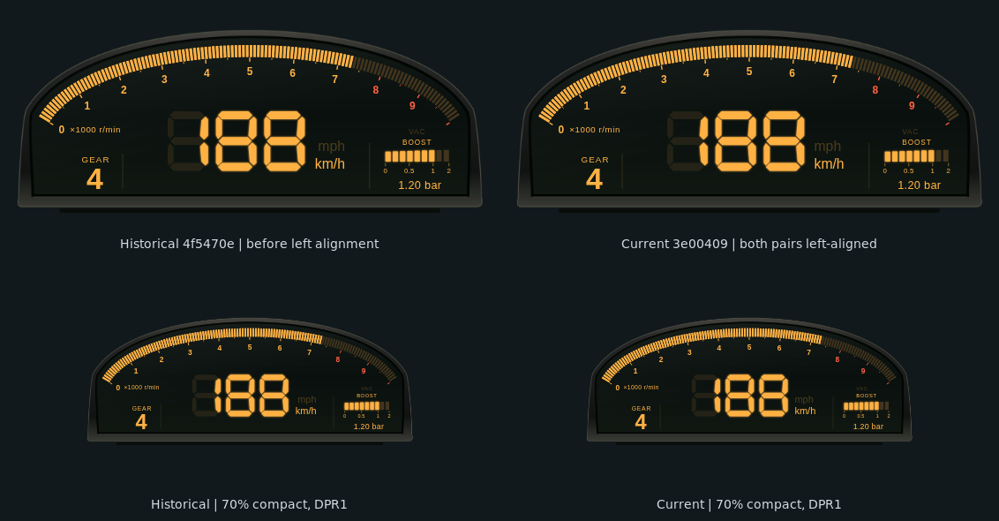
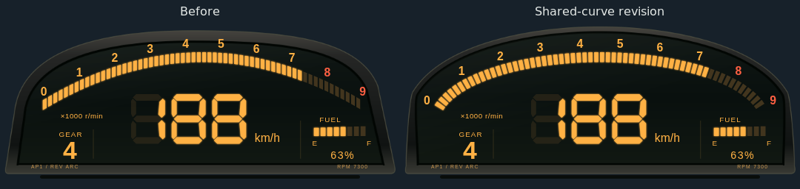
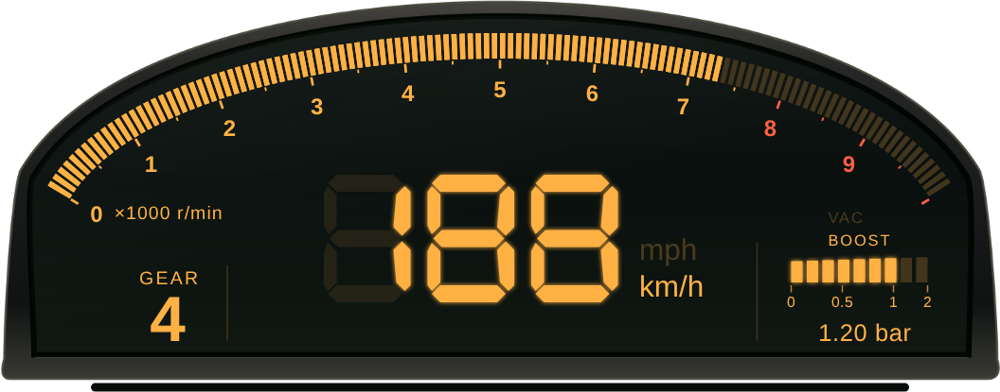
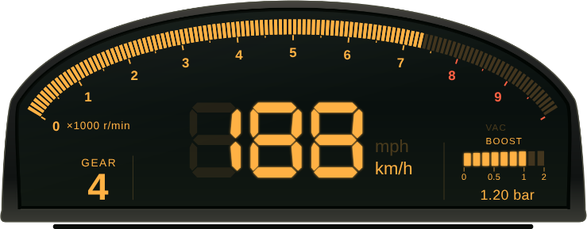
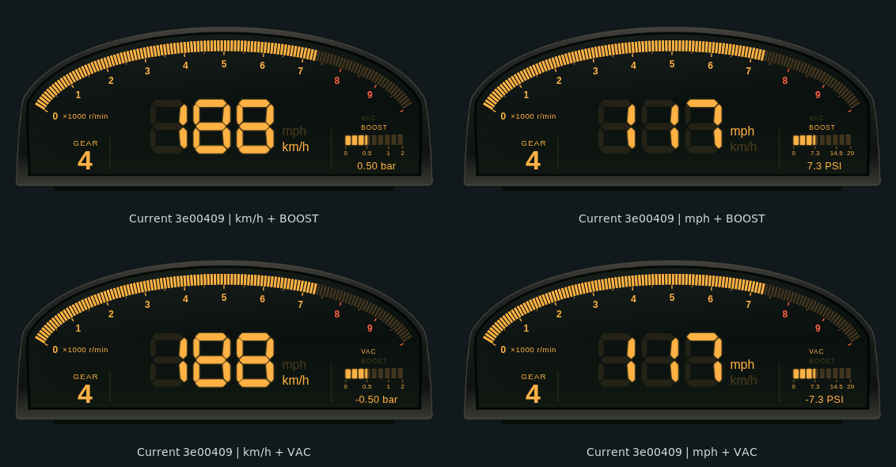

# AP1 Rev Arc：1999 Honda S2000 AP1 儀表原型

> 最新修正將mph／km/h與VAC／BOOST各自改為共同左緣，順序與明暗語意不變。source `3e00409` 的實際Chrome／launcher與像素複查已通過；目前預覽全部更新，比較圖明列歷史4f與目前3e。最終文件head的CI待發布後確認；PR保持Ready。

## 原型與來源

本樣式以 **1999 年 Honda S2000 AP1，日本上市初期儀表**為視覺研究對象。不是美規年份的混稱，也不是後期 AP2 儀表重製。

- [Honda 1999 年 4 月官方 Fact Book，Interior](https://www.honda.co.jp/factbook/auto/s2000/199904/046.html)：已在雲端 Chromium 實際查看座艙圖片的像素，確認低矮儀表罩、弧形數位轉速帶與中央大型速度讀值
- [該頁官方座艙圖片](https://www.honda.co.jp/factbook/auto/s2000/199904/image/037_001.gif)：僅供研究，沒有複製至本專案
- [Honda S2000 99 官方新聞資料](https://hondanews.eu/eu/fi/cars/media/pressreleases/34329/honda-s2000-99)：搜尋索引可讀到 Digital read-out 段落；直接抓取遇到 502，因此不用它聲稱已看見額外的儀表照片

原廠資料以單一半圓形數位儀表與賽車啟發為設計背景。本作品保留其辨識語彙，依遊戲遙測重新編排，沒有宣稱原廠一比一複製或官方合作。

## 設計方向與玩家

- **整體風格**：低寬煙燻黑色儀表罩、琥珀色 LCD、密集轉速分段與簡短字標，避免把既有 VFD 收音機 HUD 換色當成新風格
- **視覺主角**：120 格細長上拱 RPM 帶和中央大型三位七段速度；轉速刻度隨當前車輛調整，不把所有車款硬套 9000 RPM
- **HUD 改編**：左下低調檔位是遊戲用途的新增欄位，並非宣稱 1999 原廠即有此數位檔位；右側依使用者要求改為 BOOST；這是遊戲用途改編，並非宣稱1999原廠儀表配有增壓錶
- **目標玩家**：喜歡 1990 年代末 Honda/JDM 數位儀表、高轉自然進氣車款與簡潔道路駕駛 HUD 的玩家
- **取捨**：不加入沒有可靠遙測的水溫、油溫、機油警示、里程表、方向燈或 OEM 商標

標準 HUDCore 比例下，720 × 300 的設計面積顯示為 540 × 225 CSS px。沿用共用右下角 flex 容器與 30px 邊界；這個槽位假設用來**取代遊戲原生右下角儀表**。若同時顯示原生儀表，必須由玩家調整 HUD 比例或遊戲顯示設定。外殼以外保持透明，不宣稱適合每種遊戲 UI 配置。

## RPM原型複查與既有幾何修正

本輪先實際查看下列圖片，再修改RPM區；研究圖片沒有封裝到HUD或預覽：

- [Honda 1999.04 Fact Book](https://www.honda.co.jp/factbook/auto/s2000/199904/046.html)與[其座艙圖](https://www.honda.co.jp/factbook/auto/s2000/199904/image/037_001.gif)：日本1999年4月上市初期S2000 AP1，雲端瀏覽器重新查看點亮的宣傳畫面；原圖較小，不用它推算精確cell數量
- [Honda手冊掃描（s2000.club保存為S2Kbooklet1999.pdf）](https://www.s2000.club/OM/S2Kbooklet1999.pdf)：實際查看第27頁座艙／點亮儀表小圖。保存站的年份標記只作輔助，掃描PDF製作日期不當成原件出版日期證據
- [Motor Magazine的1999年4月15日發表回顧之儀表照片](https://web.motormagazine.co.jp/_ct/17065339/album/16782798/image/16818352)與[1280×544原圖](https://d1uzk9o9cg136f.cloudfront.net/f/16783018/rc/2019/04/09/14f33f22cadf21d6da43ec05ae6def9f90dc3a65.jpg)：實際查看原廠AP1儀表，全部分段點亮、速度0 km/h的展示模式。照片可見細長密集cells，數字位於色帶內側／下方，主刻度間有較短的半步刻度，最後數字後仍有未標數字的尾段；不是實際行駛遙測或OEM校準文件
- [2000–03 AP1原廠拆車儀表的第一手商品照片](https://www.ebay.com/itm/334214668079)與[1200×900原圖](https://i.ebayimg.com/images/g/GNwAAOSwlVphKPmS/s-l1200.jpg)：實際查看未通電狀態，佐證印刷數字／長短刻度的位置。此圖不是日本1999年單一車輛的年份證據，也不用來數LCD cells

原本把數字放在色帶與外框之間，與原型不符。先前932修正保留原有ellipse，數字改由同一曲線的inward normal offset產生；主／半步刻度也沿相同normal置於band下方。60格改為120格，填色佔每個等弧長pitch的64%；這是針對小型HUD的密度適配，未聲稱OEM恰有120格。RPM自己的glow稍減，避免細格間隙被光暈連成一片；BOOST的paint不變。

照片的無數字尾段提供編排參考。本HUD在向上取整的引擎最大RPM之外保留一個major interval：9000引擎max對應10000顯示axis，12000引擎max對應14000 axis。數字、長短刻度和填色都使用同一顯示axis；`maxRpm`保留引擎資料，`scaleMaxRpm`只描述顯示範圍。這不是由照片推定OEM必定校準到10000，也不是提高引擎上限。紅線與SHIFT仍只依Coordinator提供的實際門檻，沒有改用headroom推導；超出顯示axis只限制填色，aria中的實際RPM不截斷。

最新上移將整組RPM沿原橢圓的outward unit normal移動24設計單位；band厚度仍為18，與face contour的法線間隙由36縮至12，扣掉4寬face stroke向內佔用的2後，名義淨空為10。此構造在拱頂與兩端一致；外框採樣表完全不動，RPM改用位於新band中線的獨立等弧長表，避免兩端cell密度不均。RPM單位沿左端相同normal，從(109,172)移至約(88.428,159.639)。速度、檔位、速度單位、BOOST／VAC區與fascia保持原位。

本輪Chrome實測最小法線間隙11.999977、扣stroke後9.999977設計單位；最大glow設定2的RPM blur實測為1.2px，三倍blur預算後約6.400設計單位。這是幾何預算，不宣稱Gaussian光暈有精確有限邊界。已查看default／70%compact × DPR1／DPR2的全部四張最大glow圖，拱頂、左右端、0與RPM單位未見裁切、外溢或字標碰撞。compact DPR1最小cell width為1.725 device pixels、gap為0.973；細格可區分，未見大面積moire或連成實心條。此結論僅涵蓋所檢視的靜態尺寸，不延伸到所有縮放、面板或移動遊戲畫面。

本輪97個style tests涵蓋數字內側、刻度長短／映射、cell長寬與間隙比例、zero／redline／engine max／headroom／overrange和高轉車。28組RPM browser scenes加4組最大glow場景覆蓋default／compact × DPR1／DPR2，記錄實際最小寬度、gap、數字與既有讀值／刻度相交情況，並保留real launcher回放。詳見[rpm-reference-revision-evidence.json](../assets/ap1-rev-arc/rpm-reference-revision-evidence.json)。本輪實際Chrome／launcher已通過，28組RPM及4組最大glow場景的碰撞列表皆空；Inkscape概念排版未被當作browser驗收。

### 本輪左對齊前後比較



比較圖沿用原檔名以保留預覽identity，目前內容為字標左對齊修正。兩側已有相同120格、上移24的RPM曲線，使用相同合成遙測；左為歷史4f，右為目前3e，default及70%compact皆為DPR1原像素，未重取樣。[本輪run37293328206](https://github.com/eddie772tw/FH6-HorizonTuner/actions/runs/37293328206)／[artifact11337143995](https://github.com/eddie772tw/FH6-HorizonTuner/actions/runs/37293328206/artifacts/11337143995)。先前RPM原型／上移研究及當時截圖來源保留於[rpm-reference-revision-evidence.json](../assets/ap1-rev-arc/rpm-reference-revision-evidence.json)。

## 固定成對LCD字標與本輪左對齊

- `mph`／`km/h`為兩個固定SVG文字節點，上下排列，現在共用x458與start anchor，保持原有上下位置與區域。單位設定選中者全亮，另一個以相同RGB降低opacity，速度數值仍依設定選擇實際遙測
- `VAC`在上、`BOOST`在下，兩個固定caption以共同x591與start anchor靠左對齊，仍位於既有色帶上方；正壓與真正零點亮BOOST，有限負壓點亮VAC，缺值／錯誤／暫停／stale兩者皆暗。沒有以替換字串或增刪節點切換模式
- 缺少速度或訊號時可保留速度單位的設定提示，但數值仍為破折號與真實狀態。缺少增壓維持`--`和空條，不把缺值視為零壓
- 只切換兩對caption的opacity；bar、數值、刻度、glow保持原來的單色行為，abs分段映射、微小負號及±0.5／±1／±2對稱性皆未改動
- 新增default／70%compact、DPR1／DPR2的固定節點、上下相對位置、容納、色帶／速度／RPM避讓、metric／imperial切換，以及positive／negative／zero／missing／stale fixtures。直接renderer與實際launcher共用測試helper；前版實際CI的28組雙字標情境通過；先前VAC／BOOST順序與既有區域assertions已通過新的default／compact × DPR1／DPR2渲染
- 本輪28組default／70%compact × DPR1／DPR2場景的每對字標，其rendered left edge及screen anchor差值皆精確為0；仍檢查固定DOM、順序、選中opacity、區域容納與無重疊。詳見[left-alignment-revision-evidence.json](../assets/ap1-rev-arc/left-alignment-revision-evidence.json)
- 先前字標換序記錄：[caption-order-revision-evidence.json](../assets/ap1-rev-arc/caption-order-revision-evidence.json)；前版雙字標證據保留於`dual-label-revision-evidence.json`

## 上方弧度修正

原版 RPM 色帶採獨立拋物線、垂直厚度與垂直字標位移，框線則是非對稱 Bézier。原始取樣的內框間距約18.9–41.9設計單位，導致使用者指出的曲率失真；先前像素檢查沒有識別此結構問題。

共同構造由 `arc-geometry.js` 定義一條低寬橢圓弧，色帶兩緣、刻度中心、內框和外框共用 unit normal offsets。分段沿色帶中心線等弧長取樣；厚度18、先前色帶上緣至內框間距36（本輪向外24後為12）、框線寬10，包含兩端皆保持同一構造。Inkscape 原創 fascia 由相同幾何重新匯出。上次弧度修正保留了速度／檔位等讀值位置；後續依明確要求替換右側燃油區；最新RPM上移保留容器、底層ellipse與外框，只改RPM assembly的normal offset。

以下是**歷史弧度修正對照**，兩側仍為當時的燃油版本；用來解釋上弧／外框修正，不是最新BOOST外觀。



縮放驗證也已修正測試語意：gear 的 ink-bbox 正規化 y 在 DPR1／DPR2 分別差0.004431／0.006336，但 SVG anchor／font／局部 transform 完全相同，全部讀值的最大 screen-anchor residual 只有0.006503 device pixel。這些實測說明先前失敗是把字形範圍誤當成 anchor invariant，並非讀值位置移動。新測試保留 ink 差異診斷，另驗證語意幾何、螢幕 anchor、容納與兩端字標。

## 資料契約與生命週期

| 顯示 | 來源／規則 |
| --- | --- |
| 速度 | canonical `speed_kmh` / `speed_mph` 的絕對值（支援負值倒車），搭配 `effectiveUnits.speed`、`displayUnits.speed`、`isMetric`；只有 generic `speed` 的單位一致才使用，不重新換算原始 m/s |
| RPM | `rpm`、引擎`maxRpm`（相容 `max_rpm`）；以額外保留一個主區間的`scaleMaxRpm`做顯示映射。分段比例限制於0–1，沒有有效maxRpm時不畫假刻度 |
| 紅線 | 優先 `payload.redlineRpm`，否則 `data.redlineRpm`；不在樣式內推導引擎紅線。SHIFT 是此共用門檻的視覺提示 |
| 檔位 | 0 = R、11 = N、1–10 = 前進檔；不合法／缺少時顯示破折號 |
| BOOST | JSON路徑保留的原始 `Boost` 明確是 PSI above atmospheric，優先嚴格讀取有限數字；保留負值與0，缺少或無效時顯示 `--`。canonical-only輸入接受帶單位欄位，不猜測Pa或數值量級 |
| 鮮度 | `timestamp_ms`（相容 `TimestampMS`）必須前進；1500ms 無變化即清空並顯示 SIGNAL LOST。Coordinator 即使持續重播 RAF 也不會保留假即時讀值 |

初始零值 standby 沒有 timestamp，因此保持 WAITING FOR DATA。錯誤、暫停與部分遙測有明確狀態。新 timestamp 可恢復顯示；timestamp 回繞亦可處理。三位速度無法容納的值不截斷成另一個數字。

`config` / `hud:init` 消費設定；`hud:elements` 控制可見度；`hud:animate` 只做標示 DISPLAY CHECK 的分段測試，不產生假的速度、檔位或增壓值。有效遙測立即中止測試，尊重 reduced motion。`hud:destroy` 與 pagehide 清理樣式 watchdog、RAF 及監聽器，保持共用 HUDCore 和通訊協定不變。主色／glow 沿用共用設定，紅線警示色保留獨立語意。儀表不另外開 WebSocket，也不重複建立共用中央遙測卡片。

## BOOST 資料與右側版面

- [Forza官方Data Out文件](https://support.forza.net/hc/en-us/articles/51744149102611-Forza-Horizon-6-Data-Out-Documentation) 明定 `Boost` 為高於大氣壓的PSI。此HUD使用 `/ws/telemetry` JSON保留欄位；不套用其他binary／frontend路徑的Pa假設，也不以數值大小猜測單位
- Coordinator的aliases會把負值或缺值壓成0。因此有原始 `Boost` 時，以其嚴格有限值為準；無效／null／undefined不回退aliases。保留raw標記的Coordinator frame若缺少Boost，仍顯示缺值
- canonical-only可讀 `boost_psi`、`boost_bar`、`boost_kpa`，或帶明確 `boost_unit`／`displayUnits.boostPressure` 的generic boost；明確但不支援的單位（例如Pa）不會被重新解讀
- 可見單位為bar、PSI或kPa。採frame pressure metadata，其次設定值／metric fallback；PSI↔bar使用14.5038、PSI↔kPa使用6.89476、bar↔kPa使用100
- 正負值共用相同的絕對值映射：0–1bar magnitude使用75%長度、1–2bar使用餘下25%，所以±0.5同為37.5%、±1同為75%、±2滿條。兩方向刻度皆為0／0.5／1／2，位置0／37.5／75／100%；PSI與kPa採等價物理值，部分segment精確填色，不以整格ceil近似百分比；沒有隱藏VAC換量程或負壓專區
- 負值只以signed數字與明確`VAC`文字辨識；正負的bar、數字與刻度使用同一CSS琥珀色與glow；兩個固定caption維持相同RGB，只有選中opacity依模式改變。使用者的單色LCD／TN說明在此作為設計要求，不宣稱本輪已外部查證硬體類型
- 真實0為空條neutral模式；缺值為`--`且空條。只有填色clamp，超量程數值不截斷。bar顯示2位小數、PSI1位、kPa整數；微小有限負值即使四捨五入到0仍保留負號（例如`-0.00 bar`），真正的IEEE負零視為neutral。極大值用科學記號防止溢出版面
- `AP1 / REV ARC`與右下動態RPM文字的SVG節點／CSS均已移除；並未移動速度或檔位，也此項移除文字本身沒有變更上弧或fascia資產
- `tests/fixtures/boost-raw-json.json`保存3筆由合成324-byte封包經未修改production parser／serde_json得到的JSON。這是資料路徑回歸fixture，不是真實遊戲或網路實測

前版共用單色絕對值映射的實際驗證與數值breakpoint記錄於 [nonlinear-boost-revision-evidence.json](../assets/ap1-rev-arc/nonlinear-boost-revision-evidence.json)。視覺fixture包含+0.25／±0.5／±1／±2／零、微小負值與VAC單位切換，並精確比較正負的RGBA、opacity、filter／glow、文字與刻度paint是否相同。這些fixture已在前版實際GitHub Actions Chrome執行通過；±0.5／±1／±2的ratio分別為0.375／0.75／1，正負bar／數字／刻度paint完全相同；本輪另驗證固定caption的預期opacity差異。

## 原創資產與授權

- `hud_overlay/ap1_rev_arc/assets/fascia.svg` 是原創、可編輯的外殼向量圖
- 已使用 **Inkscape 1.4** 匯出 `fascia.png`（1440 × 600，透明外部），並用 **ImageMagick 7.1.1-43** 去除 metadata／壓縮
- 七段數字為本次手製多邊形；一般文字使用系統 sans-serif，沒有新增或複製字型
- 所有新增程式與原創圖形依本 repository 的 MIT license 提供；Honda 的照片、Logo、字型、遊戲截圖與第三方美術未被封裝
- 資產載入失敗仍以 CSS 深色外殼呈現 live 讀值，不會永久卡住啟動

重製外殼：

```sh
node hud_overlay/ap1_rev_arc/tests/visual/export-fascia.mjs
inkscape hud_overlay/ap1_rev_arc/assets/fascia.svg --export-type=png --export-filename=hud_overlay/ap1_rev_arc/assets/fascia.png --export-width=1440 --export-background-opacity=0
magick hud_overlay/ap1_rev_arc/assets/fascia.png -strip -define png:compression-level=9 hud_overlay/ap1_rev_arc/assets/fascia.png
```

## 驗證與誠實限制

使用技能：`halfmoon-design-system`、`telemetry-udp-protocol`、`pr-author-maintainer`。未修改 backend、共用生命週期或協定，沒有第三方產品相依新增。

- Style-owned Vitest：97 項純資料／行為測試；涵蓋單位、R/N、空值、NaN、Infinity、速度超界、signed BOOST／單位／缺值／量程、同字串快取邊界、適應刻度、重播 timestamp、恢復、設定與 destroy
- **Source CI:** `3e00409`的[Visual37293328206](https://github.com/eddie772tw/FH6-HorizonTuner/actions/runs/37293328206)與[Packaging37293328721](https://github.com/eddie772tw/FH6-HorizonTuner/actions/runs/37293328721)成功；[CI37293328132](https://github.com/eddie772tw/FH6-HorizonTuner/actions/runs/37293328132)於10:01 UTC仍執行中。最終文件head的CI待發布後另驗，不宣稱全綠；Packaging成功不代表原生Windows／遊戲驗收
- 完整 `pnpm -C frontend test --maxWorkers=2`：160 個檔案通過／1 個略過，1202 個測試通過／1 個略過；`pnpm -C frontend build:web-hud` 與 `git diff --check` 通過。已確認 dist 包含新 HUD 且排除 tests
- 本地 Chromium 程序被執行環境的 UNIX socket `EPERM` 阻擋；require_escalated 亦相同。雲端瀏覽器至本地 fixture URL 遭 `ERR_BLOCKED_BY_CLIENT`，沒有改用其他 hostname 迴避
- **歷史雙字標renderer／實際launcher＋Coordinator通過**：GitHub Actions Linux Chrome 154.0.8037.57、sandbox啟用、合成遙測；source `888ea8ba9af69e65f95f96874d3563dacf620680`。[CI run 37271674297](https://github.com/eddie772tw/FH6-HorizonTuner/actions/runs/37271674297)／[artifact 11328239382](https://github.com/eddie772tw/FH6-HorizonTuner/actions/runs/37271674297/artifacts/11328239382)
- 前版實際產出61張renderer截圖、28組default／70%compact × DPR1／DPR2雙字標情境與32筆launcher audit樣本；renderer errors及launcher errors／missing皆為空。已獨立查看metric／imperial × BOOST／VAC，以及zero／missing／stale的default／compact畫面：字標與數字清楚，選中狀態正確，沒有可見重疊
- [前版範圍限定像素比較](../assets/ap1-rev-arc/dual-label-preservation.json)：相對`2d88a299`，只排除兩組舊／新字標ink-box聯集及1 device pixel邊緣。default DPR2為0／476,857變動；compact DPR2為0／233,439；compact DPR1為0／58,441。default DPR1另保留64／119,025個範圍外差異，集中左側外殼邊緣；未擴張遮罩隱藏差異，也不宣稱全部像素相同。fascia與弧線source未變，差異原因未另行證明
- 單位優先序另以唯讀model probe確認：設定mph覆蓋上一幀km/h metadata，有typed mph時正確顯示；stale仍為`---`，不匹配的generic speed不會被改標單位。這是補充執行證據，沒有冒充新增的Vitest regression
- 先前字標換序版本已完成驗證，PR已解除draft。本輪RPM source的實際visual CI與像素複查已通過，最終文件head checks另外追蹤；維持Ready狀態
- Windows 原生透明 overlay、滑鼠穿透、真實 Forza 遊戲畫面與遊戲內安全區仍須平台實測

- **Fixture範圍**：launcher／Coordinator為實際程式，HTTP config／style discovery與WebSocket為fixture；production parser JSON來自先前合成封包處理，這次browser job不執行backend parser，不代表live UDP或遊戲實測
- **本輪左對齊實際驗證**：source `3e00409d0fbe86ee0f394581f6347349e7d7df00`，Chrome154.0.8037.57、Linux、sandbox啟用；[run37293328206](https://github.com/eddie772tw/FH6-HorizonTuner/actions/runs/37293328206)／[artifact11337143995](https://github.com/eddie772tw/FH6-HorizonTuner/actions/runs/37293328206/artifacts/11337143995)。93張current renderer圖、28組固定字標場景、28組RPM及4組最大glow、38筆launcher樣本；errors／missing為空
- **本輪範圍限定像素比較**：相對`4f5470e`，只排除四個新／舊字標bounds聯集及1 device pixel邊緣。compact DPR1為0／58,566、default DPR2為0／478,388、compact DPR2為0／233,858；default DPR1保留69／119,277個差異，位於左上RPM區，bbox[741,486,883,554)。未擴張遮罩；RPM幾何／fascia source bytes未變，但差異原因未證明，不能宣稱全圖相同。詳見[left-alignment-preservation.json](../assets/ap1-rev-arc/left-alignment-preservation.json)
- **歷史RPM上移驗證**：source `04b20fe7c54715ebae1477c104f23d89e6be641f`，Chrome154.0.8037.57、GitHub Actions Linux、sandbox啟用；[run37287538534](https://github.com/eddie772tw/FH6-HorizonTuner/actions/runs/37287538534)／[artifact11334872773](https://github.com/eddie772tw/FH6-HorizonTuner/actions/runs/37287538534/artifacts/11334872773)。93張renderer圖、28組RPM及4組最大glow場景、28組固定字標場景與38筆launcher樣本，errors／missing為空
- **歷史RPM保護讀值像素比較**：相對`932bbae`，四組default／compact × DPR1／2的速度、檔位、速度單位與BOOST/VAC讀值矩形（含既有glow邊界）共151,785像素中0變動。只證明這些明列區域，不包含改動的RPM區與已移動RPM單位，也不宣稱全圖相同；詳見[rpm-layout-preservation.json](../assets/ap1-rev-arc/rpm-layout-preservation.json)
- **歷史字標換序驗證**：source `d6c74ba5af2f83df94ee4a45cadaaf086e524361`，sandbox啟用，Chrome154.0.8037.57；[run37275496032](https://github.com/eddie772tw/FH6-HorizonTuner/actions/runs/37275496032)／[artifact11330051871](https://github.com/eddie772tw/FH6-HorizonTuner/actions/runs/37275496032/artifacts/11330051871)。61張截圖、28組固定字標情境、32筆launcher樣本通過；已實際查看default／compact的正負零、缺值與stale，順序與對齊正確
- **歷史字標像素保留**：對照`888ea8ba`，只排除兩個模式字標的新／舊ink範圍及1device pixel邊緣，四個default／compact × DPR1／2場景合計897,347像素中0變動；速度單位、數字、色帶、刻度、上弧與外框均納入比較。詳見`caption-order-preservation.json`

### 本輪左對齊實際Chrome預覽與證據







[本輪雙字標／compact／zero／missing／stale狀態集](../assets/ap1-rev-arc/states.png)

[720p 全幅透明 screenshot](../assets/ap1-rev-arc/metric-1280x720.png) 顯示預設右下位置。細節圖只裁切透明邊界；比較圖與狀態contact sheet使用同一次CI的實際截圖裁切、排列並加標籤與檢視背景。hero與compact保留實際renderer像素，720p保留完整viewport；比較圖與狀態集不重取樣；僅將透明區合成至檢視背景，不重畫或改造儀表讀值。圖片為GitHub Actions Chrome 154的實際renderer輸出與合成遙測，不是美術mockup或遊戲截圖。

- [本輪視覺／viewport 自動檢查](../assets/ap1-rev-arc/visual-evidence.json)：三種解析度、default／compact 的 DPR1／DPR2、單位、R/N、紅線、缺值、錯誤、暫停、斷線、重連、resize、配色與 destroy，errors 為空
- [本輪實際 launcher／Coordinator audit](../assets/ap1-rev-arc/launcher/host-audit.json)：含 smoothing 持續重播下的 signal loss、倒車重連、英制、顯隱、reload 與 destroy；errors 與 missing 均為空，頁面背景為透明
- [前版雙字標驗證與artifact來源](../assets/ap1-rev-arc/dual-label-revision-evidence.json)：記錄source head、run／artifact、固定字標選中、像素檢視與限制
- [前版單色BOOST歷史驗證](../assets/ap1-rev-arc/nonlinear-boost-revision-evidence.json)：記錄source head、run／artifact、對稱映射、同paint結果、獨立像素檢視與限制。完整截圖可從該歷史artifact取得
- [前版線性BOOST歷史驗證](../assets/ap1-rev-arc/boost-revision-evidence.json)及先前弧度研究證據保留為歷史記錄；深淺VAC方案已被本輪單色要求取代

### 可重製瀏覽器檢查

`tests/visual/render.mjs` 不修改專案依賴。使用已安裝的 Playwright，預設 `require('playwright')` 與其 Chromium；亦可指定現有安裝：

```sh
PLAYWRIGHT_MODULE_PATH=/path/to/playwright CHROMIUM_PATH=/path/to/chromium OUTPUT_DIR=/tmp/ap1-evidence node hud_overlay/ap1_rev_arc/tests/visual/render.mjs
```

輸出 1280×720、1920×1080、2560×1440、DPR 2，以及 metric／imperial／R／N／redline／missing／低轉速車／signal lost／resize／自訂色／BOOST正負零與缺值／獨立單位／過量程等 PNG 與 `visual-evidence.json`。失敗也保留 JSON；不以執行腳本存在代替驗收通過。`tests/visual/fixture.html` 是可操作的相同來源 iframe 檢查頁，透過實際 HUDCore 訊息餵資料。兩個 fixture 都放在 `tests` 內，由既有 copy-hud 打包器排除。

Author / Maintainer: Bagley as Codex
