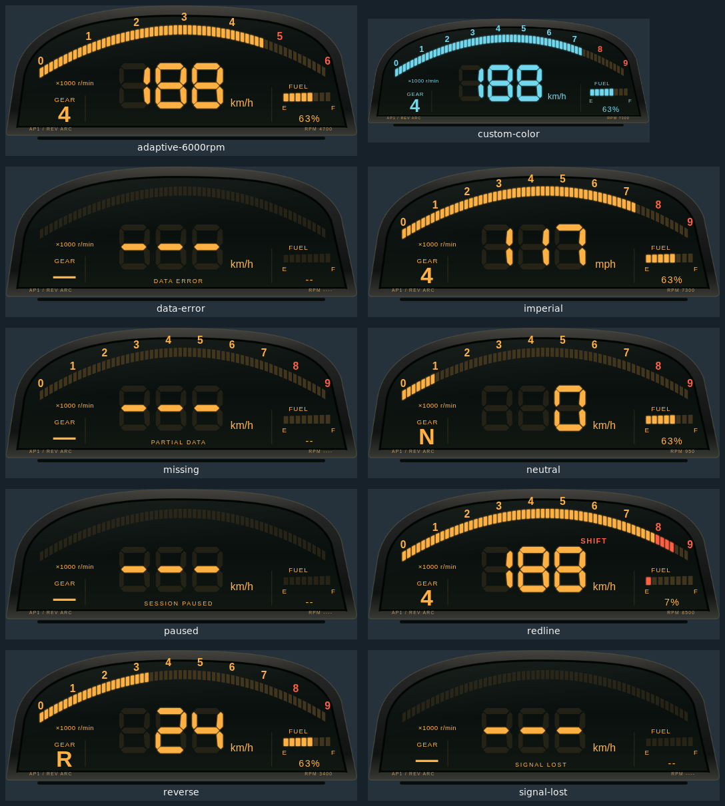

# AP1 Rev Arc：1999 Honda S2000 AP1 儀表原型

## 原型與來源

本樣式以 **1999 年 Honda S2000 AP1，日本上市初期儀表**為視覺研究對象。不是美規年份的混稱，也不是後期 AP2 儀表重製。

- [Honda 1999 年 4 月官方 Fact Book，Interior](https://www.honda.co.jp/factbook/auto/s2000/199904/046.html)：已在雲端 Chromium 實際查看座艙圖片的像素，確認低矮儀表罩、弧形數位轉速帶與中央大型速度讀值
- [該頁官方座艙圖片](https://www.honda.co.jp/factbook/auto/s2000/199904/image/037_001.gif)：僅供研究，沒有複製至本專案
- [Honda S2000 99 官方新聞資料](https://hondanews.eu/eu/fi/cars/media/pressreleases/34329/honda-s2000-99)：搜尋索引可讀到 Digital read-out 段落；直接抓取遇到 502，因此不用它聲稱已看見額外的儀表照片

原廠資料以單一半圓形數位儀表與賽車啟發為設計背景。本作品保留其辨識語彙，依遊戲遙測重新編排，沒有宣稱原廠一比一複製或官方合作。

## 設計方向與玩家

- **整體風格**：低寬煙燻黑色儀表罩、琥珀色 LCD、密集轉速分段與簡短字標，避免把既有 VFD 收音機 HUD 換色當成新風格
- **視覺主角**：60 格上拱 RPM 帶和中央大型三位七段速度；轉速刻度隨當前車輛調整，不把所有車款硬套 9000 RPM
- **HUD 改編**：左下低調檔位是遊戲用途的新增欄位，並非宣稱 1999 原廠即有此數位檔位；右下保留有來源的燃油訊息
- **目標玩家**：喜歡 1990 年代末 Honda/JDM 數位儀表、高轉自然進氣車款與簡潔道路駕駛 HUD 的玩家
- **取捨**：不加入沒有可靠遙測的水溫、油溫、機油警示、里程表、方向燈或 OEM 商標

標準 HUDCore 比例下，720 × 300 的設計面積顯示為 540 × 225 CSS px。沿用共用右下角 flex 容器與 30px 邊界；這個槽位假設用來**取代遊戲原生右下角儀表**。若同時顯示原生儀表，必須由玩家調整 HUD 比例或遊戲顯示設定。外殼以外保持透明，不宣稱適合每種遊戲 UI 配置。

## 資料契約與生命週期

| 顯示 | 來源／規則 |
| --- | --- |
| 速度 | canonical `speed_kmh` / `speed_mph` 的絕對值（支援負值倒車），搭配 `effectiveUnits.speed`、`displayUnits.speed`、`isMetric`；只有 generic `speed` 的單位一致才使用，不重新換算原始 m/s |
| RPM | `rpm`、`maxRpm`（相容 `max_rpm`）；分段比例限制於 0–1。沒有有效 maxRpm 時不畫假刻度 |
| 紅線 | 優先 `payload.redlineRpm`，否則 `data.redlineRpm`；不在樣式內推導引擎紅線。SHIFT 是此共用門檻的視覺提示 |
| 檔位 | 0 = R、11 = N、1–10 = 前進檔；不合法／缺少時顯示破折號 |
| 燃油 | 只使用 0–1 的 canonical `fuel_ratio`；缺少或不合法時顯示 `--`，不偽造油量 |
| 鮮度 | `timestamp_ms`（相容 `TimestampMS`）必須前進；1500ms 無變化即清空並顯示 SIGNAL LOST。Coordinator 即使持續重播 RAF 也不會保留假即時讀值 |

初始零值 standby 沒有 timestamp，因此保持 WAITING FOR DATA。錯誤、暫停與部分遙測有明確狀態。新 timestamp 可恢復顯示；timestamp 回繞亦可處理。三位速度無法容納的值不截斷成另一個數字。

`config` / `hud:init` 消費設定；`hud:elements` 控制可見度；`hud:animate` 只做標示 DISPLAY CHECK 的分段測試，不產生假的速度、檔位或油量。有效遙測立即中止測試，尊重 reduced motion。`hud:destroy` 與 pagehide 清理樣式 watchdog、RAF 及監聽器，保持共用 HUDCore 和通訊協定不變。主色／glow 沿用共用設定，紅線警示色保留獨立語意。儀表不另外開 WebSocket，也不重複建立共用中央遙測卡片。

## 原創資產與授權

- `hud_overlay/ap1_rev_arc/assets/fascia.svg` 是原創、可編輯的外殼向量圖
- 已使用 **Inkscape 1.4** 匯出 `fascia.png`（1440 × 600，透明外部），並用 **ImageMagick 7.1.1-43** 去除 metadata／壓縮
- 七段數字為本次手製多邊形；一般文字使用系統 sans-serif，沒有新增或複製字型
- 所有新增程式與原創圖形依本 repository 的 MIT license 提供；Honda 的照片、Logo、字型、遊戲截圖與第三方美術未被封裝
- 資產載入失敗仍以 CSS 深色外殼呈現 live 讀值，不會永久卡住啟動

重製外殼：

```sh
inkscape hud_overlay/ap1_rev_arc/assets/fascia.svg --export-type=png --export-filename=hud_overlay/ap1_rev_arc/assets/fascia.png --export-width=1440 --export-background-opacity=0
magick hud_overlay/ap1_rev_arc/assets/fascia.png -strip -define png:compression-level=9 hud_overlay/ap1_rev_arc/assets/fascia.png
```

## 驗證與誠實限制

使用技能：`halfmoon-design-system`、`telemetry-udp-protocol`、`pr-author-maintainer`。未修改 backend、共用生命週期或協定，沒有第三方產品相依新增。

- Style-owned Vitest：34 項純資料／行為測試；涵蓋單位、R/N、空值、NaN、Infinity、速度超界、燃油、適應刻度、重播 timestamp、恢復、設定與 destroy
- 完整 `pnpm -C frontend test`：157 個檔案通過／1 個略過，1139 個測試通過／1 個略過；`pnpm -C frontend build:web-hud` 與 `git diff --check` 通過。已確認 dist 包含新 HUD 且排除 tests
- 本地 Chromium 程序被執行環境的 UNIX socket `EPERM` 阻擋；require_escalated 亦相同。雲端瀏覽器至本地 fixture URL 遭 `ERR_BLOCKED_BY_CLIENT`，沒有改用其他 hostname 迴避
- **遠端 Chromium 視覺與實際 launcher／Coordinator 檢查已通過**：Linux Chrome 154.0.8037.57、sandbox 啟用，驗證 head `8b783d080511ad5b49939f7f6603bd5d86e9a659`。[CI run 37255610983](https://github.com/eddie772tw/FH6-HorizonTuner/actions/runs/37255610983)／[artifact 11322980570](https://github.com/eddie772tw/FH6-HorizonTuner/actions/runs/37255610983/artifacts/11322980570)
- 已獨立目視 DPR2 細節、十種狀態、720p／1440p 全幅與 launcher 倒車重連圖片：沒有發現裁切或文字重疊；不需變更 runtime。完整專案 CI 在此紀錄更新時仍執行中，應另看 PR checks，不能以視覺 job 取代全部 gate
- Windows 原生透明 overlay、滑鼠穿透、真實 Forza 遊戲畫面與遊戲內安全區仍須平台實測

### 實際瀏覽器預覽與證據




[720p 全幅透明 screenshot](../assets/ap1-rev-arc/metric-1280x720.png) 顯示預設右下位置。細節圖只裁切透明邊界；狀態 contact sheet 以實際截圖裁切後加標籤與深色檢視背景。三張 PNG 僅作無損壓縮，ImageMagick AE 比較均為 0。不是美術 mockup，也沒有遊戲背景。

- [視覺／viewport 自動檢查](../assets/ap1-rev-arc/visual-evidence.json)：三種解析度、DPR2、單位、R/N、紅線、缺值、錯誤、暫停、斷線、重連、resize、配色與 destroy，errors 為空
- [實際 launcher／Coordinator audit](../assets/ap1-rev-arc/launcher/host-audit.json)：含 smoothing 持續重播下的 signal loss、倒車重連、英制、顯隱、reload 與 destroy；errors 與 missing 均為空，頁面背景為透明
- [研究、像素檢查與 artifact 來源](../assets/ap1-rev-arc/review-evidence.json)：記錄瀏覽器版本、head、CI 來源與限制。JSON 保留完整 artifact 的 screenshot 名稱；repo 僅收錄精選三張，其餘可從該 artifact 取得

### 可重製瀏覽器檢查

`tests/visual/render.mjs` 不修改專案依賴。使用已安裝的 Playwright，預設 `require('playwright')` 與其 Chromium；亦可指定現有安裝：

```sh
PLAYWRIGHT_MODULE_PATH=/path/to/playwright CHROMIUM_PATH=/path/to/chromium OUTPUT_DIR=/tmp/ap1-evidence node hud_overlay/ap1_rev_arc/tests/visual/render.mjs
```

輸出 1280×720、1920×1080、2560×1440、DPR 2，以及 metric／imperial／R／N／redline／missing／低轉速車／signal lost／resize／自訂色等 PNG 與 `visual-evidence.json`。失敗也保留 JSON；不以執行腳本存在代替驗收通過。`tests/visual/fixture.html` 是可操作的相同來源 iframe 檢查頁，透過實際 HUDCore 訊息餵資料。兩個 fixture 都放在 `tests` 內，由既有 copy-hud 打包器排除。

Author / Maintainer: Bagley as Codex
