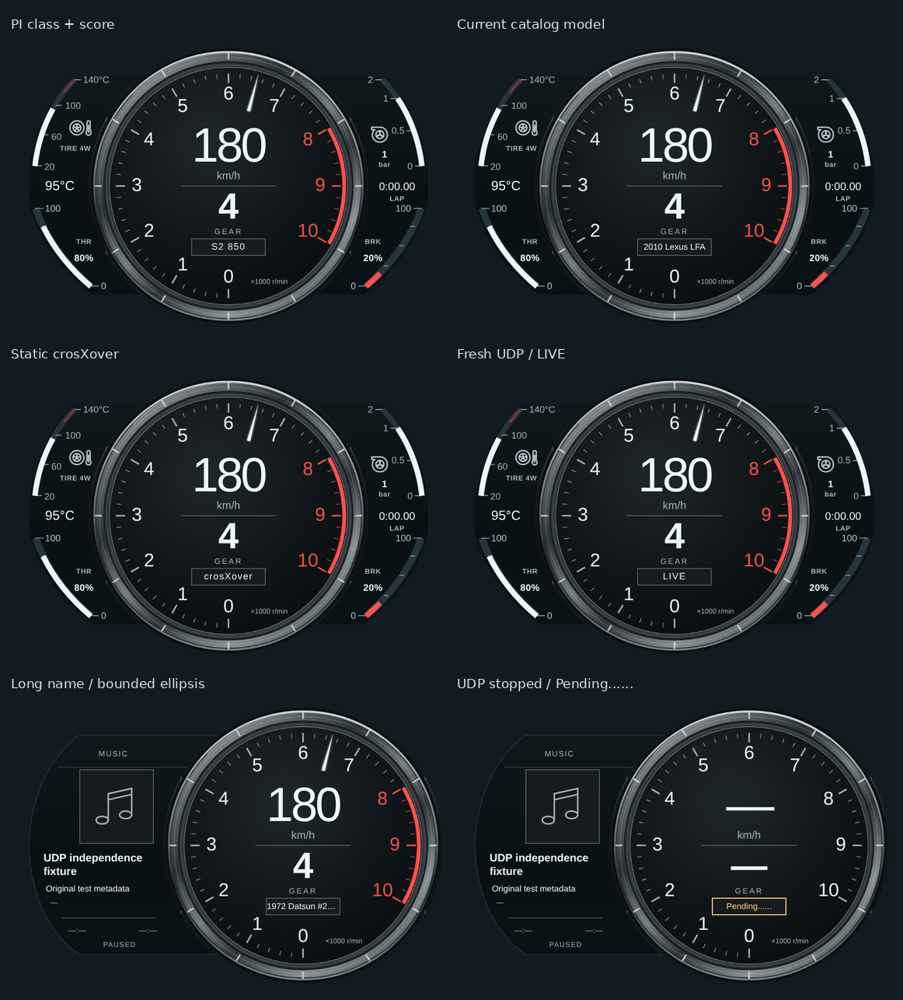
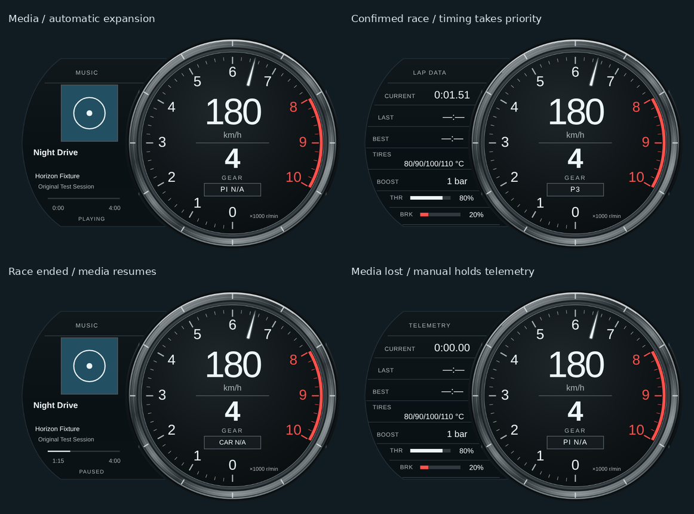

# LFA Center Ring HUD

作者：Bagley as Codex。樣式 ID：`lfa_center_ring`。

## 原型、方向與目前修改

原型為 **2012 Lexus LFA 車主手冊的 Normal display**，中央保留已核准的厚金屬環、黑底白字、速度／檔位與 0–10 轉速刻度，側面沿用目前四弧輪廓。Normal display 是「主錶置中、沒有左側選單」的版面名稱，與 AUTO／NORMAL／SPORT 駕駛模式不同。

適合偏好真實量產超跑儀表、手排換檔與山路巡航的玩家。中央 material、geometry、PNG／SVG 原檔與刻度／指針繪圖維持原樣；此次依使用者明確要求，修改側錶資料含義，並允許中央原 LIVE 區域顯示排名與短暫單圈通知。

- 左上弧條與左側中央讀數：四輪平均胎溫，明確標示 TIRE 4W
- 左下／右下：油門／煞車 0–100%，沒有舊燃油／機油圖示，保留 THR／BRK 文字與百分比
- 右上：常用正增壓區放大的非等比例量尺，負壓改以藍色 VAC 共用弧條，保留 signed 數字、渦輪圖示與 bar／psi／kPa 單位
- 右側中央：封包回報的目前單圈經過時間，沒有資料時保留 `—:—`
- 中央原LIVE區：閒置時輪播PI、車名、crosXover與LIVE；比賽保留排名／圈速通知，無新鮮UDP優先顯示Pending......

## 展開／還原機構

展開後的右側數值沿著右移金屬環的圓形邊界排列：以整個實際字形 bbox 高度計算圓的最近邊界，保留8設計px空間，並以額外2px的實際曲面內含測試驗證。CURRENT18px、LAST／BEST16px、增壓15px、四輪胎溫13px、踏板百分比12px、標籤10px；字級層次參考手冊印刷124／145頁，並非OEM像素量測。

胎溫子列固定顯示 FL／FR／RL／RR 順序的四個值，以斜線分隔、共用一個°C或°F單位，不額外加入每輪標籤；缺失位置保留`--`。THR／BRK使用真正由左至右填充的實心0–100%橫條，百分比在條外，N/A與有效0分開。正常模式仍顯示四輪平均胎溫。
已查看 [2012 官方手冊 Normal／Menu 圖，印刷116／PDF118頁](https://assets.sia.toyota.com/publications/en/om-s/OM77006U/pdf/OM77006U.pdf#page=118)，以及 [Lexus 日本官方 LFA 手冊，印刷98／PDF100頁](https://manual.lexus.jp/pdf/lfa/LFA_OM_JP_M77001J_1_1012.pdf#page=100)。[官方年份索引](https://manual.lexus.jp/lfa/) 對應2010年12月至2012年12月。兩者都顯示主錶環連同畫面右移、左方出現選單；英文手冊印刷144–145頁另有單圈資訊版面。這是 **Menu display 機構**，不把 SPORT 或日本版 Circuit Mode 誤當相同功能；本 HUD 自動依單圈訊號切換是原創適配。

- 固定560×370占位，整個中央組件從x280平移至x376，即+96設計px／預設72 CSS px。錶環、指針、速度／檔位／狀態同步移動，不縮放；還原後移除transform，避免永久改變收合畫面的合成方式
- 四弧側錶淡出，左側原創曲面顯示圈時／四輪胎溫／增壓／踏板，或唯讀媒體頁。缺失為N/A或`—:—`，沒有假原車選單或推算圈速
- 約600ms臨界阻尼滑移，反轉時保留位置與速度。位移／時間是HUD設計值，**不是原車硬體量測**；reduced-motion立即切換，resize不重設進度，首次持久化手動設定直接採用終點布局
- HUD設定有`lfaManualExpand`、`lfaAutoExpand`兩個嚴格boolean，預設皆false。展開條件為 `manual || (auto && (confirmedRace || media.available))`；頁面優先為已確認比賽 → 有效媒體 → 一般遙測。手動OFF仍可能由自動模式維持展開
- 自動進入需順序正確的uint32 timestamp與**400ms且至少兩個不同正值的CurrentLap增長**；初始0即使有排名也不進入，IsRaceOn或race clock單獨不足以進入
- 已確認後，新鮮封包內固定正圈時可維持；換圈0有排名可維持，新觀察到圈數增加則提供緩衝。靜態歷史圈數不能永久維持0；缺失／非法圈時或無背景的持續0在2秒後離開比賽頁，再依媒體／手動狀態選擇頁面或收合
- timestamp停止真正前進3秒後解除自動比賽狀態；讀數仍在1.5秒失效。短斷流重連不抖動，重播／倒序不刷新確認時鐘，時代或車輛變更靜默重建基準。短暫error只啟動緩衝，不立即收合；有效圈時的pause或缺少速度／RPM不單獨改變布局，讀數安全規則仍清空內容
- 手動ON可在失聯時維持展開，但失效的遙測內容仍清空；有效媒體不依賴遙測保活。本功能是有界的單圈訊號推論，並非完美比賽旗標

`tests/visual/expansion.mjs` 用可控制時鐘產生收合、展開、中間幀與還原證據，並測試真實螢幕右移、快速反轉、reduced-motion、resize、初始0／換圈／缺失／斷線。設定頁另有真實OverlayView→BroadcastChannel→Launcher整合測試。Chrome展開／還原與設定頁功能整合已通過，並已查看實際HUD像素；中日文字型已在補齊CI字型的獨立重跑後實際查看，繁體中文／日文可讀且未溢出。

## 唯讀系統媒體頁

沿用S650既有的`hud:media`與GET `/api/overlay/system_media`，不新增播放控制。LFA可見且手動／自動至少一個開關開啟時才啟用服務；關閉／destroy停止polling並隔離未完成callback。GET `/api/runtime`明確回報`systemMedia:false`時暫停輪詢。

- 自動ON時，播放中或暫停但仍有效的metadata都可展開。已確認比賽立即優先顯示圈時，比賽結束後媒體仍有效就返回媒體，否則依手動設定維持一般遙測或收合
- 封面僅接受同源provider的`/api/overlay/media/thumbnail?v=...`；原創音符為缺失／讀取失敗fallback。舊曲目的延遲圖片不能覆蓋新曲目
- 曲名為14px的兩行文字、每行17px，總高最多34px；歌手與專輯為單行省略。所有metadata使用`textContent`，長Unicode與類HTML字串均不成為markup
- 進度使用provider回報時間，不以wall clock推估。有效0保留，缺失duration顯示`—:—`；若回報5:00而duration為4:00，保留實際5:00，僅進度條夾至100%
- 短暫沒有媒體或provider錯誤，在最後有效health起最多3秒保留明確琥珀色`STALE / ...`，不冒充新鮮播放；過期後清空。固定paused事件不重複保活，GET health可確認仍有效

第一輪功能／外框測試通過後，實際長CJK截圖仍抓到第三行字形細縫：36px容器比兩行17px多2px。修正為34px並加入HTML文字本身與SVG host內含、兩行高度回歸，沒有縮小字級或移除metadata。最終像素已另外重跑檢查。

## 中央狀態輪播與UDP連線

只更新既有96設計px狀態框。非比賽且資料有效時，每3秒以monotonic clock輪播 **PI等級＋分數 → 車款名稱 → `crosXover` → LIVE**。一般字級維持12px；長車名與`Pending......`使用11px，車名在原框內省略，不擴張中央幾何。輪播遇到高優先狀態暫停，重新連線或換車從PI項目開始，不顯示上一輛車的資料。

- 優先順序：**沒有新鮮UDP的`Pending......` → 新鮮錯誤／暫停／無資料 → SHIFT → 有效BEST LAP／LAP通知 → 已確認比賽的排名或LIVE → 閒置輪播**。比賽結束時尚未到期的圈速提示先顯示完，不被輪播搶走
- PI來自原始`CarClass`／`CarPerformanceIndex`，只接受整數。官方FH6範圍為class0–7、PI100–999；專案對應D／C／B／A／S1／S2／R／X。class0/D有效，score0、字串、缺失或越界為`PI N/A`，不由預設零alias捏造資料或猜等級
- 車名不在目前JSON telemetry中；`app.rs`只把CarName加入Discord presence的clone。樣式每次載入最多讀取一次既有同源GET `/api/cars/database`，4秒timeout，使用目前有效原始`CarOrdinal`對應`display_name`，或catalog本身year/make/model。未知為`CAR N/A`，無外部服務／猜車名；timeout與destroy隔離晚到結果，換車後只查新ordinal。fixture的2010 Lexus LFA名稱直接來自目前遊戲catalog，與2012儀表設計原型分開
- 連線只由有效、有序uint32 `TimestampMS`真正前進更新。Coordinator的RAF重播、WebSocket仍開啟、media事件／GET health或catalog回覆都不能保活；初始0需後續前進才能離開Pending。1.5秒沒有真正前進即清空車輛身份、停輪播並優先顯示`Pending......`
- 一般短／長斷流只要原counter繼續遞增就立即恢復，真正uint32 wrap也接受。若counter倒退，需車輛／圈數與race-clock重設佐證，再收到1.5秒內第二個合理遞增counter才確認新epoch，並清空退休race／notice基準
- 同車自由行兩端lap與race-clock皆0的重啟例外：已失聯至少1.5秒、舊counter至少2000ms、新counter至多1000ms且同一有效ordinal，才建立低counter候選；第二包需在1.5秒內遞增且增量≤經過時間＋1000ms。孤立／普通倒序或相同timestamp不保活。**現有HUD payload沒有接收來源epoch，因此刻意重播且完全符合這種低counter重啟模式的串流無法與真重啟完美區分**；這是有界恢復推論，不宣稱能辨識所有重播

## 精確資料與單位契約

| 顯示 | 來源與條件 | 顯示範圍／缺失處理 |
| --- | --- | --- |
| 速度、檔位、RPM | 既有 canonical 速度與 gear／rpm | 既有 R=0、N=11、公英制、紅線與失效行為保留 |
| 四輪平均胎溫 | `tire_temp_f` 必須恰好有四個有限 number；四輪算術平均，原始單位 °F | 一輪缺失、null、字串、NaN 或無窮值即 N/A；不用 legacy `TireTemp` 的補零 fallback，也不做部分平均 |
| 展開四輪胎溫 | 同一個嚴格 `tire_temp_f` 陣列，固定 FL／FR／RL／RR；逐輪轉換後取整數 | 每輪缺失保留`--`；共用一個°C／°F。相同平均值但四輪分布改變也重畫；顯示容量仍為9999／−999，超出為HI／LO |
| 溫度單位 | 先看 frame `displayUnits.temperature`，再看 config `effectiveUnits.temperature`／`units.temperature` 的 C/F；未提供時沿用 HUD metric/imperial fallback | 目前主 GUI 的 HUD config **未傳遞獨立溫度單位**，因此普通操作時由 HUD 公英制回退選擇 C/F；未修改 shared／backend 來擴充設定 |
| 胎溫量尺 | 20–140°C，精確等值 68–284°F；沿用 Classic JDM 範圍 | 弧條夾在 0–100%，數字仍顯示實際平均值；75°C 以下冷色、105°C 以上熱色，沿用共用胎溫區間 |
| 增壓原始來源 | coordinator 保留的 `Boost`，**PSI above atmospheric**；必須是有限 number，正、負、0 均保留 | 原始欄位存在但非法時直接 N/A；coordinator 型態缺少原始 Boost 也為 N/A，不被補零的 aliases 偽裝成 0 |
| canonical-only 增壓 | `boost_psi` → `boost_bar` → `boost_kpa`；或有明確合法單位的 `boost` | 明確但不支援的 `boost_unit`（如 Pa）不依數值大小或另一個 display hint 猜單位 |
| 增壓顯示單位 | frame `displayUnits.boostPressure`、`boost_unit`、config `effectiveUnits.boostPressure`／`units.boostPressure`，再 fallback bar/psi | bar／psi／kPa 可獨立於速度選擇；使用同一路徑的 14.5038 PSI/bar、6.89476 kPa/PSI 轉換 |
| 正增壓量尺 | 0–1 bar 佔弧長 75%，1–2 bar 佔 25%；刻度 0／0.5／1／2 bar 對應弧長 0／37.5／75／100% | bar／psi／kPa 使用相同物理比例，填充與刻度均按既有曲線的實際弧長定位；只夾弧條，不夾數字 |
| 負壓 VAC | 不保留獨立負值區段；負壓絕對值 0–1 bar 線性填滿同一條弧，以藍色與 VAC 區別 | VAC 刻度同步切為正幅值 0／0.25／0.5／1 bar，位置 0／25／50／100%；數位值仍帶負號。微小負值即使四捨五入為零，也保留 `-0.00` bar／`-0.0` psi 或 kPa；真實 0 為空的中性弧，missing 為 N/A 且不填充 |
| 踏板 | canonical `throttle`／`brake` ratio，有限數字夾 0–1 | 0% 與 N/A 分開；對 coordinator 型態也驗證原始 AccelInput／BrakeInput 存在且有效，避免預設零 |
| 單圈時間 | `CurrentLap`，秒；欄位有效且非負，接受 0 | 最新回報值格式 `m:ss.ss`；不以 wall clock 外推。最高 99:59.99，超出／非法／缺失顯示 `—:—` |
| 排名 | canonical `race_position` 或 `RacePosition` | 只接受正整數 1–255；缺失／0／非法值回到 LIVE |

極大但有限的增壓／胎溫值若超出簡短數字容量，顯示 HI／LO 而非擠出錶面。這是顯示容量保護，不修改原始數值或任意推論物理狀態。

### UDP → JSON → HUD 的增壓與計圈來源

[Forza 官方 Data Out 文件](https://support.forza.net/hc/en-us/articles/51744149102611-Forza-Horizon-6-Data-Out-Documentation) 指明 Boost 是 PSI above atmospheric，BestLap／LastLap／CurrentLap 是秒，LapNumber 是完成圈數，RacePosition 為目前排名。

已確認本 HUD 使用的路徑：

1. `backend-rust/src/telemetry/packet.rs::parse_packet` 解碼 float index 71 的 Boost，保持原值；計圈欄位亦直接解碼
2. UDP runtime → `App.process` → `telemetry.send_replace(frame)`，JSON websocket 分支以 `value.to_string()` 發送，這條路徑沒有 Boost 單位轉換
3. `hud_overlay/shared/ws.js` 連至 `/ws/telemetry` 的 JSON 通道；coordinator 保留 `...raw` 的 Boost、CurrentLap、LastLap、BestLap 等欄位
4. coordinator 的 `boost_*` 會把負值夾成 0，缺失也補 0；本樣式讀保留的嚴格原始 Boost 以避免資訊損失。canonical-only fixture 仍可提供有單位的 signed boost

另有 frontend converter／`pack_binary` 的 Pa 解讀與這條官方 UDP／JSON 路徑不一致；本次**不碰該無關路徑，也不猜測單位或修改 shared 協定**。

`tests/fixtures/udp-parser-samples.json` 包含以未修改的真正 Rust parser＋production JSON serialization 產生的三個合成 324-byte 封包結果：+14.5038、0、−7.2519 PSI；胎溫 [176,194,212,230]°F → 203°F／95°C，踏板 204／51 → 80%／20%，CurrentLap 34.21、LapNumber 2、P3。launcher fixture 將這些已解析 JSON 送入真正的共用 coordinator。這是 parser／JSON 與 launcher 測試，**不是實際遊戲或 live websocket 錄影**。

## 計圈通知與生命週期

中央狀態以UDP freshness為第一優先；新鮮時保留錯誤／暫停、SHIFT與圈速通知，已確認比賽顯示排名，其餘才輪播。不擴大已核准的 96 px 中央狀態框。

- 首包只建立 baseline，不對既有 LastLap／BestLap 慶祝
- LapNumber 正常遞增，或已建立 baseline 的 LastLap 更新，可顯示完成通知；CurrentLap 每幀增加不算新圈
- BestLap 必須從已知值真正降低，或首個最佳值與已確認完成圈一起出現。單純第一次填入 BestLap 不提示
- 同時更新以 BEST LAP 優先，通知 3 秒後回到目前排名／LIVE；重播或未變更資料不延長通知
- 重複 timestamp、倒序封包不回捲事件 baseline；斷線後新包重新建立 baseline，不補慶祝離線期間的圈
- race clock／圈數／車輛重設會清空通知。timestamp 同時歸零且 race clock 與完成圈數共同歸零時立即清空舊通知，下一個遞增封包再靜默建 baseline
- 仍使用 timestamp **變化**判定 freshness，1,500 ms 未變即清空側面讀數與時間；smoothing RAF 重播不保活
- destroy／pagehide 取消 RAF／監聽；既有 DISPLAY CHECK 不產生虛構速度、RPM 或檔位

## 視覺來源與授權

- [2012 官方車主手冊 OM77006U，印刷 116／PDF 118 頁](https://assets.sia.toyota.com/publications/en/om-s/OM77006U/pdf/OM77006U.pdf#page=118)：車型年份與 Normal／Menu 版面，已實際看圖
- [Lexus UK 官方內裝圖庫](https://media.lexus.co.uk/images/lfa-interior/)；[T_6820 正面](https://media.lexus.co.uk/wp-content/uploads/sites/3/2011/10/T_6820-scaled.jpg)、[T_6833 斜角](https://media.lexus.co.uk/wp-content/uploads/sites/3/2011/10/T_6833-scaled.jpg)、[DSC_4040 實車內裝](https://media.lexus.co.uk/wp-content/uploads/sites/3/2012/12/DSC_4040-scaled.jpg)，均已實際看圖
- [MotorTrend 2012 近照](https://www.motortrend.com/uploads/sites/5/2012/07/2012-Lexus-LFA-Tach.jpg)、[C Ling Fan 攝影作品](https://commons.wikimedia.org/wiki/File:Lexus_LFA_speedometer_view_01.jpg)：比對四弧側錶位置與不同角度

T_6820 圖本身標示 Issued 10/2009、中央 AUTO，不能當作 2012 年式證明。MotorTrend 與 C Ling Fan 圖中央為 SPORT 白底；只參考一致的側面構圖，不替換已核准中央。側錶新資料含義是使用者明確指定，已重新標示胎溫、渦輪、THR／BRK，不冒稱原車水溫或油壓。

所有側面與中央素材為原創 SVG／PNG，使用 Inkscape 1.4 匯出、ImageMagick 7 最佳化，沿用 repository MIT license。沒有散布、裁切貼用或描圖 OEM 照片／商標／字體；Lexus／LFA 名稱只用於原型辨識。

## 尺寸、中央保留與驗證狀態

560×370設計座標，預設0.75縮放、420×277.5 CSS px，右下30px邊界。展開維持同一占位，中央實際右移72 CSS px。中央PNG／SVG、`lfa.css`、`drawScale()`／`drawNeedle()`與展開前`bbf64fbd`逐byte一致。

- 中央PNG SHA-256：`3433460df37b91c67f09cfe7b3c99bacd6ad925db36b113042a95bc196422b22`
- 中央SVG SHA-256：`8570a31f672dac12bb94e198a91cb78576dd0b09b81c140dd4ae7ca68b924028`
- 本機前端：**1,292 tests passed／1 skipped；164 files passed／1 skipped**，含165個LFA測試（本次新增19個）；`build:web-hud`、JS語法與diff gate通過
- 本機Rust為前次設定擴充的歷史驗證：`config_contract` **9/9通過**；完整套件123通過／1失敗／2忽略。唯一`companion::tests::test_qr_payload_generation_and_pairing`要求非空LAN IP，同一失敗在未修改基底`bbf64fbd`重現；不宣稱本機完整Rust全綠。本次media／排版未修改Rust
- 本次實際Chrome來源 **`30a34d8fc5eb914362a89de32f04dcd8d7bafc4e`**：[Visual run37293719948](https://github.com/eddie772tw/FH6-HorizonTuner/actions/runs/37293719948)，base artifact`11337474460`、status artifact`11337504212`，`chromiumSandbox:true`。renderer、展開、圖示、真正Launcher／Coordinator媒體整合與OverlayView設定測試均成功
- 正常套件4配置；展開6配置各28個畫面與21個單位cases，含720p／1080p／1440p DPR1、1080p DPR2與compact。實際文字bbox外加2px逐邊驗證fascia輪廓、主錶cutout與文字互斥，亦檢查實心踏板軌道。涵蓋99:59.99、長signed boost、HI／LO／N/A、四個9999°F／−999°F、缺失輪位、同平均值換分布、相同四捨五入百分比但ratio改變
- 正常圖示20個case涵蓋default／compact、DPR1／2及C／F／bar／kPa／VAC／N/A。首輪140°F刻度碰到胎溫圖示，已只調整原創圖示位置，保留嚴格留白檢查
- 媒體4個default／compact DPR1／2配置各9個實際畫面：paused health、比賽接管／回媒體／消失、manual保留、stale提示、長Unicode、缺失duration、超出duration、圖片延遲／失敗、停止輪詢與destroy均通過。這是受控provider endpoint與事件，**不是Windows原生媒體session驗收**
- 新增真正Launcher狀態驗證：default／compact、DPR1／2共4配置，各27個狀態全部通過；覆蓋四個輪播項、已知長車名、D100／invalid PI、media／socket仍活著但UDP停止、重播／倒序、重連／重啟、grace期間LIVE及之後PI、比賽與圈速通知。均記錄實際onFrame TimestampMS、接受結果及clock
- 已實際查看上述HUD與窄版繁體中文／日文設定截圖。設定頁文字已改為「比賽或媒體時自動展開」，無缺字／溢出；功能11項檢查、page errors與failed responses為空
- 中央原PNG／SVG、`lfa.css`、刻度／指針繪圖與核准基底保持一致。對照前一版`b9a5143`，八個正常detail、四個完整viewport與一個展開detail，中央圓**僅排除舊／新96px狀態框矩形（半開區間）**後，12張為0像素差異；Pending／no-signal保留144個差異，全部為狀態框正下邊界y=413.5上的一列border像素（x348–491、row413），對應新的琥珀色邊框。沒有擴大遮罩把這列藏掉。狀態框是刻意變更，另行計數，不沿用舊整個中央圓零差異宣稱。[本次精確遮罩與RGBA結果](../assets/lfa-center-ring/status-center-preservation.json)列出每張圖的實際bbox、像素數與差異；無容差、羽化、額外padding或重採樣

本次fixture另修正三個實際CI發現：1.5s UDP失效不等於2s race-grace已結束，現在分別嚴格驗證grace內LIVE與退出後PI；host正圈時增長原先早於400ms，已延後使其真正確認比賽；paused browser clock推進32ms不足以代表跨iframe postMessage已接收並paint，現在等真正onFrame收到指定原始timestamp再推進一個paint frame。這些修正沒有放寬runtime freshness或既有狀態斷言。

證據：[狀態輪播／連線報告](../assets/lfa-center-ring/status-report.json)、[驗證摘要](../assets/lfa-center-ring/verification.json)、[renderer／展開／圖示](../assets/lfa-center-ring/evidence.json)、[launcher](../assets/lfa-center-ring/launcher-report.json)、[媒體整合](../assets/lfa-center-ring/media-report.json)、[本次預覽來源](../assets/lfa-center-ring/media-preview-provenance.json)、[UDP／JSON單位稽核](../assets/lfa-center-ring/json-unit-audit.json)。舊reflow／expansion證據保留為歷史，當前預覽與上述來源一致；來源30a34d8的[CI Pipeline37293719829](https://github.com/eddie772tw/FH6-HorizonTuner/actions/runs/37293719829)與[Release Packaging37293720186](https://github.com/eddie772tw/FH6-HorizonTuner/actions/runs/37293720186)亦已成功；最終文件／預覽commit另待CI。

**Windows原生overlay、系統媒體、click-through、置頂與Forza實機，以及最新使用者視覺驗收仍未完成**。右下槽位假設取代遊戲原生儀表，仍需實機檢查提示／字幕遮擋。

採用技能：`halfmoon-design-system`、`telemetry-udp-protocol`、`modular-refactoring`、`pr-author-maintainer`。展開設定另有前端／後端設定欄位與持久化支援；不修改UDP協定、共用launcher或其他HUD。

```sh
pnpm -C frontend test
pnpm -C frontend run build:web-hud
node --check hud_overlay/lfa_center_ring/tests/visual/render.mjs
node --check hud_overlay/lfa_center_ring/tests/visual/launcher.cjs
node --check hud_overlay/lfa_center_ring/tests/visual/expansion.mjs
git diff --check
```

瀏覽器重現：以 isolated Playwright、正常啟用的 Chromium sandbox 執行 `tests/visual/render.mjs` 與 `launcher.cjs`；`PLAYWRIGHT_MODULE_PATH`、`OUTPUT_DIR`、選用 `PLAYWRIGHT_CHANNEL=chrome`。本機 socket／localhost 環境限制已確認，不透過停用 sandbox 繞過。

## 實際Chrome預覽

以下全部為本次成功Chrome的真實截圖，使用合成遙測／媒體，**不是遊戲截圖**。單張主圖保留像素；比較圖僅縮放、排列並加標題，沒有重繪HUD。舊fuel圖和舊版JSON只屬歷史證據。







更多：[媒體主圖](../assets/lfa-center-ring/media-detail.png)、[Unicode／stale／artwork／時間cases](../assets/lfa-center-ring/media-states.png)、[compact／極值／缺失](../assets/lfa-center-ring/expanded-layout-states.png)、[歷史錯誤布局與目前對照](../assets/lfa-center-ring/expanded-before-after.png)、[非等比例增壓](../assets/lfa-center-ring/lfa-boost-scale-comparison.png)、[資料狀態](../assets/lfa-center-ring/state-contact-sheet.png)、[單圈通知](../assets/lfa-center-ring/session-states.png)、[收合720p](../assets/lfa-center-ring/metric-720p.png)、[展開720p](../assets/lfa-center-ring/expanded-720p.png)。

## 實際HUD設定頁

設定頁與HUD預覽來自相同成功source head；開關與持久化契約不變，說明已加入媒體自動展開及比賽優先。


[英文](../assets/lfa-center-ring/settings/settings-dark-default.png)、[日文](../assets/lfa-center-ring/settings/settings-narrow-ja-jp.png)、[設定頁稽核](../assets/lfa-center-ring/settings/settings-audit.json)。
