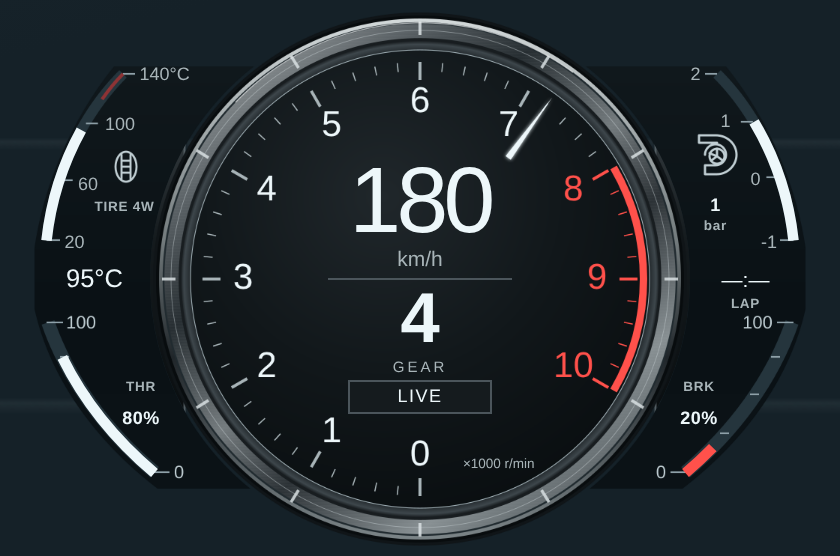
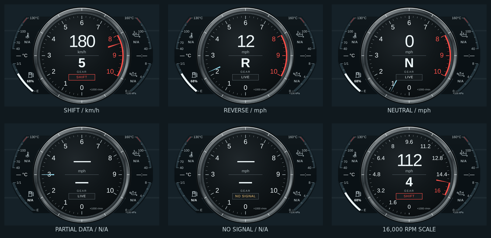
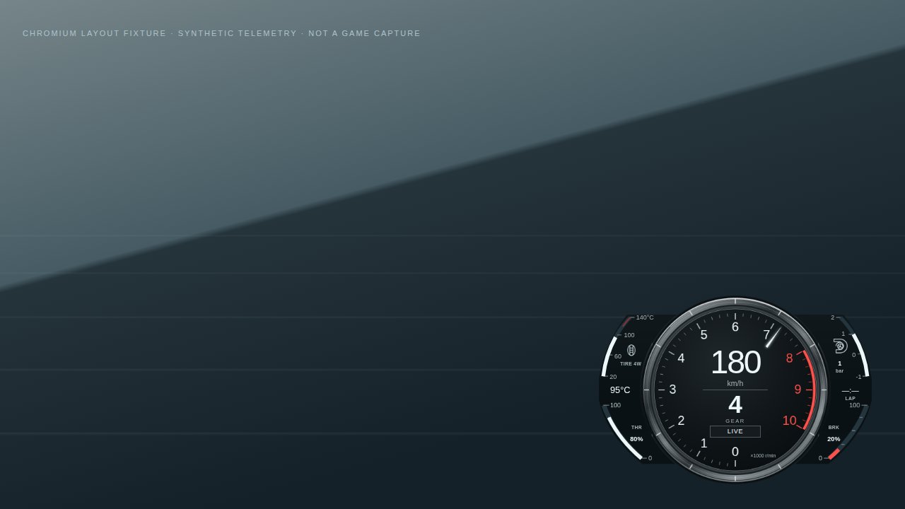

# LFA Center Ring HUD

作者：Bagley as Codex。樣式 ID：`lfa_center_ring`。

## 原型、設計方向與適合玩家

以 **2012 Lexus LFA、車主手冊的 Normal display（非 Menu display）** 為明確原型。此處的 Normal 是儀表版面名稱，不宣稱遊戲提供原車 NORMAL／SPORT 駕駛模式。本設計保留厚金屬中央錶環、黑底白字、順時針 0–10 轉速刻度、上方數位速度與中央檔位，以及兩側克制的窄翼資訊。

適合喜歡真實量產超跑儀表、手排換檔與山路巡航、想減少一般賽車電腦欄位密度的玩家。不是既有 Mustang S650 的換色，也不是 GT3 賽車資料面板。金屬環與側翼由原創 SVG 製作，使用 **Inkscape 1.4** 匯出透明 PNG，再以 **ImageMagick 7.1.1-43** 無損移除 metadata／最佳化壓縮；靜態材質走 PNG，轉速刻度／指針走 Canvas，文字走 DOM。

## 實際瀏覽器預覽

本次依使用者回饋重建兩側子錶，中央錶面保持已核准版本。以下暫留 commit `93085acd2ff238650dd9e2ac6c552e224ebdd060` 的上一版實際截圖，作為中央保留基準，**尚未呈現此次側錶修訂**；新 browser gate、截圖與中央圓形區域比對待補。所有截圖輸入為測試 fixture，不是 Forza 遊戲截圖。







狀態拼圖僅縮小並排列實際截圖，未重新繪製儀表；其他預覽只移除 metadata 並最佳化 PNG 壓縮。原始 artifact 保留全部尺寸與狀態。

## 官方視覺來源與授權

- [Lexus USA：2012 Lexus LFA 官方圖庫](https://pressroom.lexus.com/album/2012-lexus-lfa/)：核對車型與年份；開發時圖庫的 S3 縮圖回傳 AccessDenied，因此沒有把未看見的照片列為已驗證構圖。
- [Toyota／Lexus 官方車主手冊 OM77006U](https://assets.sia.toyota.com/publications/en/om-s/OM77006U/pdf/OM77006U.pdf#page=118)：**印刷第 116 頁，PDF 第 118 頁**，已下載並實際檢視 Normal display 與 Menu display 的像素。Normal 圖可辨識金屬大環、0–10 tachometer、速度位於檔位上方、窄側翼與原車輔助儀表。此為本次可驗證的主要視覺來源。

### 側錶二次研究：實車照片與模式區分

本次額外下載並實際檢視下列實車照片，不只依賴手冊示意圖：

| 來源 | 實際看見的內容 | 本次用途／限制 |
| --- | --- | --- |
| [Lexus UK 官方 LFA Interior 圖庫](https://media.lexus.co.uk/images/lfa-interior/)／[T_6820 原圖](https://media.lexus.co.uk/wp-content/uploads/sites/3/2011/10/T_6820-scaled.jpg) | 正面駕駛艙；中央為 AUTO、藍色錶面，左右各兩個沿外緣彎曲的量尺 | 照片本身標示 **Issued 10/2009**，雖於 2011 圖庫發布，也不能當成 2012 年式證據。只用於早期標準置中版面與四側錶位置 |
| [Lexus UK T_6833 原圖](https://media.lexus.co.uk/wp-content/uploads/sites/3/2011/10/T_6833-scaled.jpg) | 斜角實車近照，可見環與後方螢幕的層次 | 確认側錶屬於深色背景螢幕，不是帶亮框、凸起的獨立數位卡片；部分文字失焦，不用來判斷刻度值 |
| [Lexus UK DSC_4040 原圖](https://media.lexus.co.uk/wp-content/uploads/sites/3/2012/12/DSC_4040-scaled.jpg) | 2012 圖庫的實車斜角內裝照片 | 核對安裝比例與黑色座艙融合方式，不用模糊小字推測模式或數值 |
| [MotorTrend 2012 專題](https://www.motortrend.com/news/thread-of-the-day-are-you-afraid-to-rev-your-engine-to-its-redline-228293)／[2012-Lexus-LFA-Tach 原圖](https://www.motortrend.com/uploads/sites/5/2012/07/2012-Lexus-LFA-Tach.jpg) | 高解析度正面近照；**SPORT 白色中央錶面**，四側錶清晰，圖片 EXIF 標示 ISP-Grube.de | 只核對冷卻液、機油溫度、燃油、機油壓力的位置、弧線、短刻度與填條；不採用 SPORT 中央白底 |
| [C Ling Fan：Lexus LFA speedometer view 01](https://commons.wikimedia.org/wiki/File:Lexus_LFA_speedometer_view_01.jpg)／[原圖](https://upload.wikimedia.org/wikipedia/commons/f/f7/Lexus_LFA_speedometer_view_01.jpg) | 2009-10-31 攝影作品，實車反光／斜角，中央 SPORT 顯示 | 比對不同視角仍維持四量尺結構；屬早期照片，不宣稱是 2012 年式。僅作視覺參考，沒有將 CC BY 照片散布於專案 |

手冊的 Normal display 是「主錶置中、沒有左側選單」的版面名稱，和 AUTO／NORMAL／SPORT 驅動模式不同。上述照片有 AUTO 與 SPORT，本次只採用其一致的側錶結構，**已核准的中央黑底、金屬環、刻度、字體與位置均維持原樣**；2012 年式範圍仍以 OM77006U 為準。

診斷差異：前一版把側面畫成兩塊大百分比卡片，具有直立內壁、明顯外框與水平踏板條。實車是四個上下分區的狹長弧形量尺，沿外緣配置短刻度，圖示位於量尺內側，中段留給環境溫度與時鐘；外殼高低延伸較長，融入黑色背景。本次依此重建側錶輪廓、分區、量尺與手繪通用圖示。

### 核准中央區域的保留界線

- `assets/center-ring.png` 與 `.svg` 原檔逐位元保留，不重新匯出中央圖層
- 原有中央 CSS、文字 DOM、`drawScale()` 與 `drawNeedle()` 保持不變；只移除原側翼專用 CSS
- 新增 `side-crescents.svg`／PNG 作獨立側面圖層；中央半徑 180 設計像素內透明
- 以同心半徑 180 的外層裁切隱藏舊圖的過大側翼，這是唯一必要的邊界合成調整；中心仍為 `(280,185)`，尺寸與縮放未變
- 已驗證中央 PNG SHA-256：`3433460df37b91c67f09cfe7b3c99bacd6ad925db36b113042a95bc196422b22`；SVG：`8570a31f672dac12bb94e198a91cb78576dd0b09b81c140dd4ae7ca68b924028`
- 待新 CI 實際截圖回來後，以包含核准金屬環的中央圓形遮罩和原圖進行像素比較，不把需要改變的側翼算入中央差異

沒有打包、裁切、描圖或重新散布官方照片、手冊圖片、商標、OEM 字體或原車面板貼圖。Lexus／LFA 名稱僅用於原型辨識，不代表合作或官方產品。`assets/center-ring.svg`／`center-ring.png`、CSS 與程式均為本 PR 原創內容，沿用 repository 的 MIT license。

## 遙測誠實性

| 顯示 | 資料 | 缺失／異常處理 |
| --- | --- | --- |
| 速度 | canonical `speed_kmh`／`speed_mph`；具 `displayUnits.speed` 才可使用 `speed` | 有限數值取絕對值以支援倒車；超過三位數容量 999 顯示 `—`，不截斷或回繞 |
| 檔位 | `gear` | 0＝R、11＝N、1–10 保留；缺失／非法值＝`—` |
| 轉速 | `rpm`、`maxRpm`／`max_rpm` | 缺失指針隱藏；不從速度或聲音推算 |
| 紅線／SHIFT | 優先 `payload.redlineRpm`，其次 canonical `data.redlineRpm`，並需有效最大轉速 | 缺失時無紅線／SHIFT；不硬套 LFA 原車 9,000 rpm |
| 左下燃油量尺 | canonical `fuel_ratio`，0–1 | 0%／100% 為真實端點；缺失、非有限數值或超出 0–1＝N/A，沒有填條 |
| 左上冷卻液／右上油溫／右下油壓 | 沒有可靠支援欄位 | 保留原型量尺和圖示，明確顯示 N/A，不畫出讀值填條或指針 |
| 側面中段環境溫度／車輛時鐘 | 沒有來源 | 顯示 `— °C`／`—:—`，不製造氣溫或遊戲時間 |
| 狀態 | timestamp、race-on、success/error | WAITING／NO DATA／PAUSED／DATA ERROR／NO SIGNAL |

原車側翼的冷卻液、機油溫度與壓力沒有可靠對應欄位，**本 HUD 不製造這些讀數，也不拿胎溫或踏板輸入代替物理感測器**。固定量尺採參考照片的 °C／×100 kPa；與速度公英制設定分開。新側錶移除原來的油門／煞車卡片，保留唯一有 canonical 來源的燃油弧條。所有速度單位轉換由共用 coordinator 負責，本樣式不重算物理或重新解碼 UDP。

0–10 刻度代表真實的 `×1000 r/min`，不是 0–100% 的偽刻度。最大轉速不高於 10,000 的車保留原型量尺；較高轉速車以 2,000 rpm 向上取整上限，維持 11 個真實數值標籤。例如 16,000 rpm 的刻度為 0、1.6、3.2…16。指針、刻度與紅線使用同一上限。

## 資料中斷與生命週期

- 以 `timestamp_ms`／`TimestampMS` 的**變化**判斷新封包，1,500 ms 未變化即清空行車值與警示，顯示 NO SIGNAL。共用 coordinator 的 RAF 重播不會延長資料有效期限
- 僅對沒有 timestamp 的第三方 fixture 使用有意義讀數變化作 fallback；相同讀數不會永久保持 LIVE，launcher 的全零待機畫面維持 WAITING
- race-off、`success:false`、truthy `error` 與完全缺失資料立即清空數值；下一個有效新 timestamp 可恢復，不保留前車讀數
- `hud:init`／`config`／`hud:elements`／縮放沿用 HUDCore。動畫只繪製有 DISPLAY CHECK 標示的錶圈亮線，不掃出虛構車速、轉速或檔位；新有效遙測立即結束檢查
- `hud:destroy`／`pagehide` 取消 RAF、解除本樣式的監聽器。destroy 後 hooks 不再更新已卸載介面
- 自訂色影響已核准中央指針；燃油條保持實車式冷白，紅線保留紅色語意。glow＝0 可關閉指針發光

## 尺寸與 safe zone

560 × 370 設計座標，預設 HUDCore 全域倍率 0.75，視覺槽位約 420 × 277.5 CSS px。沿用 `.hud-root-wrapper` 右下角 30 px 邊界與 framework 縮放；外殼外側透明。靜態材質 PNG 為 1120 × 740，Canvas 隨實際 DPR 1–3 重建 backing store。

此槽位**假設取代遊戲右下原生儀表**，不是承諾與原生儀表同時開啟時互不遮擋。720p 的寬度佔比最大，須在實際遊戲中確認右側提示、字幕及玩家自訂 HUD 比例。Windows click-through、置頂、原生 overlay 與 Forza 實機尚未驗收。

## 重現與驗證

採用 skill ID：`halfmoon-design-system`、`telemetry-udp-protocol`、`pr-author-maintainer`。未改 shared 協定、coordinator、HUDCore 或後端；新增的 tests 已由既有 Vitest include glob 收集。

```sh
pnpm -C frontend install --frozen-lockfile --store-dir /tmp/lfa-pnpm-store
pnpm -C frontend test
pnpm -C frontend run build:web-hud
node --check hud_overlay/lfa_center_ring/tests/visual/render.mjs
git diff --check
```

基於已核准的 PR head `dfad352be6728fca43e443a8610aa447a6c59472` 執行此次側錶修訂；本機完整前端測試：**156 files passed／1 skipped；1,134 tests passed／1 skipped**（含本樣式 29 個行為測試）。`build:web-hud` 通過，已確認新樣式入口、JS、CSS、原創 PNG／SVG 打包至 `frontend/dist/hud/lfa_center_ring/`，測試目錄不隨產品打包。

### Chromium fixture gate

```sh
PLAYWRIGHT_MODULE_PATH=/path/to/node_modules/playwright \
OUTPUT_DIR=/tmp/lfa-evidence \
node hud_overlay/lfa_center_ring/tests/visual/render.mjs
```

預設使用 Playwright 內附 Chromium；只有明確提供 `CHROMIUM_PATH` 才指定外部執行檔。啟用 Chromium sandbox，不透過停用 sandbox 解決環境限制。不增加產品 npm dependency。

runner 以真正的 HUDCore dispatcher 檢查 1280×720、1920×1080、2560×1440、1920×1080 DPR2，涵蓋初始化、設定、公英制、倒車、空檔、高轉速、紅線、缺失／非法值、錯誤、暫停、重播 timestamp 逾時、重連、隱藏恢復、resize、動畫與 destroy；成功或失敗都輸出 `evidence.json`，有頁面時保留失敗畫面。完整 viewport 與主要狀態 PNG 供人工檢視，不採逐像素／Canvas 呼叫次數斷言。

本機無法啟動獨立 Chromium（UNIX socket EPERM），雲端瀏覽器開啟本機 fixture 被 ERR_BLOCKED_BY_CLIENT 阻擋；因此改由正常 GitHub Actions 執行，不停用 sandbox。**此次側錶修訂的 browser gate 與新截圖仍待完成；以下為上一版已核准中央的歷史證據，不當成新側錶通過證明**：

- [GitHub Actions run 37256008636](https://github.com/eddie772tw/FH6-HorizonTuner/actions/runs/37256008636)，原始碼 head `93085acd2ff238650dd9e2ac6c552e224ebdd060`，artifact ID `11322413248`
- 使用 GitHub runner 預先安裝的 Chrome **154.0.8037.57**，Playwright `chromiumSandbox: true`；沒有新增產品相依套件
- [完整 fixture 報告](../assets/lfa-center-ring/evidence.json)：四組 viewport／DPR 配置全部完成，`passed: true`，每組 `errors: []`
- [真正 launcher 報告](../assets/lfa-center-ring/launcher-report.json)：動態發現、raw telemetry → coordinator、smoothing 重播後失效、帶負號倒車重連、公英制、720p、隱藏恢復、樣式重載及 destroy 完成；`errors: []`、`missing: []`
- 已實際檢視公英制、R／N、SHIFT、部分資料、NO SIGNAL、高轉速與完整 720p／1080p／1440p 圖片；依第一輪像素修正狀態框碰到刻度 1 的問題，以及高轉速長標籤與主刻度碰撞，第二輪截圖確認消除
- [驗證摘要與來源](../assets/lfa-center-ring/verification.json) 記錄來源 commit、run、artifact 與本機測試結果

以上是 Linux Chromium／Chrome 合成遙測與 launcher 驗證，**不等同 Windows 原生 overlay 或 Forza 實機驗收**。

互動手動 fixture：`node hud_overlay/lfa_center_ring/tests/visual/serve.mjs`，在可連到該伺服器的瀏覽器開啟終端顯示網址。`tests/visual/fixture.html` 可切換尺寸／狀態並執行行為檢查；此頁不打包於產品。
