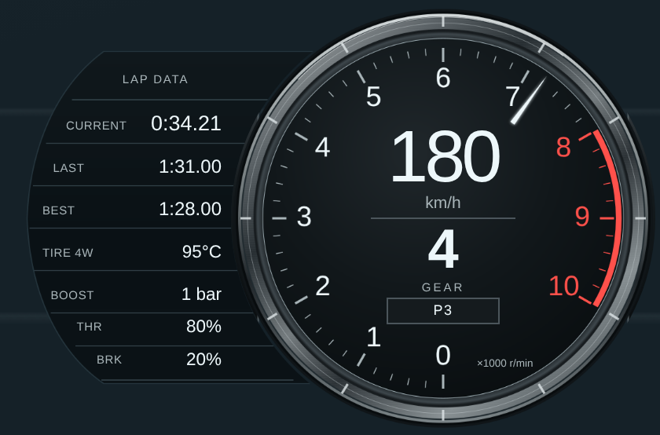
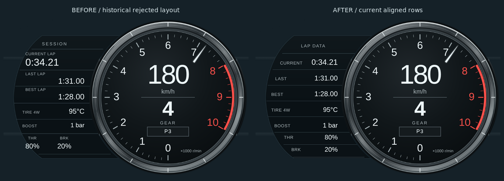
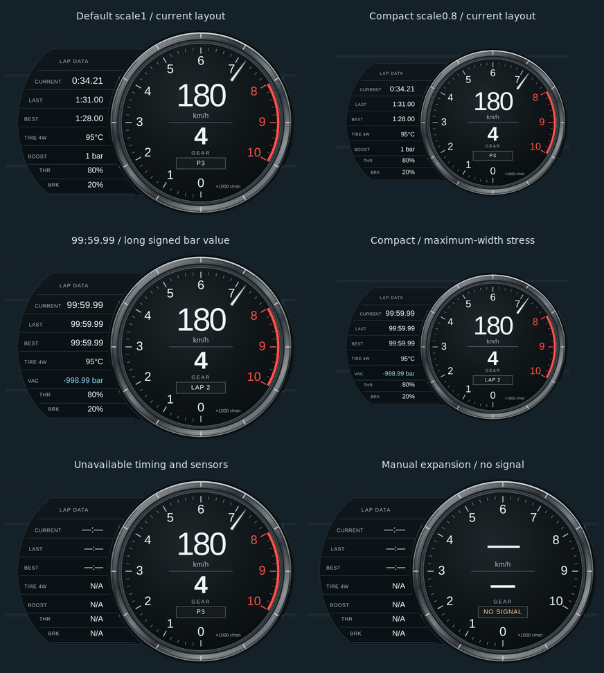
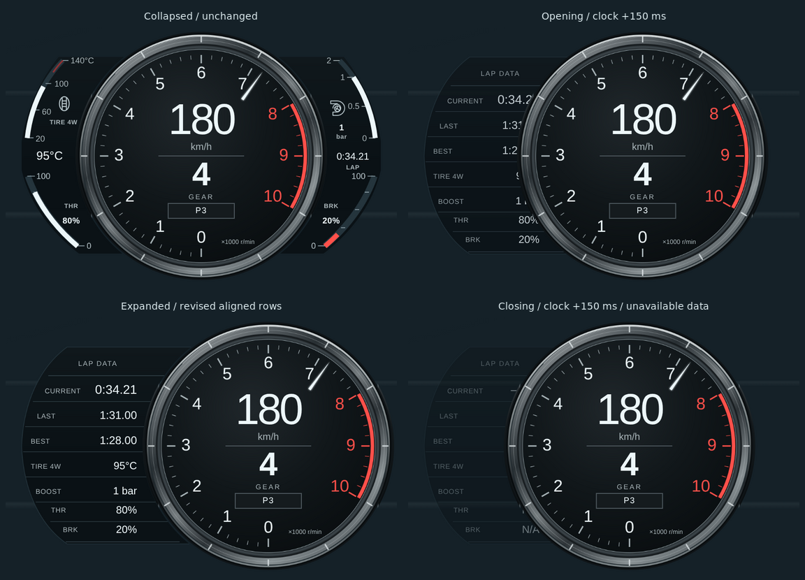
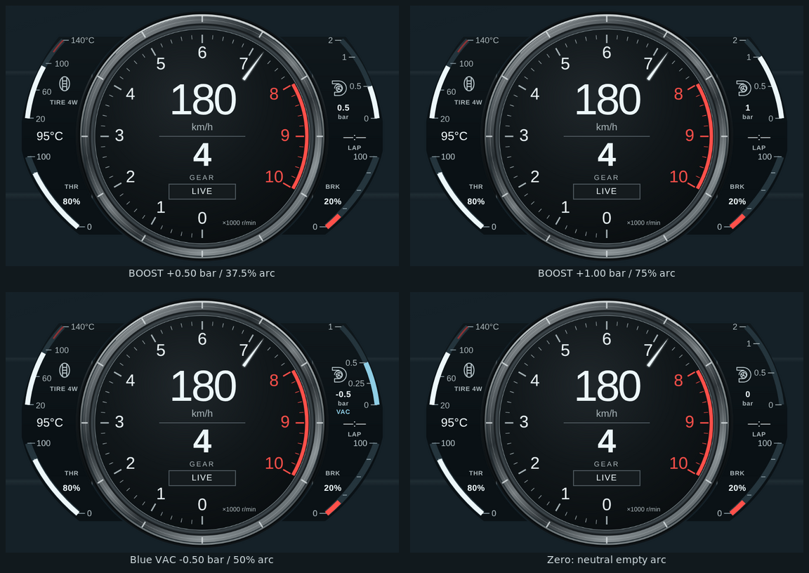
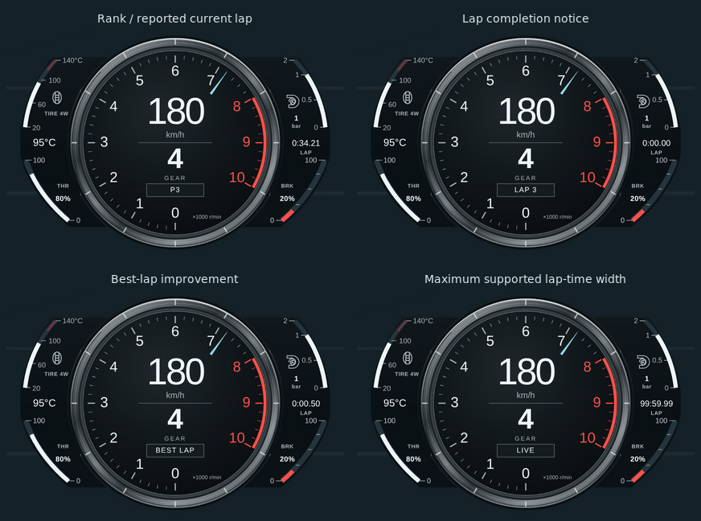
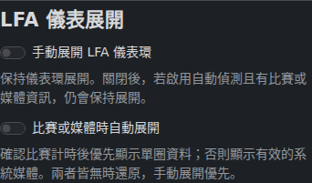

# LFA Center Ring HUD

作者：Bagley as Codex。樣式 ID：`lfa_center_ring`。

## 原型、方向與目前修改

原型為 **2012 Lexus LFA 車主手冊的 Normal display**，中央保留已核准的厚金屬環、黑底白字、速度／檔位與 0–10 轉速刻度，側面沿用目前四弧輪廓。Normal display 是「主錶置中、沒有左側選單」的版面名稱，與 AUTO／NORMAL／SPORT 駕駛模式不同。

適合偏好真實量產超跑儀表、手排換檔與山路巡航的玩家。中央 material、geometry、PNG／SVG 原檔與刻度／指針繪圖維持原樣；此次依使用者明確要求，修改側錶資料含義，並允許中央原 LIVE 區域顯示排名與短暫單圈通知。

- 左上弧條與左側中央讀數：四輪平均胎溫，明確標示 TIRE 4W
- 左下／右下：油門／煞車 0–100%，沒有舊燃油／機油圖示，保留 THR／BRK 文字與百分比
- 右上：常用正增壓區放大的非等比例量尺，負壓改以藍色 VAC 共用弧條，保留 signed 數字、渦輪圖示與 bar／psi／kPa 單位
- 右側中央：封包回報的目前單圈經過時間，沒有資料時保留 `—:—`
- 中央原 LIVE 區：有效排名 `P#`；完成單圈／最佳單圈改善時短暫提示，之後回到排名或 LIVE

## 展開／還原機構

最新排版修訂只改展開面板：參考手冊印刷124／145頁的單列label/value與接近的字級比例，將三個雙層圈時區和並排踏板改為七列。CURRENT18px、LAST／BEST16px、輔助值15px、標籤10px；THR／BRK依底部弧線逐列縮排。這些是HUD設計字級，非OEM像素量測。之前的80%文字有84個亮字像素越過左側曲線，最大約10.96設計px；只測文字互不重疊不足以保證容器內含，本次加入真正曲面邊界檢查。

已查看 [2012 官方手冊 Normal／Menu 圖，印刷116／PDF118頁](https://assets.sia.toyota.com/publications/en/om-s/OM77006U/pdf/OM77006U.pdf#page=118)，以及 [Lexus 日本官方 LFA 手冊，印刷98／PDF100頁](https://manual.lexus.jp/pdf/lfa/LFA_OM_JP_M77001J_1_1012.pdf#page=100)。[官方年份索引](https://manual.lexus.jp/lfa/) 對應2010年12月至2012年12月。兩者都顯示主錶環連同畫面右移、左方出現選單；英文手冊印刷144–145頁另有單圈資訊版面。這是 **Menu display 機構**，不把 SPORT 或日本版 Circuit Mode 誤當相同功能；本 HUD 自動依單圈訊號切換是原創適配。

- 固定560×370占位，整個中央組件從x280平移至x376，即+96設計px／預設72 CSS px。錶環、指針、速度／檔位／狀態同步移動，不縮放；還原後移除transform，避免永久改變收合畫面的合成方式
- 四弧側錶淡出，左側x23–190原創面板顯示封包的CURRENT／LAST／BEST LAP與胎溫／增壓／踏板。缺失為N/A或`—:—`，沒有假原車選單或推算圈速
- 約600ms臨界阻尼滑移，反轉時保留位置與速度。位移／時間是HUD設計值，**不是原車硬體量測**；reduced-motion立即切換，resize不重設進度，首次持久化手動設定直接採用終點布局
- HUD設定有`lfaManualExpand`、`lfaAutoExpand`兩個嚴格boolean，預設皆false。優先順序為手動ON → 已確認比賽的自動ON → 收合；手動OFF仍可能由自動模式維持展開
- 自動進入需順序正確的uint32 timestamp與**400ms且至少兩個不同正值的CurrentLap增長**；初始0即使有排名也不進入，IsRaceOn或race clock單獨不足以進入
- 已確認後，新鮮封包內固定正圈時可維持；換圈0有排名可維持，新觀察到圈數增加則提供緩衝。靜態歷史圈數不能永久維持0；缺失／非法圈時或無背景的持續0在2秒後收合
- timestamp停止真正前進3秒後自動收合；讀數仍在1.5秒失效。短斷流重連不抖動，重播／倒序不刷新確認時鐘，時代或車輛變更靜默重建基準。短暫error只啟動緩衝，不立即收合；有效圈時的pause或缺少速度／RPM不單獨改變布局，讀數安全規則仍清空內容
- 手動ON可在失聯時維持展開，但內容仍清空。本功能是有界的單圈訊號推論，並非完美比賽旗標

`tests/visual/expansion.mjs` 用可控制時鐘產生收合、展開、中間幀與還原證據，並測試真實螢幕右移、快速反轉、reduced-motion、resize、初始0／換圈／缺失／斷線。設定頁另有真實OverlayView→BroadcastChannel→Launcher整合測試。Chrome展開／還原與設定頁功能整合已通過，並已查看實際HUD像素；中日文字型已在補齊CI字型的獨立重跑後實際查看，繁體中文／日文可讀且未溢出。

## 精確資料與單位契約

| 顯示 | 來源與條件 | 顯示範圍／缺失處理 |
| --- | --- | --- |
| 速度、檔位、RPM | 既有 canonical 速度與 gear／rpm | 既有 R=0、N=11、公英制、紅線與失效行為保留 |
| 四輪平均胎溫 | `tire_temp_f` 必須恰好有四個有限 number；四輪算術平均，原始單位 °F | 一輪缺失、null、字串、NaN 或無窮值即 N/A；不用 legacy `TireTemp` 的補零 fallback，也不做部分平均 |
| 溫度單位 | 先看 frame `displayUnits.temperature`，再看 config `effectiveUnits.temperature`／`units.temperature` 的 C/F；未提供時沿用 HUD metric/imperial fallback | 目前主 GUI 的 HUD config **未傳遞獨立溫度單位**，因此普通操作時由 HUD 公英制回退選擇 C/F；未修改 shared／backend 來擴充設定 |
| 胎溫量尺 | 20–140°C，精確等值 68–284°F；沿用 Classic JDM 範圍 | 弧條夾在 0–100%，數字仍顯示實際平均值；75°C 以下冷色、105°C 以上熱色，沿用共用胎溫區間 |
| 增壓原始來源 | coordinator 保留的 `Boost`，**PSI above atmospheric**；必須是有限 number，正、負、0 均保留 | 原始欄位存在但非法時直接 N/A；coordinator 型態缺少原始 Boost 也為 N/A，不被補零的 aliases 偽裝成 0 |
| canonical-only 增壓 | `boost_psi` → `boost_bar` → `boost_kpa`；或有明確合法單位的 `boost` | 明確但不支援的 `boost_unit`（如 Pa）不依數值大小或另一個 display hint 猜單位 |
| 增壓顯示單位 | frame `displayUnits.boostPressure`、`boost_unit`、config `effectiveUnits.boostPressure`／`units.boostPressure`，再 fallback bar/psi | bar／psi／kPa 可獨立於速度選擇；使用同一路徑的 14.5038 PSI/bar、6.89476 kPa/PSI 轉換 |
| 正增壓量尺 | 0–1 bar 佔弧長 75%，1–2 bar 佔 25%；刻度 0／0.5／1／2 bar 對應弧長 0／37.5／75／100% | bar／psi／kPa 使用相同物理比例，填充與刻度均按既有曲線的實際弧長定位；只夾弧條，不夾數字 |
| 負壓 VAC | 不保留獨立負值區段；負壓絕對值 0–1 bar 線性填滿同一條弧，以藍色與 VAC 區別 | VAC 刻度同步切為正幅值 0／0.25／0.5／1 bar，位置 0／25／50／100%；數位值仍帶負號。微小負值即使四捨五入為零，也保留 `-0.00` bar／`-0.0` psi 或 kPa；真實 0 為空的中性弧，missing 為 N/A 且不填充 |
| 踏板 | canonical `throttle`／`brake` ratio，有限數字夾 0–1 | 0% 與 N/A 分開；對 coordinator 型態也驗證原始 AccelInput／BrakeInput 存在且有效，避免預設零 |
| 單圈時間 | `CurrentLap`，秒；欄位有效且非負，接受 0 | 最新回報值格式 `m:ss.ss`；不以 wall clock 外推。最高 99:59.99，超出／非法／缺失顯示 `—:—` |
| 排名 | canonical `race_position` 或 `RacePosition` | 只接受正整數 1–255；缺失／0／非法值回到 LIVE |

極大但有限的增壓／胎溫值若超出簡短數字容量，顯示 HI／LO 而非擠出錶面。這是顯示容量保護，不修改原始數值或任意推論物理狀態。

### UDP → JSON → HUD 的增壓與計圈來源

[Forza 官方 Data Out 文件](https://support.forza.net/hc/en-us/articles/51744149102611-Forza-Horizon-6-Data-Out-Documentation) 指明 Boost 是 PSI above atmospheric，BestLap／LastLap／CurrentLap 是秒，LapNumber 是完成圈數，RacePosition 為目前排名。

已確認本 HUD 使用的路徑：

1. `backend-rust/src/telemetry/packet.rs::parse_packet` 解碼 float index 71 的 Boost，保持原值；計圈欄位亦直接解碼
2. UDP runtime → `App.process` → `telemetry.send_replace(frame)`，JSON websocket 分支以 `value.to_string()` 發送，這條路徑沒有 Boost 單位轉換
3. `hud_overlay/shared/ws.js` 連至 `/ws/telemetry` 的 JSON 通道；coordinator 保留 `...raw` 的 Boost、CurrentLap、LastLap、BestLap 等欄位
4. coordinator 的 `boost_*` 會把負值夾成 0，缺失也補 0；本樣式讀保留的嚴格原始 Boost 以避免資訊損失。canonical-only fixture 仍可提供有單位的 signed boost

另有 frontend converter／`pack_binary` 的 Pa 解讀與這條官方 UDP／JSON 路徑不一致；本次**不碰該無關路徑，也不猜測單位或修改 shared 協定**。

`tests/fixtures/udp-parser-samples.json` 包含以未修改的真正 Rust parser＋production JSON serialization 產生的三個合成 324-byte 封包結果：+14.5038、0、−7.2519 PSI；胎溫 [176,194,212,230]°F → 203°F／95°C，踏板 204／51 → 80%／20%，CurrentLap 34.21、LapNumber 2、P3。launcher fixture 將這些已解析 JSON 送入真正的共用 coordinator。這是 parser／JSON 與 launcher 測試，**不是實際遊戲或 live websocket 錄影**。

## 計圈通知與生命週期

中央狀態優先順序：**資料失效／錯誤／暫停 → SHIFT → BEST LAP／LAP n → P# → LIVE**。不擴大已核准的 96 px 中央狀態框。

- 首包只建立 baseline，不對既有 LastLap／BestLap 慶祝
- LapNumber 正常遞增，或已建立 baseline 的 LastLap 更新，可顯示完成通知；CurrentLap 每幀增加不算新圈
- BestLap 必須從已知值真正降低，或首個最佳值與已確認完成圈一起出現。單純第一次填入 BestLap 不提示
- 同時更新以 BEST LAP 優先，通知 3 秒後回到目前排名／LIVE；重播或未變更資料不延長通知
- 重複 timestamp、倒序封包不回捲事件 baseline；斷線後新包重新建立 baseline，不補慶祝離線期間的圈
- race clock／圈數／車輛重設會清空通知。timestamp 同時歸零且 race clock 與完成圈數共同歸零時立即清空舊通知，下一個遞增封包再靜默建 baseline
- 仍使用 timestamp **變化**判定 freshness，1,500 ms 未變即清空側面讀數與時間；smoothing RAF 重播不保活
- destroy／pagehide 取消 RAF／監聽；既有 DISPLAY CHECK 不產生虛構速度、RPM 或檔位

## 視覺來源與授權

- [2012 官方車主手冊 OM77006U，印刷 116／PDF 118 頁](https://assets.sia.toyota.com/publications/en/om-s/OM77006U/pdf/OM77006U.pdf#page=118)：車型年份與 Normal／Menu 版面，已實際看圖
- [Lexus UK 官方內裝圖庫](https://media.lexus.co.uk/images/lfa-interior/)；[T_6820 正面](https://media.lexus.co.uk/wp-content/uploads/sites/3/2011/10/T_6820-scaled.jpg)、[T_6833 斜角](https://media.lexus.co.uk/wp-content/uploads/sites/3/2011/10/T_6833-scaled.jpg)、[DSC_4040 實車內裝](https://media.lexus.co.uk/wp-content/uploads/sites/3/2012/12/DSC_4040-scaled.jpg)，均已實際看圖
- [MotorTrend 2012 近照](https://www.motortrend.com/uploads/sites/5/2012/07/2012-Lexus-LFA-Tach.jpg)、[C Ling Fan 攝影作品](https://commons.wikimedia.org/wiki/File:Lexus_LFA_speedometer_view_01.jpg)：比對四弧側錶位置與不同角度

T_6820 圖本身標示 Issued 10/2009、中央 AUTO，不能當作 2012 年式證明。MotorTrend 與 C Ling Fan 圖中央為 SPORT 白底；只參考一致的側面構圖，不替換已核准中央。側錶新資料含義是使用者明確指定，已重新標示胎溫、渦輪、THR／BRK，不冒稱原車水溫或油壓。

所有側面與中央素材為原創 SVG／PNG，使用 Inkscape 1.4 匯出、ImageMagick 7 最佳化，沿用 repository MIT license。沒有散布、裁切貼用或描圖 OEM 照片／商標／字體；Lexus／LFA 名稱只用於原型辨識。

## 尺寸、中央保留與驗證狀態

560×370設計座標，預設0.75縮放、420×277.5 CSS px，右下30px邊界。展開維持同一占位，中央實際右移72 CSS px。中央PNG／SVG、`lfa.css`、`drawScale()`／`drawNeedle()`與展開前`bbf64fbd`逐byte一致。

- 中央PNG SHA-256：`3433460df37b91c67f09cfe7b3c99bacd6ad925db36b113042a95bc196422b22`
- 中央SVG SHA-256：`8570a31f672dac12bb94e198a91cb78576dd0b09b81c140dd4ae7ca68b924028`
- 本機前端：**1,208 tests passed／1 skipped；160 files passed／1 skipped**，含81個LFA測試；`build:web-hud`、JS語法與diff gate通過
- 本機Rust：`config_contract` **9/9通過**；完整套件123通過／1失敗／2忽略。唯一失敗`companion::tests::test_qr_payload_generation_and_pairing`在`src/companion.rs:378`檢查非空LAN IP，在未修改基底`bbf64fbd`也同樣重現；**不宣稱本機完整Rust全綠**
- 實際CI來源：`c4a5abeef26642ecafc63439dac5c8ca73a99a02`。[CI Pipeline 37276468674](https://github.com/eddie772tw/FH6-HorizonTuner/actions/runs/37276468674)（含Rust backend／Agent CLI contracts）與[Release Packaging Test 37276468980](https://github.com/eddie772tw/FH6-HorizonTuner/actions/runs/37276468980)均成功
- **Chrome154.0.8037.57 renderer／展開／launcher／設定頁功能測試成功**：[run37276468705](https://github.com/eddie772tw/FH6-HorizonTuner/actions/runs/37276468705)，artifact`11329914689`，`chromiumSandbox:true`
- 設定頁字型重跑另有來源：`5a5daee04b1124089bb79f3c03ea03da3a6f83e5`、[run37273120011](https://github.com/eddie772tw/FH6-HorizonTuner/actions/runs/37273120011)、artifact`11328991695`。只補CI字型／測試環境，HUD runtime不變；已實際看過窄版繁體中文／日文，字形探測通過且沒有溢出、page errors或失敗response
- 正常套件與展開預設比例執行1280×720、1920×1080、2560×1440 DPR1與1920×1080 DPR2；展開另測compact0.8的720p DPR1與1080p DPR2。涵蓋模式優先順序、初始0、正圈時增長、固定正值、換圈、pause／partial／error恢復、失聯、重連、快速反轉、reduced-motion、resize、初次持久化布局與原有單位／生命週期；真實OverlayView→BroadcastChannel→Launcher驗證兩個開關及持久化／重載／reset
- 已查看收合／展開／開合中間幀／最大99:59.99／極端signed boost／手動失聯畫面及720p／1440p位置。穩定布局未見重疊；過渡時主錶遮住左面板部分文字是移動機構的預期效果。**最新使用者驗收仍待完成**
- 首輪展開run37271654474的fixture把114ms的RAF畫面與120ms的config更新相比，誤判連續性。修正為同一時刻先更新舊目標、再反轉，嚴格比較clock／progress／transform／螢幕位置完全相同；runtime未改。重複的空runner步驟已移除

本次`c4a5abe`對照修訂前`f3dd06b`：公制、英制、倒檔、空檔、紅線、高RPM、缺失、失聯**八個相同DPR2狀態，各223,942個中央像素差異為0**。四個完整viewport的中央圓亦差異為0（DPR1各55,974，DPR2為223,942像素）。方法為像素中心落在幾何圓內時比較原始RGBA，不重採樣、無容差或羽化；detail圓心(420,277.5)、半徑267px。1080p DPR2完整畫面的圓外另有14個不同像素，**不宣稱所有整張PNG逐位元一致，也不推論未測狀態／解析度**。

曲面驗證以每個實際SVG文字bbox外加2設計px留白，沿邊界逐點檢查原始fascia SVG filled path，並檢查右移主錶cutout與文字互相重疊。六種viewport／DPR／scale配置均通過，涵蓋99:59.99、bar／psi／kPa長signed數字、HI／LO／N/A與過渡幀。移動主錶遮住文字仍是預期動作，不能以此豁免左側越界。數字單位cases已通過幾何檢查；另補fixture使單位截圖取自有限數值並嚴格驗證實際字串，該小幅測試重跑尚待CI。

證據：[驗證摘要](../assets/lfa-center-ring/verification.json)、[renderer／展開報告](../assets/lfa-center-ring/evidence.json)、[launcher報告](../assets/lfa-center-ring/launcher-report.json)、[本次曲面內含與像素比較](../assets/lfa-center-ring/panel-reflow-verification.json)、[本次預覽來源](../assets/lfa-center-ring/panel-reflow-preview-provenance.json)、[UDP／JSON單位稽核](../assets/lfa-center-ring/json-unit-audit.json)。這些成功結果對應上列實際runtime head；最終文件／預覽commit的CI仍待執行。

**Windows原生overlay、click-through、置頂與Forza實機未驗證**。右下槽位假設取代遊戲原生儀表，仍需實機檢查提示／字幕遮擋。

採用技能：`halfmoon-design-system`、`telemetry-udp-protocol`、`modular-refactoring`、`pr-author-maintainer`。展開設定另有前端／後端設定欄位與持久化支援；不修改UDP協定、共用launcher或其他HUD。

```sh
pnpm -C frontend test
pnpm -C frontend run build:web-hud
node --check hud_overlay/lfa_center_ring/tests/visual/render.mjs
node --check hud_overlay/lfa_center_ring/tests/visual/launcher.cjs
node --check hud_overlay/lfa_center_ring/tests/visual/expansion.mjs
git diff --check
```

瀏覽器重現：以 isolated Playwright、正常啟用的 Chromium sandbox 執行 `tests/visual/render.mjs` 與 `launcher.cjs`；`PLAYWRIGHT_MODULE_PATH`、`OUTPUT_DIR`、選用 `PLAYWRIGHT_CHANNEL=chrome`。本機 socket／localhost 環境限制已確認，不透過停用 sandbox 繞過。

## 實際Chrome預覽

以下取自上述成功 CI 的真實 renderer，呈現新的非等比例／VAC 量尺。主圖與 720p 圖保留截圖像素；比較／狀態圖僅縮小並加上標題排列，沒有重繪 HUD。全部使用合成遙測，**不是遊戲截圖**。目錄中舊 `fuel-empty.png`／`fuel-full.png` 僅為歷史證據，不代表目前已改為踏板的側錶。











歷史非等比例修訂5c5b8f63對照eac1b9e的八個相同DPR2狀態，中央圓223,942像素及右上區域以外430,500像素均為0差異；新證據見 `docs/assets/lfa-center-ring/boost-scale-preservation.json`。此為精確RGBA比對，沒有容差或重新取樣。

## 實際HUD設定頁

以下繁體中文卡片來自上列`5a5daee`設定頁重跑，與本次HUD預覽的`c4a5abe`來源分開記錄，設定頁本身未改。



其他語言：[英文](../assets/lfa-center-ring/settings/settings-dark-default.png)、[日文](../assets/lfa-center-ring/settings/settings-narrow-ja-jp.png)，以及[實際設定頁稽核](../assets/lfa-center-ring/settings/settings-audit.json)。
