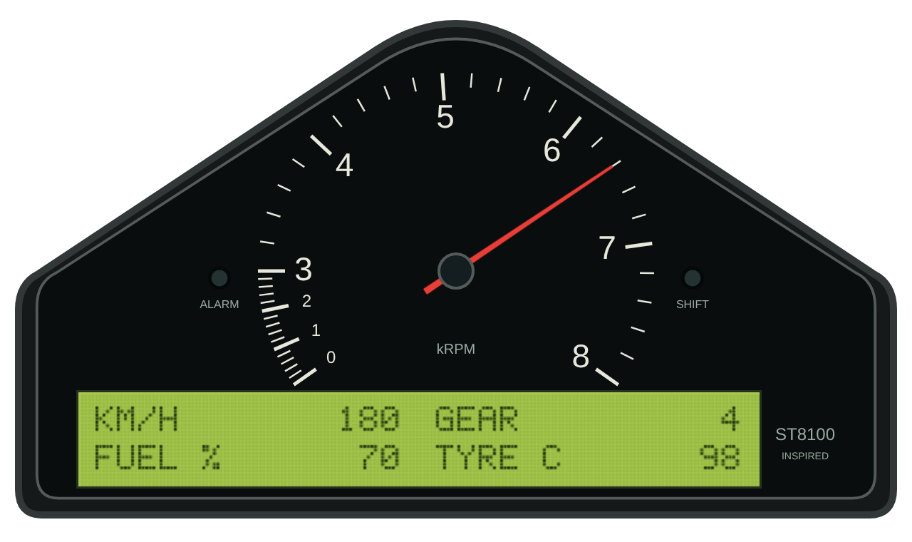
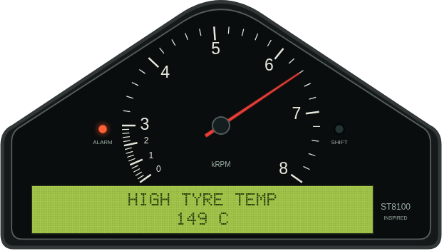
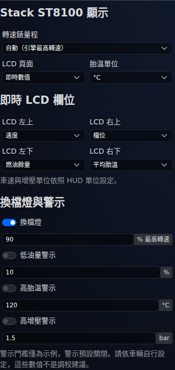

# Stack ST8100 Inspired HUD

## 定位與參考版本

本樣式以 Stack ST8100 賽車儀表為辨識基礎：小型中央類比轉速錶、壓縮低轉速區、斜肩外殼、下方長條綠色兩列點陣 LCD。適合喜歡 club racing、trackday、Caterham／kit-car 與改裝賽車儀表的玩家；不是量產車原廠儀表，也不宣稱特定車款年式。

- [Stack 官方 ST8100 產品與型號表](https://www.stackltd.com/st8100.html)：0–3–8k、0–4–10k、0–6–13k 等實際黑底版本、類比錶、LCD、換檔燈、警報與 peak recall
- [Stack 官方安裝照片](https://www.stackltd.com/images/Stack_st8100.jpg)：外殼、類比轉速錶、下方 LCD 的相對位置；照片白底款作為造型佐證，不是假稱本 HUD 是白底款
- [原廠 ST54030-007 使用手冊](https://d32vzsop7y1h3k.cloudfront.net/c1afd2ffb4e5107d8445cfbdef36a55a.PDF)：印刷頁 4 的模組圖、6–9 的顯示層、10–13 的 peak／alarm、15 的換檔燈
- [Stack 官方可設定顯示層升級](https://www.stackltd.com/configupgrade.html)：可配置的 LCD channel 與個別警報，支持本 HUD 的可選欄位方向；本實作不是完整六層硬體模擬
- [黑底 0–4–10k 實物照片](https://saboulautosport.com/109071-large_default/tableau-de-bord-stack-st8100-0-4-10000.jpg)：已實際查看其壓縮刻度及外觀，僅供視覺研究；型號範圍仍以官方目錄為依據

所有 Canvas 外殼、刻度、指針及 5×7 點陣字元均為原創程式；未打包商標圖樣、原廠照片、手冊、字型或第三方圖片。畫面小字 `ST8100 INSPIRED` 是文字說明，不是 Stack 商標圖樣。此樣式沒有原廠認證或合作關係。

## 實際瀏覽器預覽

以下為 sandboxed Google Chrome 執行真實 HUD／GUI 的截圖，非設計稿。來源 commit `a7d2ff3`、[Visual Review run 37280301294](https://github.com/eddie772tw/FH6-HorizonTuner/actions/runs/37280301294)，完整來源與檔案雜湊見 [provenance.json](../assets/stack-st8100/provenance.json)。

## 使用方式

1. 在 HUD 設定選擇 `Stack ST8100 Inspired`
2. 展開進階設定，設定轉速範圍、LCD page、四個欄位、胎溫 °C／°F
3. 速度與增壓單位使用既有「HUD Unit Settings」，支援跟隨 App 或 HUD 獨立單位
4. 需要監控時，個別啟用低油量、高胎溫、高增壓警示，再輸入適合自己用途的門檻

預設 LCD 上列是速度／檔位，下列是油量百分比／四輪平均胎溫。四格可選速度、檔位、油量、平均／最高胎溫、增壓、RPM、當圈／上圈／最佳圈時間、已完成圈數、session 最高 RPM／速度。

`Peak values` page 顯示 session 最高 RPM、最高速度、最低油量、最高單輪胎溫。它只保存當次有效遙測的觀測值，不寫入永久歷史。換車、可確認的新比賽或 HUD 重新載入會清除。一般短暫暫停／斷訊不清除已觀測的峰值，但斷訊畫面不再顯示它們。

### 轉速與換檔燈

- `Auto` 依 `EngineMaxRpm` 選擇真實目錄的 0–3–8k、0–4–10k、0–6–13k 範圍；沒有引擎上限時使用 8k 盤面，但不偽造換檔門檻
- 低轉速段約占 35°，其餘工作區約占 215°；這是依實物／手冊觀察重新繪製的視覺比例，不是原廠校準規格
- 手動固定範圍或引擎超過 13k 時，指針會停在盤面上限，並另顯示 `RPM > 上限`，不將超範圍數值偽裝成低轉速
- 換檔燈預設為回報 `EngineMaxRpm` 的 90%，可選 50–100%；不是共用 Coordinator 的 `maxRPM − 1000` 推估紅線，也不是車輛最佳換檔建議
- 全域 Gauge、RPM、Speed、Gear、Boost、Center Info 元素開關皆生效；Center Info 關閉一般 LCD 欄位時，警示與遙測狀態仍保留
- Glow 調整指針／燈光；Custom Gauge Color 只改指針色，保留 LCD 綠底深字的對比

### 監控與警示互動

三種車況警示預設全關閉。預填的 10% 油量、120°C 胎溫、1.5 bar 增壓僅是可編輯示例，不是車種安全值或調校建議。

啟用後，值必須持續越界至少 500ms，且有持續前進的 telemetry timestamp（相鄰有效樣本間隔小於 500ms）才會觸發。LCD 改顯示警示名稱及目前讀值，ALARM 燈常亮；不閃爍、不播放聲音。多重警示依「最高胎溫 → 增壓 → 油量」優先顯示，其他警示仍獨立追蹤。

- 低油量：小於或等於門檻觸發；回升至門檻 +2 個百分點才解除
- 高胎溫：四輪最高溫大於或等於門檻觸發；降至門檻 −5°C 才解除
- 高增壓：大於或等於門檻觸發；降至門檻 −0.1 bar 才解除

恢復正常後自動回到選定 LCD page，或可在 GUI 關閉該警示。切換設定會清除警示計時，再以新設定重新評估；不需要點擊 overlay，也不加入會和 HUD click-through 衝突的假硬體按鈕。

門檻輸入支援暫時清空、小數輸入；Enter／離開欄位才儲存，Escape 取消，空白／無效數字恢復原值。範圍：油量 1–50%、胎溫 50–200°C、增壓 0.1–5 bar。胎溫與增壓分別以 °C／bar 持久化，改成 °F／PSI／kPa 不會改變警示的物理門檻，也不會因顯示四捨五入而重寫原值。

## 遙測真實性與狀態

本 HUD 只使用已存在的 Forza 遙測。沒有油壓、油溫、水溫、電瓶電壓、燃油壓力、胎壓或煞車偏壓欄位，因此不顯示或合成這些原儀表 channel。

| 讀值 | 來源與單位 |
| --- | --- |
| RPM／引擎上限／檔位 | 原始 `CurrentEngineRpm`、`EngineMaxRpm`、`Gear`；0=R、11=N、1–10=前進檔 |
| 速度 | 原始 `SpeedMetersPerSecond` → km/h 或 mph |
| 油量 | 原始 `Fuel` 0–1 → 0–100%；0 是實際空油量，不當作缺值 |
| 增壓 | 原始 signed `Boost` PSI above atmospheric → bar／PSI／kPa；負值保留 |
| 胎溫 | canonical `tire_temp_f`，或直接原始 `TireTemp`；必須完整四輪且每個值皆有限，才計算平均與最高溫 |
| 圈速／圈數 | `CurrentLap`、`LastLap`、`BestLap` 秒數、`LapNumber` 已完成圈數；0 秒不適用時顯示 `--:--.--`，不自行推算計時 |

缺少原始感測欄位時顯示 `--`，不信任 Coordinator 為相容性補的 0 或 7000 RPM；缺少、非有限、錯誤型別的感測值不會觸發警示。某輪胎溫缺失時整組胎溫顯示 unavailable，不以其餘三輪假稱四輪平均。

Coordinator 的唯讀 `sourceTelemetry` 保留未平滑的原始封包；監控、換檔燈、LCD 數值及峰值使用此來源，避免外插尖峰被當成真實量測。只有類比指針跟隨既有 smoothing 視覺幀；不改變其他 HUD 的平滑行為。

`TimestampMS` 前進才證明新資料；重複／過期／重播的內插幀不延長 freshness。1.5 秒沒有前進 timestamp 顯示 `NO SIGNAL`，指針與換檔燈關閉，警示清除；`IsRaceOn=0` 顯示 `PAUSED`，錯誤顯示 `DATA ERROR`，缺少有效 timestamp／race state 顯示 `NO DATA`。新有效資料恢復正常。

uint32 timestamp wrap 保持 session；單一逆序幀不回滾狀態。換車或「比賽時間歸零＋圈數歸零／曾暫停／已斷訊」等可確認重啟會清除峰值；若 timestamp 倒退，即使該封包看起來像新比賽，也必須至少兩個連續前進且車輛／比賽時間一致的新 epoch 封包才接受。缺少比賽資訊時，還要先確認斷訊，避免單一逆序封包重設 session。

## 設定與模組邊界

- GUI：`frontend/src/features/overlay_control/stack_st8100/`，完整 typed settings、嚴格 primitive 驗證、單位轉換與編輯 draft
- HUD：`hud_overlay/stack_st8100/`，pure display model、monitor state machine、original dot font、Canvas renderer、HUDCore controller
- 標準資料流：GUI runtime → BroadcastChannel／POST `/api/overlay/config` → Rust 原子持久化 → `hud:config` → Launcher → HUDCore
- Stack namespace 設定只在 active style 補預設；切換其他樣式保留已存在設定，不侵入其他 HUD defaults，未知第三方設定保留
- 新增 HUD 依現有動態 scanner；不建立另一份 launcher 靜態清單，不依賴未合併的 LFA／AP1 分支

## 驗證與限制

採用 `halfmoon-design-system`、`huge-component-refactoring`、`modular-refactoring`、`telemetry-udp-protocol`、`cross-agent-collaboration`；遵循 `workspace`、`ui-architecture`、`testing-strategy`。

- 單元測試：`pnpm -C frontend exec vitest run ../hud_overlay/stack_st8100/tests/unit src/features/overlay_control/stack_st8100`
- 完整前端 gate：`pnpm -C frontend test`、`FH6_PLATFORM=windows pnpm -C frontend build`、`FH6_PLATFORM=lan pnpm -C frontend build`
- Rust 設定／持久化契約：`cargo test --locked --manifest-path backend-rust/Cargo.toml --test stack_st8100_config_contract`
- 真實 Chrome fixture 畫面：`node hud_overlay/stack_st8100/tests/visual/render.mjs`
- 真實 Launcher／Coordinator／smoothing：`node hud_overlay/stack_st8100/tests/visual/launcher.cjs`
- 真實 GUI 鍵盤編輯／單位／持久化／主題與窄視窗：`node frontend/src/features/overlay_control/stack_st8100/tests/browser/verify.cjs`

視覺工具使用獨立 Playwright 安裝及 `PLAYWRIGHT_MODULE_PATH`、`PLAYWRIGHT_CHANNEL=chrome`、`OUTPUT_DIR`，保持 `chromiumSandbox: true`。`.github/workflows/hud-stack-st8100-visual.yml` 在雲端 Chrome 產出實際 PNG 與 JSON 稽核，另驗證中日文字形。這些是可控 telemetry 的瀏覽器驗收，不能代表 FH6 遊戲、Windows 原生 click-through、螢幕選擇或透明度的實機驗收。實際 PNG 及 reviewed commit／run 證據由 PR 收錄。
