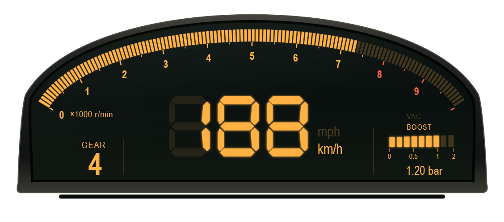
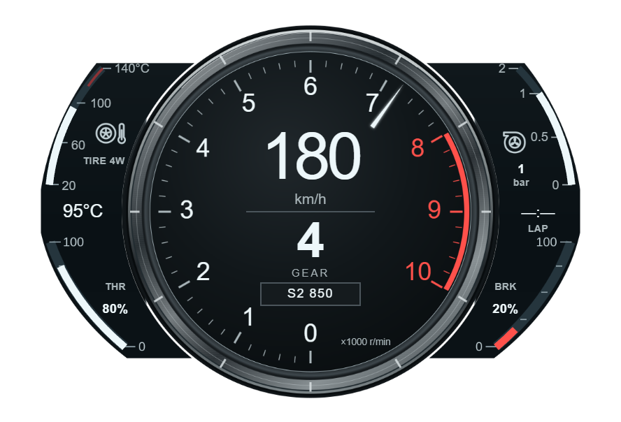
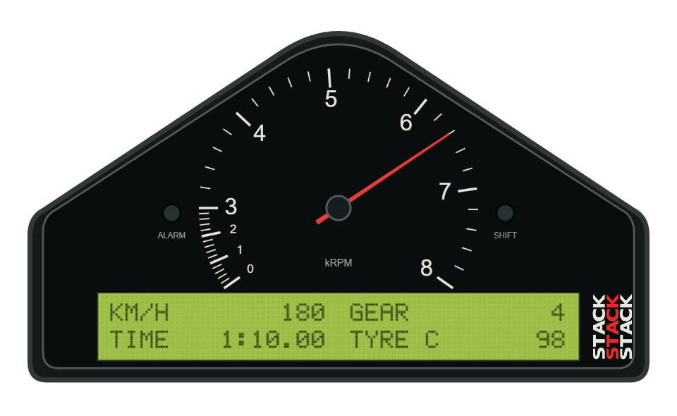
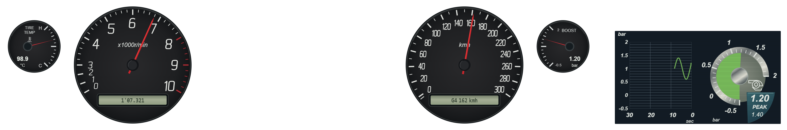
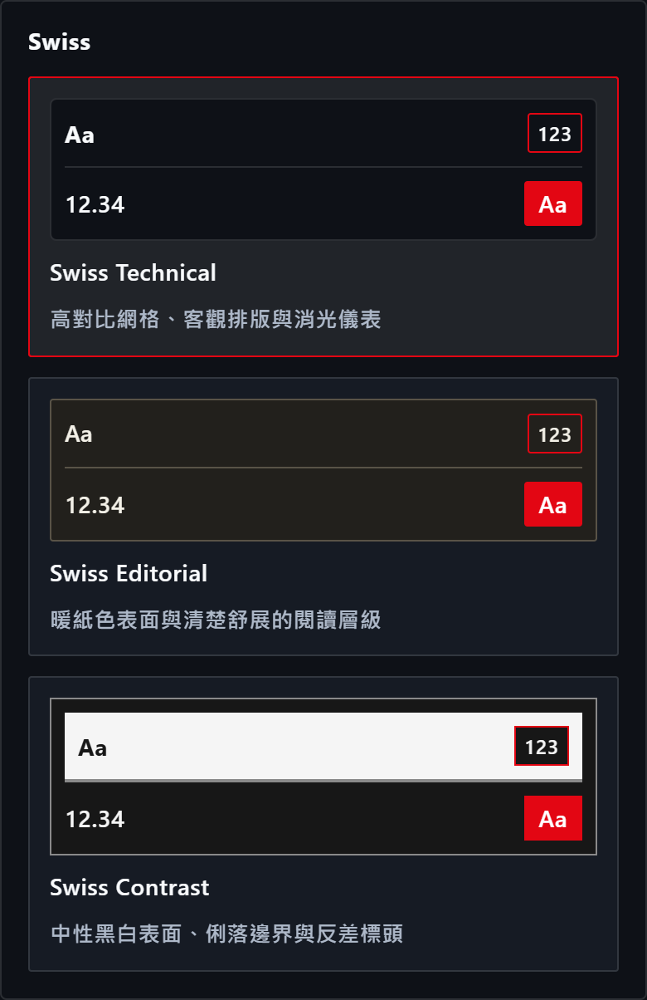
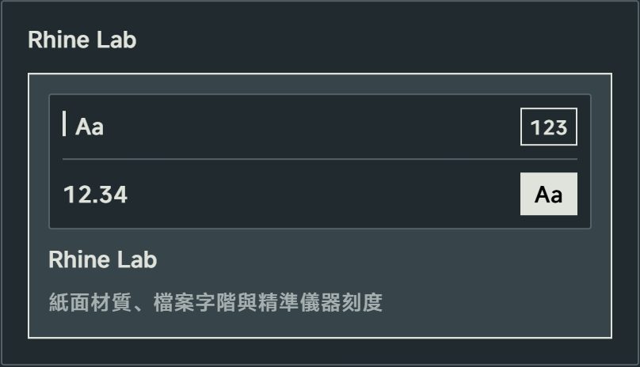

# HorizonTuner V1.7.2 — HUD, Themes & Analysis Update

發行說明草稿，Core／OTA runtime：**11.45.22**。本版新增四款 HUD 與四個主題核心，改善賽事分析、即時圖表與 Companion 體驗；CVT、量測證據與部分裝置功能仍依下方 Known Issue 保留開發／驗收限制。

## What's New

**四款新 HUD 儀表樣式**

* **AP1 Rev Arc**：AP1 風格的琥珀色 LCD 與弧形轉速刻度，整合速度、檔位與增壓顯示。[#474](https://github.com/eddie772tw/FH6-HorizonTuner/pull/474)

* **LFA Center Ring**：中央轉速環搭配四側儀表，提供胎溫、增壓、油門／煞車與圈次顯示。[#473](https://github.com/eddie772tw/FH6-HorizonTuner/pull/473)

* **Stack ST8100**：賽車風格指針儀表與中央點陣 LCD，加入三組警示與圈次提示。[#482](https://github.com/eddie772tw/FH6-HorizonTuner/pull/482)

* **R34 MFD**：R34 風格雙指針儀表與五頁 MFD，可查看增壓與其他遙測；沒有資料的欄位保留 N/A。[#483](https://github.com/eddie772tw/FH6-HorizonTuner/pull/483)

*上方 HUD 圖片由正式 HUD renderer 離線渲染，使用合成遙測資料，並非 FH6 遊戲實機截圖；R34 圖中展示 Single 頁。儀表名稱代表風格設計，顯示內容依可用遙測與所選設定而定。*

**Swiss 與 Rhine Lab 主題**

* 新增 **Swiss Technical／Editorial／Contrast** 三個核心，提供消光儀表、暖紙面與黑白高反差三種編排。[#481](https://github.com/eddie772tw/FH6-HorizonTuner/pull/481)
* 新增 **Rhine Lab** 核心，以紙面／石板色調、檔案字階與儀器刻度呈現介面；同步改善各主題的遙測卡片與跨頁圖表樣式。[#489](https://github.com/eddie772tw/FH6-HorizonTuner/pull/489)

*主題圖片直接擷取實際桌面外觀設定元件的區塊，使用繁中、深色模式與對應色彩預設；這些截圖不代表 Android 原生介面驗收。*

**自訂路線與賽事分析** [#495](https://github.com/eddie772tw/FH6-HorizonTuner/pull/495)

* 新增計時賽與漫遊路線的起終點、武裝控制：計時賽使用同一起點閉合圈次，漫遊則在終點停止。
* 改善圈段完整性、修剪與來源標示，並提供 MoTeC CSV 欄位對應。缺少座標、時間倒退或資料缺口時，不會補造完整圈次。
* 加入實驗性的 MoTeC `.ld`／`.ldx` ZIP 匯出。CSV 匯入預覽尚未保存為後端 session 時，後端匯出／開啟操作保持停用。

**中性基準預覽（Beta）** [#506](https://github.com/eddie772tw/FH6-HorizonTuner/pull/506)

* 顯示目前值、建議值、差異與缺項，支援草稿、取消及明確套用；未知或不可調欄位維持 unavailable／locked。
* 車輛、profile、目標或季節切換後，舊回覆不會覆蓋新狀態。**套用只更新程式內的基準，不會修改遊戲設定。**

**CVT 證據基礎（WIP）** [#504](https://github.com/eddie772tw/FH6-HorizonTuner/pull/504)

* 加入變速箱類型／能力選擇，以及 CVT capture 的資格、診斷、保存與重讀契約。
* CVT 使用獨立分流；終傳求解、ratio preview 與可套用推薦仍未提供，詳見 [#434](https://github.com/eddie772tw/FH6-HorizonTuner/issues/434)。

**Companion 主題與字型更新（Beta）** [#498](https://github.com/eddie772tw/FH6-HorizonTuner/pull/498)、[#507](https://github.com/eddie772tw/FH6-HorizonTuner/pull/507)

* 原生外殼與 WebView 接收同一份主題設定，保留各連線的最後有效主題。
* 加入原生 Outfit／Inter 字型資源與離線授權頁，改善文字角色的一致性；Rhine 原生字型仍使用系統 SansSerif fallback。

## What's Fixed & Performance

* 修正 V1.7.1 Known Issue 中，**即時懸吊行程圖只顯示部分歷史**的問題，並統一靜止時圖表更新。[#478](https://github.com/eddie772tw/FH6-HorizonTuner/pull/478)
* 輪胎溫度直方圖改為增量更新，減少離屏卡片的繪製工作；重新顯示時保留最新遙測，切換單位後最高速度顯示正確。[#493](https://github.com/eddie772tw/FH6-HorizonTuner/pull/493)
* 減少趨勢圖、HUD 與 Canvas 重複查詢主題色彩的開銷。[#488](https://github.com/eddie772tw/FH6-HorizonTuner/pull/488)、[#492](https://github.com/eddie772tw/FH6-HorizonTuner/pull/492)、[#496](https://github.com/eddie772tw/FH6-HorizonTuner/pull/496)
* 改善已載入 session 的圈次聚合，保留不完整圈、未知圈速與原始來源狀態。[#509](https://github.com/eddie772tw/FH6-HorizonTuner/pull/509)
* 修正 Stack ST8100 溫度單位契約。[35cdb26b](https://github.com/eddie772tw/FH6-HorizonTuner/commit/35cdb26b5f106f6a4588157cf8105f71146d0484)
* 補齊 Road 統計、更新來源、Companion 與 Hz 標籤翻譯；修正英文 Companion 顯示 `companion.*` 原始鍵的問題，保留繁中／日文既有用語。[#479](https://github.com/eddie772tw/FH6-HorizonTuner/pull/479)、[#490](https://github.com/eddie772tw/FH6-HorizonTuner/pull/490)、[#509](https://github.com/eddie772tw/FH6-HorizonTuner/pull/509)、[#512](https://github.com/eddie772tw/FH6-HorizonTuner/pull/512)
* HUD 音訊刷新與 Companion LAN／USB 停用按鈕補上狀態提示，保留 busy、未選裝置與指定 serial 的保護。[#509](https://github.com/eddie772tw/FH6-HorizonTuner/pull/509)
* 進一步收斂 API 錯誤回應細節，更新前端、Rust 與建置相依套件，將 `source-map-js` 收斂至修補版本 1.2.2。[#491](https://github.com/eddie772tw/FH6-HorizonTuner/pull/491)、[#508](https://github.com/eddie772tw/FH6-HorizonTuner/pull/508)

## Known Issue

* **CVT AEGO（WIP）**：完整採集／匯入／選取流程與可信設定來源仍在開發；終傳求解、比例預覽與可套用推薦保持不可用，真實 CVT 遊戲驗收尚未執行。[#434](https://github.com/eddie772tw/FH6-HorizonTuner/issues/434)
* **EV AEGO（Beta）**：真正單速 EV 的遊戲可見終傳 A–B–A 測試仍待執行；既存 Taycan 固定終傳資料不能替代此驗收。[#435](https://github.com/eddie772tw/FH6-HorizonTuner/issues/435)
* **Android Companion（Beta）**：原生資源／設計與裝置體驗尚未完成驗收，包括 CJK、窄螢幕、旋轉、長文字及 LAN／USB／QR。需 Android 13+ 與持續運行的 HorizonTuner Full；目前 CI 的 debug APK 不代表正式簽章、安裝／升級或裝置驗收通過。[#485](https://github.com/eddie772tw/FH6-HorizonTuner/issues/485)
* **基準與量測證據（WIP）**：正常離線選車／保存證據入口、可信設定與採集窗口來源，以及分檔 WOT 圖仍在開發；缺少來源的資料保持 unavailable。[#487](https://github.com/eddie772tw/FH6-HorizonTuner/issues/487)
* **MoTeC LD／LDX（Experimental）**：尚未在真實 MoTeC i2 完成開檔與通道／單位核對；既有 CSV／工作區 XML 匯出保留。

四個相關 Issue 保持開啟。各項本地驗證、裝置／遊戲與正式發行產物的驗收狀態見[候選驗收紀錄](v1.7.2-acceptance.md)。

## What's Changed

* feat(hud): 新增 LFA Center Ring 原創儀表樣式 by @eddie772tw in [#473](https://github.com/eddie772tw/FH6-HorizonTuner/pull/473)
* feat(hud): 新增 S2000 AP1 Rev Arc 原創儀表樣式 by @eddie772tw in [#474](https://github.com/eddie772tw/FH6-HorizonTuner/pull/474)
* deps(rust)(deps): bump the rust-dependencies group in /frontend/src-tauri with 4 updates by @dependabot in [#475](https://github.com/eddie772tw/FH6-HorizonTuner/pull/475)
* deps(frontend)(deps): bump @tauri-apps/plugin-updater from 2.13.0 to 2.13.1 in /frontend in the frontend-dependencies group by @dependabot in [#476](https://github.com/eddie772tw/FH6-HorizonTuner/pull/476)
* ci(deps): bump gradle/actions/setup-gradle from 6.3.0 to 6.4.0 in the github-actions group by @dependabot in [#477](https://github.com/eddie772tw/FH6-HorizonTuner/pull/477)
* fix(telemetry): 修復懸吊歷史截斷並統一靜止時圖表更新 by @eddie772tw in [#478](https://github.com/eddie772tw/FH6-HorizonTuner/pull/478)
* ui(i18n): extract missing hardcoded tech and statistics strings by @eddie772tw in [#479](https://github.com/eddie772tw/FH6-HorizonTuner/pull/479)
* feat(ui): unify Swiss themes, navigation and color presets (#480) by @eddie772tw in [#481](https://github.com/eddie772tw/FH6-HorizonTuner/pull/481)
* feat(hud): add Stack ST8100 telemetry monitor and settings by @eddie772tw in [#482](https://github.com/eddie772tw/FH6-HorizonTuner/pull/482)
* feat(hud): add Skyline R34 cluster and NISMO MFD modes by @eddie772tw in [#483](https://github.com/eddie772tw/FH6-HorizonTuner/pull/483)
* build(deps): bump rustls from 0.23.43 to 0.23.45 in /frontend/src-tauri in the cargo group across 1 directory by @dependabot in [#486](https://github.com/eddie772tw/FH6-HorizonTuner/pull/486)
* perf: cache CSS variable resolution in TrendChart by @eddie772tw in [#488](https://github.com/eddie772tw/FH6-HorizonTuner/pull/488)
* feat(theme): 新增 Rhine Lab、Swiss 遙測差異與跨頁圖表風格 by @eddie772tw in [#489](https://github.com/eddie772tw/FH6-HorizonTuner/pull/489)
* ui(i18n): extract hardcoded text in CompanionTuning.tsx to localization files by @eddie772tw in [#490](https://github.com/eddie772tw/FH6-HorizonTuner/pull/490)
* 🛡️ Sentinel: Fix raw exception leakages in API by @eddie772tw in [#491](https://github.com/eddie772tw/FH6-HorizonTuner/pull/491)
* perf: cache HUD telemetry card theme colors to eliminate getPropertyValue calls in the render loop by @eddie772tw in [#492](https://github.com/eddie772tw/FH6-HorizonTuner/pull/492)
* perf(live): 增量胎溫分箱與畫面外卡片停止繪製 by @eddie772tw in [#493](https://github.com/eddie772tw/FH6-HorizonTuner/pull/493)
* feat(analysis): implement time trial, free roam, motec csv workflow and trimming (#484) by @eddie772tw in [#495](https://github.com/eddie772tw/FH6-HorizonTuner/pull/495)
* perf: Cache getComputedStyle resolution in canvas render loop by @eddie772tw in [#496](https://github.com/eddie772tw/FH6-HorizonTuner/pull/496)
* feat(companion): synchronize receive-only visual themes by @eddie772tw in [#498](https://github.com/eddie772tw/FH6-HorizonTuner/pull/498)
* feat(tuning): neutral baseline preview and inline tire evidence (#487 P1) by @eddie772tw in [#499](https://github.com/eddie772tw/FH6-HorizonTuner/pull/499)
* fix(companion): map native typography roles to design-system CSS by @eddie772tw in [#503](https://github.com/eddie772tw/FH6-HorizonTuner/pull/503)
* feat(tuning): add CVT capability and Rust evidence foundation by @eddie772tw in [#504](https://github.com/eddie772tw/FH6-HorizonTuner/pull/504)
* feat(companion): load audited Outfit and Inter native font fallback chains by @eddie772tw in [#505](https://github.com/eddie772tw/FH6-HorizonTuner/pull/505)
* fix(tuning): preserve baseline and CVT contracts during integration by @eddie772tw in [#506](https://github.com/eddie772tw/FH6-HorizonTuner/pull/506)
* fix(companion): integrate reviewed typography and native font contracts by @eddie772tw in [#507](https://github.com/eddie772tw/FH6-HorizonTuner/pull/507)
* fix(deps): deduplicate source-map-js to patched 1.2.2 by @eddie772tw in [#508](https://github.com/eddie772tw/FH6-HorizonTuner/pull/508)
* fix(frontend): integrate reviewed settings tooltips, Hz labels and lap aggregation by @eddie772tw in [#509](https://github.com/eddie772tw/FH6-HorizonTuner/pull/509)
* chore(release): prepare v1.7.2 with explicit WIP boundaries by @eddie772tw in [#512](https://github.com/eddie772tw/FH6-HorizonTuner/pull/512)

**Full Changelog**：[v1.7.1 → 已接受的功能／版本準備來源 7a134238](https://github.com/eddie772tw/FH6-HorizonTuner/compare/v1.7.1...7a13423884b39942474460733b636a85a3a084b1)
