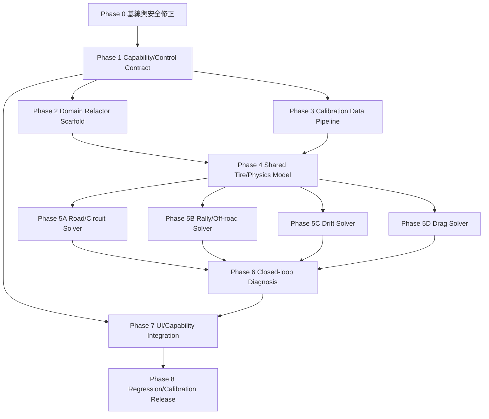

# TuningMath 多階段實作計畫

日期：2026-08-13
基準文件：[調校數學與 FH6 Meta 評估報告](./tuning-math-fh6-meta-evaluation-report.md)

## 1. 實作策略

目標不是一次把 heuristic 改成「完整物理引擎」，而是分三個層次逐步收斂：

1. **契約正確**：輸出的數值必須符合車輛改裝件、遊戲版本、UI step、min/max 與可調能力。
2. **模型可校準**：所有未驗證常數都要集中、版本化，能用同一車輛/路面/改裝條件做 A/B 校準。
3. **賽事 solver 可驗證**：Road、Rally、Drift、Drag 分別以對應 telemetry 指標驗證，而不是以單一圈速或單一分享碼宣稱 meta。

目前的 `tuningMath.ts` 保留為相容 facade；新 domain modules 通過測試後才逐步取代內部實作。任何階段都不得直接把社群分享碼或未版本化文章轉成 production 常數。

## 2. 總體依賴圖



### 依賴規則

- P0、P1、P2 是主幹順序依賴，完成前不應大幅改變 solver 輸出。
- P2 與 P3 在 P1 完成後可並行；P2 負責程式模組，P3 負責資料/fixture，不共用寫入檔案。
- P5A–P5D 在 P4 完成後可完全並行；每個 agent 只擁有自己的 solver、測試與文件。
- P6 必須等四種 solver 的輸出契約穩定後再整合，避免診斷同時適配多套未完成數值。
- P7 與 P6 有部分可並行：UI capability gate 可先做，closed-loop advice 的欄位整合必須等 P6 完成。
- P8 是 release gate，不應與 P5 solver 開發並行合併。

## 3. 分階段計畫

### Phase 0 — 基線、命名與安全修正

**順序：** 第一階段，無前置依賴。
**可並行性：** 主 agent 建立基線；QA agent 可並行檢查既有測試與邊界。
**目標：** 先把「通過既有測試」與「目前數值真實語意」固定下來。

工作內容：

- 記錄現有 `45 files / 251 tests` 基線與代表車輛輸出 snapshot。
- 將 README/UI 文案中的 `physically sound`、`scientific` 改成 `empirical starting preset` 或等價語意。
- 修正不會改變正常輸出的安全問題：`weight_distribution=0/100` 的除零、NaN/Infinity、未知 telemetry 被當成 0 的狀態標記。
- 明確標註 `tireCoefficients` 是 Drift gearing prior，而非通用 grip coefficient。
- 對 Rally secondary correction 的 Road ratio reuse 建立 failing regression test；先不在同一 commit 重寫 solver。

**預計 commit：**

- `docs(tuning): classify presets as empirical and record baseline`
- `fix(tuning): guard invalid distribution and unknown telemetry states`
- `test(tuning): capture Rally correction regression and solver snapshots`

**完成門檻：** 所有既有測試通過；新增測試先描述目前 bug/風險；沒有未記錄的輸出變更。

### Phase 1 — FH6 Capability 與 Control Contract

**順序：** P0 後。
**可並行性：** Contract agent 與資料審查 agent 可並行，但只能由 contract owner 合併。
**目標：** 分離「遊戲真實可調範圍」與「solver 建議範圍」。

新增：

```ts
type TuneControlSpec = {
  section: string;
  field: string;
  unlocked: boolean;
  min: number;
  max: number;
  step: number | 'snap' | 'unknown';
  precision: number | 'unknown';
  unit: string;
  source: 'in_game_capture' | 'community' | 'default' | 'unknown';
  gameBuild?: string;
};

type UpgradeUnlockSpec = {
  installedPart: string;
  capabilities: Record<string, boolean>;
  controls: TuneControlSpec[];
};
```

工作內容：

- 建立 versioned data schema，不先填入未驗證的 FH6 真值。
- 將 `CarParams.adjustability` 擴充為 capability contract，保留舊欄位相容轉換。
- 統一 numeric clamp、step quantization、precision rounding；禁止 number input 繞過 solver 邊界。
- 解決 UI 車高 `5–35 cm` 與 solver 預設 `10–25 cm` 的不一致。
- 將 toe 從字串改為 numeric domain value，顯示單位留在 presentation layer。

**預計 commit：**

- `feat(tuning): add versioned tune control contract`
- `refactor(tuning): normalize numeric bounds and toe values`
- `test(tuning): cover clamp quantization and locked controls`

**完成門檻：** 同一控制項的 solver、UI、保存格式使用同一份 spec；locked control 不再輸出可套用建議；未知 step 必須顯示 unknown 而不是猜測。

### Phase 2 — Domain Refactor Scaffold

**順序：** P1 後。
**可並行性：** 可與 P3 並行。
**目標：** 把目前 God module 拆為純函式 domain modules，先保持輸出相容。

建議目錄：

```text
frontend/src/domain/tuning/
  contracts.ts
  constants.ts
  validation.ts
  tires/tireModel.ts
  chassis/suspensionSolver.ts
  chassis/differentialSolver.ts
  gearing/gearSpeed.ts
  gearing/aegoSolver.ts
  profiles/roadProfile.ts
  profiles/rallyProfile.ts
  profiles/driftProfile.ts
  profiles/dragProfile.ts
```

工作內容：

- `tuningMath.ts` 改成向後相容的 re-export facade。
- 將 gear speed/RPM、輪胎幾何、aero resolution、chassis profile、alignment 分離。
- 將所有 magic numbers 移至 `constants.ts`，每個常數標註 `empirical`、`physical` 或 `unknown`。
- 為每個 module 建立 table-driven tests，先鎖定既有行為，再允許 P4 逐步改變。

**預計 commit：**

- `refactor(tuning): introduce domain module boundaries`
- `refactor(tuning): move calibration constants behind profiles`
- `test(tuning): add domain-level compatibility fixtures`

**完成門檻：** UI 不直接依賴 profile 內部細節；純函式可獨立測試；原有 import path 與既有測試仍可工作。

### Phase 3 — Calibration Data Pipeline 與中國社群 Fixture

**順序：** P1 後；可與 P2 並行。
**可並行性：** Data agent 與 telemetry agent 可並行，均不修改 solver。
**目標：** 把 Bilibili/中國社群分享碼從「線索」變成可重現實驗資料，而不是直接變成常數。

資料欄位至少包含：

```text
car_id, drivetrain, class, pi, game_build,
installed_parts, tire_type, surface, weather, assists,
event_type, track, share_code,
control_section, field, display_value, unit,
min, max, step, precision, screenshot_path,
telemetry_session, lap_time, launch_time, notes, confidence
```

工作內容：

- 建立 JSON schema/fixture loader 與資料品質檢查。
- 建立 Starlet、AE86、GMC Jimmy、WRX、MG 6R4、Viper、B600 FWD Civic 等候選樣本。
- 將「Bilibili 412/驗證碼、只有分享碼、無版本」記為 evidence limitation。
- 定義 A/B protocol：同車、同 PI、同改裝、同路面、同輔助設定、重複至少 5 次。
- 產生相對指標：峰值 longitudinal/lateral G、slip ratio、slip angle、60-ft/100-m、換檔後 RPM、觸底率與落地 G。

**預計 commit：**

- `feat(calibration): add tuning experiment schema and loader`
- `test(calibration): validate fixture completeness and version keys`
- `docs(calibration): add Chinese-community evidence and capture protocol`

**完成門檻：** 沒有 `game_build` 或改裝清單的資料不能進入 production calibration profile，只能放在 `unverified/`。

### Phase 4 — Shared Tire/Physics Model

**順序：** P2、P3 後。
**可並行性：** Tire agent 與 chassis/critical damping agent 可並行；兩者共用 contracts，不共用同一 implementation file。
**目標：** 先建立所有賽事共用的可校準物理基礎。

最低模型：

```text
muLong[compound][surface]
muLat[compound][surface]
temperatureMultiplier
pressureMultiplier
loadSensitivity
peakSlipRatio
peakSlipAngle
```

工作內容：

- 把單一 `tireGripCoefficient` 拆成 longitudinal/lateral/surface profile；舊值只能作 legacy prior。
- 建立 friction circle/ellipse 與 combined-slip validation。
- 以 sprung mass、wheel rate、motion ratio、目標自然頻率計算 spring；以 critical damping 與 damping ratio 建立 rebound/bump 初始值。
- 將 `Fz` 缺失明確標示為 estimated/unknown，不假裝是量測值。
- 建立 calibration constants 與 game-build versioning。

**預計 commit：**

- `feat(physics): add versioned tire longitudinal-lateral model`
- `feat(physics): derive spring and damping baselines from wheel rate`
- `test(physics): add friction ellipse and critical damping invariants`

**完成門檻：** 舊 solver 可透過 legacy profile 重現；新模型在無校準資料時不得自動覆蓋既有 preset。

### Phase 5A — Road/Circuit Solver

**順序：** P4 後。
**可並行性：** 可與 P5B/P5C/P5D 完全並行。
**目標：** 將 Road/Circuit 從單一分支拆成 `technical`、`balanced`、`high_speed`。

工作內容：

- solver 輸入加入 target top speed、slowest corner speed、straight ratio、surface 與 aero state。
- 保留 AWD `1/65` 為 `circuit_rotation` preset，不作通用公式。
- 以完整 torque/power curve 決定 shift RPM 與 ratio，而不是線性 `rMin/rMax`。
- 以胎溫、slip angle、lateral G 與底盤觸底率校準胎壓/camber/ARB。

**預計 commit：**

- `feat(tuning): add road technical balanced high-speed profiles`
- `feat(gearing): optimize road ratios against powerband targets`
- `test(tuning): add road profile and powerband fixtures`

### Phase 5B — Rally/Off-road Solver

**順序：** P4 後。
**可並行性：** 可與 P5A/P5C/P5D 完全並行。
**目標：** 分離 `Rally/Gravel`、`CrossCountry`、`DangerSign/Jump`。

工作內容：

- 使用 surface roughness、jump severity、airtime、wheel travel 與 landing impact。
- 接入 `SurfaceRumble`、`TireCombinedSlip`、四輪行程與 timestamp。
- 修正 Rally secondary correction 不應套用 Road ratio 的缺陷。
- AWD rear bias 與 decel lock 由前後軸 slip/combined slip 校準；`25%` 僅保留為 legacy preset。

**預計 commit：**

- `fix(rally): preserve rally ratio model during secondary correction`
- `feat(rally): split gravel cross-country and jump profiles`
- `test(rally): cover surface slip and landing telemetry`

### Phase 5C — Drift Solver

**順序：** P4 後。
**可並行性：** 可與 P5A/P5B/P5D 完全並行。
**目標：** 將漂移調校從固定值改為可控滑移窗口。

工作內容：

- `rear accel=100%` 改為可配置 range；`80%+`、`100/100` 作為不同 preset。
- 以 vehicle sideslip、yaw rate、velocity vector、front steer 與 rear slip angle 分離「車身漂移角」與「輪胎滑角」。
- 前 toe-out、前 camber、rear camber、胎壓與後 ARB 依目標角度、穩定度與胎溫校準。
- drift time 改用 timestamp integration，不使用 sample count。

**預計 commit：**

- `feat(drift): add controllable slip-window solver`
- `fix(diagnosis): separate vehicle drift angle from tire slip angle`
- `test(drift): cover angle, stability and timestamp boundaries`

### Phase 5D — Drag Solver

**順序：** P4 後。
**可並行性：** 可與 P5A/P5B/P5C 完全並行。
**目標：** 讓 Drag gearing 由賽道距離、power curve 與 launch traction 決定。

工作內容：

- `vDragTop` 改為 simulated top speed anchor；長期加入 CdA、rolling resistance、efficiency。
- 以 `ΔFz = m·a·hCG/L` 建立 launch load transfer，加入 tire longitudinal grip、diff torque split 與 AWD/RWD。
- 4-speed/第 4 檔 `1.00` 改為可選 strategy；依 strip length 和終點檔位最佳化。
- Drag tire 與一般胎分離 longitudinal/lateral 行為。
- 以 60-ft、100-m、shift RPM、wheelspin、終點速度作 acceptance metrics。

**預計 commit：**

- `feat(drag): add launch traction and load-transfer model`
- `feat(drag): optimize gearing by strip distance and power curve`
- `test(drag): add AWD RWD tire mass and distance matrix`

### Phase 6 — Closed-loop Diagnosis

**順序：** P5A–P5D 完成後。
**可並行性：** diagnosis core 與 report/UI adapter 可並行，但 schema owner 必須一致。
**目標：** 把 telemetry 從事後提示升級為 solver 的可控回饋。

工作內容：

- 所有缺失訊號回傳 `unknown`，禁止 fallback 0 造成假安全。
- 以 timestamp 計算 drift time、jump airtime、落地後 impact window。
- 由四輪/內中外溫差、slip angle、combined slip 產生 adjustment confidence。
- 每個建議附上 current、target、delta、reason、confidence、source profile。

**預計 commit：**

- `refactor(diagnosis): represent missing telemetry as unknown`
- `feat(diagnosis): add timestamp and confidence-aware recommendations`
- `test(diagnosis): cover telemetry gaps and nonuniform sampling`

### Phase 7 — UI、改裝能力與保存格式整合

**順序：** P1 可先做 capability gate；完整整合依賴 P6。
**可並行性：** UI agent 與 persistence/API agent 可並行；不得直接修改 domain solver。

工作內容：

- UI 僅顯示 `editable=true` 且有已知 range 的 controls。
- 顯示 `suggested value` 與 `actual in-game value` 兩欄。
- locked/unknown controls 顯示原因與資料來源。
- 補上 brake balance/pressure、aero capability 與真正的 gear count contract。
- 保存 tuning 時寫入 game build、installed parts、profile、calibration version。

**預計 commit：**

- `feat(ui): enforce capability-aware tuning controls`
- `feat(tuning): persist versioned profile and installed parts`
- `test(ui): cover locked controls units and step quantization`

### Phase 8 — 整合驗證與受控發布

**順序：** 所有前置階段完成。
**可並行性：** QA、資料完整性審查與文件審查可並行；最後由 main integrator 合併。
**目標：** 只發布有證據支撐的 profile，未校準功能保持 opt-in。

驗證矩陣：

- `pnpm -C frontend run test`
- `pytest tests/`
- `ruff check .` 與 `ruff format --check .`
- 每種賽事至少一個 legacy profile regression fixture。
- 每個新 profile 至少一組已版本化 A/B telemetry fixture。
- 極端輸入：0/100 weight distribution、缺胎種、無改裝能力、未知 step、非均勻 timestamp、不同 gear count。
- `git diff --check`、文件/Journal 更新與 evidence source review。

**預計 commit：**

- `test(tuning): add end-to-end profile regression matrix`
- `docs(tuning): publish calibration status and known limitations`
- `release(tuning): enable only validated profiles`

## 4. Subagent 投入方案

### 建議角色與寫入 ownership

| 角色 | 建議模型 | 寫入範圍 | 投入階段 | 預估投入 |
|---|---|---|---|---:|
| Architecture/Contract owner | `gpt-5.6-terra` | `frontend/src/domain/tuning/contracts.ts`、schema、contract tests | P1–P2、P7 | 4–6 agent-turns |
| Calibration/Data owner | `gpt-5.6-terra` | `docs/calibration/`、fixture schema、capture protocol、data QA | P3、P8 | 3–5 agent-turns |
| Shared Physics/Tire owner | `gpt-5.6-terra` | `tires/`、spring/damping model、physics tests | P4 | 5–8 agent-turns |
| Road/Rally owner | `gpt-5.6-terra` | `profiles/road*`、`profiles/rally*`、各自 tests | P5A–P5B | 各 4–6 agent-turns |
| Drift/Drag owner | `gpt-5.6-terra` | `profiles/drift*`、`profiles/drag*`、各自 tests | P5C–P5D | 各 4–6 agent-turns |
| Diagnosis/QA owner | `gpt-5.6-terra` 或較快模型 | `tuningDiagnosis` adapter、diagnosis tests、matrix | P6、P8 | 4–6 agent-turns |
| UI/Integration owner | `gpt-5.6-terra` 或較快模型 | tuning components、persistence、compat facade | P7–P8 | 4–7 agent-turns |

### 實際並行配置

- **低並行（1–2 agents）：** 主 agent 做 P0/P1；Terra 做 P3；P5 四類 solver 分兩波完成。適合代理槽位有限或需要頻繁 review 的情況。
- **建議並行（3–4 agents）：** 主 agent掌握整合與 contract；Terra-1 做 shared physics；Terra-2 做 Road/Rally；Terra-3 做 Drift/Drag；P5 可在 P4 完成後兩波合併。這是最安全的效率/衝突平衡。
- **高並行（5–6 agents）：** 只有在每個 agent 有嚴格 disjoint write set、明確 fixture 與每日整合窗口時使用。不要讓多名 agent 同時修改 `tuningMath.ts`、`tuningDiagnosis.ts` 或同一份 JSON calibration profile。

### Subagent 使用原則

1. 研究型 agent 只提供 source/evidence，不直接修改 production constants。
2. 每個 coding agent 必須在 prompt 中收到明確 ownership、禁止修改檔案與驗證命令。
3. Terra 用於跨模組物理/契約與高風險 solver；簡單測試搬移、fixture 格式化或文件整理可使用較快模型。
4. 任何 agent 完成後先回報 changed files、tests、未解問題，再由 main integrator review；不直接互相覆蓋。
5. 需要共享檔案時先拆成 facade/adapter，避免 agent 直接同改 `tuningMath.ts`。

## 5. 風險與停止條件

- 若拿不到 FH6 實機 slider snapshot，不得把 community anecdote 升級為 calibration constant；維持 legacy profile。
- 若某 solver 改善一項指標卻惡化另一項（例如 Drag 直線速度提升但 wheelspin/60-ft 惡化），保留兩個 profile，不強行選單一 meta。
- 若遊戲版本更新改變 Drag Tires、胎壓標尺或改裝能力，停用受影響 calibration profile，新增 build key，不覆蓋歷史資料。
- 若 domain refactor 使既有 UI 或 Python contract 失效，先回退到 compatibility facade；不得在同一 commit 同時改 API、solver 與 UI。

## 6. 最終交付形態

完成後應交付：

- versioned `TuningCapabilityContract` 與改裝解鎖資料。
- legacy 與 calibrated profile 並存的 tuning domain API。
- Road、Rally、Drift、Drag 各自的 solver、測試與 calibration status。
- tire longitudinal/lateral/surface 模型與資料品質標記。
- confidence-aware telemetry diagnosis。
- 可追溯的 game build、改裝件、分享碼、slider snapshot 與 telemetry fixture。
- 每個 commit 對應單一責任，能獨立 review、測試與回退。
