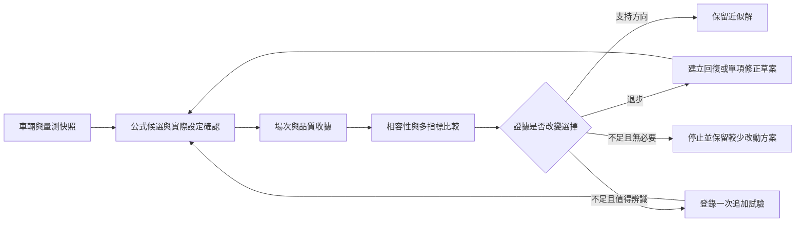

# 調校工作流與賽後分析回饋提案

狀態：2026-09-10設計提案，尚未實作。依據本次Integra與MX-5實测、分析工具及目前產品程式整理；不增加新場次、不自動改寫公式或遊戲設定。採用 `modular-refactoring` 整理資料與模組邊界。

## 產品目標與決策原則

將「輸入資料 → 公式候選 → 實際套用確認 → 完整場次 → 可比較證據 → 保留／回復／一次有目的的追加測試」接成可追溯流程。成功是找到方向合理、近似可用且沒有明顯退步的設定；不是每台車都做多點尋優，也不要求單圈一定變快。

使用者先看到三件事：這次改了什麼、結果是否足以比較、下一步是否值得做。圈速、穩定性與局部動態分開呈現；無可辨識差異時以較少改動的候選作工程優先選擇，不能寫成統計等效或最優。

## 已有基礎與目前落差

以下是本次程式碼核對所得，並非新功能已完成。

|目前入口|可沿用部分|接入前要補的能力|
|---|---|---|
|`frontend/src/features/tuning/TuningView.tsx`、`tuningMeasurement.ts`|量測身分、時間進展、輸入完整度、凍結量測摘要|把快照與公式版本持久化，連到實際設定和場次；目前頁面生命週期快照不等於試驗紀錄|
|`components/Step5TelemetryCalibration.tsx`|核對實際底盤／齒比，修改撤銷確認，等待新駕駛資料|建立不可變的已確認設定版本與場次關聯；分析後回傳「候選建議」，不要直接改表或遊戲|
|`backend/race_recorder.py`|有界佇列、非同步SQLite寫入、丟樣／失敗診斷|目前`downsample_interval=0.1`、最多50000樣本，不能當全頻率研究capture；需完整圈界、完賽metadata等待、可選研究錄製與逐場缺口紀錄|
|`backend/telemetry_sqlite.py`|場次、逐點及圈摘要存取|現有圈速由儲存點首尾時間相減，不是遊戲LastLap；若干單位以值大小猜測，ANG寫入乘57.29578再讀回除回，部分小輸入／加速度可能丟失；必須用來源版本明確轉換|
|`frontend/src/features/analysis/AnalysisView.tsx`|歷史場次、圈選擇、地圖及摘要入口|目前比較圈來自同一選定場次；新增跨場次、設定版本、試驗區塊選擇|
|`LapDeltaCanvas.tsx`|速度與操作疊圖呈現|目前橫軸依`i/(length-1)`並標為Lap Distance；應先區分樣本進度與實際沿程，再提供共同路徑對齊與真正時間差|
|`sessionDebriefMath.ts`、`backend/motec_exporter.py`|前後端賽後摘要與匯入管道|目前按樣本算平均、把行程≥0.95樣本計為bottom_out_count，缺胎溫可能用預設值；需改為覆蓋率、時間加權與近端事件，兩端遵守同一版本契約|
|`scripts/analyze_chassis_race.py`|完整圈、延後末圈、缺口、SHA、時間加權逐輪描述及6項測試|可提煉為離線摘要核心；其餘比較、空間及模型探索仍在ignored scratch，先整理成有契約的正式模組後再接UI|

研究JSONL、產品SQLite與MoTeC匯入是不同來源。不能因API欄位同名就當成相同單位、圈號或取樣品質；歷史檔無法補回已丟失欄位與高頻事件。此PR先記錄落差，沒有宣稱已修復上述賽後路徑。

## 方法整理與對應功能

|本次方法|要回答的問題|產品化輸出與限制|
|---|---|---|
|原檔SHA、讀回收據、完整性盤點|分析是否來自正確且完整的場次？|場次品質卡：來源、實際設定版本、七圈覆蓋、末圈來源、缺口、未觀測時間、通道覆蓋。原始檔不可被重算覆寫|
|凍結A、單因素變更、A→候選→A回訪|變化能否合理連到設定？|設定差異表、未固定因素、先後順序。套件替換與單項試驗分開，不能將多因素套件當單項回歸|
|主窗口與敏感度窗口|結論是否只取決於選圈？|保留全部圈，站立起跑獨立顯示；七圈預設2～7主比較，另列3～6、2～6。短賽／衝刺依其結構設定，不能硬套七圈|
|全場時間、平均／中位數、標準差／MAD與全距|較快與較一致是否同時成立？|場內描述分開呈現，最快圈僅作補充。跨場估計以場次為實驗單位；標準差也受圈序／路線影響，不能單獨歸因車輛更穩|
|共同XYZ路徑投影、同圈序／同路段比較|時間在哪裡獲得或失去？|距離軸速度差、累積時間差、13段等固定區段及快慢並存結果。提供投影殘差、共同覆蓋與失配區，不能跨缺口插值或按樣本索引冒充同位置|
|依煞車、油門、橫向加速度分相位|滑移與輸入是否在相近操駕條件下改變？|入彎煞車、彎中、功率轉彎的速度／輸入／四輪滑移分布和曝光時間。遮罩名稱是操作描述，不宣稱精確APEX或穩態|
|時間加權逐輪分位數|指標是否被高頻樣本數或短暫尖峰支配？|每輪均值、p05/p50/p95、觀測秒數及缺測率。權重只計有效相鄰時間，缺值不補零；門檻與取樣契約隨報告保存|
|5Hz駕駛輸入總變化量、輸入事件|ANNA是否需要更多操作活動？|油門／煞車／轉向活動分開，固定重採樣率並避開缺口；稱「控制需求代理」，不顯示虛構的ANNA信心分數|
|近伸展／壓縮端連續事件與SurfaceRumble|局部異常是否重現、是否伴隨路面交互？|事件數、總時間、最長時間、同位置疊圖及同時／延遲曝光。門檻跨越不能按每個封包算一事件；不直接標成離地、觸底、接地力或輪荷|
|胎溫、G-G觀測曝光|是否存在熱狀態或加速度使用差異？|逐輪溫度與同色階G-G，標示body座標、單位及坡度未修正。無內中外胎溫／磨耗時不顯示均勻吃胎或抓地極限判定|
|A回訪、時間漂移敏感度|收益是否小於基準自身變化？|原始差為主要結果，另報前後A平均／插值及時間项敏感度；有回訪也不消除非線性漂移，不能宣稱完成因果隔離|
|S／SD、A/E/G/H四格及差中之差|額外阻尼或定位是否帶來新增收益？|主效應與交互差、順序及每格真實場數。定位新舊各一場只作描述，不能把圈或重疊路段當獨立重複|
|設計矩陣秩、線性k／1/k／二次模型、整檔留出|複雜模型是否有可識別且可靠的額外價值？|進階研究頁；資料秩不足先標不可辨識。訓練誤差、整個剛度檔位留出及事前新檔預測分開；禁止隨機拆封包造成洩漏|
|擾動敏感度、凍結基準直接取整|公式是否對小誤差穩定？|報適用區間、已評估網格的預測擾動與合法UI刻度差。從凍結A重算後才取整，不逐步累积刻度誤差；有限網格或clamp不叫最優收斂證明|

## 建議的使用者流程

1. **準備**：沿用已知靜態資料及引擎量測；顯示資料足夠與缺少哪些假設。MR未知時保留未知／輪端目標，不要求使用者猜一個值來解鎖結論。
2. **建立比較**：選既有確認設定作A，選公式版本產生S或SD。自動列出實際改動、鎖定項、胎壓／定位／變速箱等未變項；使用者確認遊戲读回後凍結候選。若設定差超出計畫，保留偏差而非靜默改設計。
3. **執行場次**：一般模式採最小完整區塊A→S→SD→A；已有適當A可重用但顯示時間差與相容性。允許使用者只跑一場或暫停，品質與證據強度據實降級，不強迫為完成精靈而額外開賽。
4. **賽後先看可比較性**：展示完整場次、條件差異、缺測及設定差，預設不因缺一欄而拒绝所有分析；各指標各自標可用或不可用。
5. **判讀**：頂部用「方向正向」「有取捨」「明顯退步」「差異不足」「無法比較」等結論，附具體理由與原始指標。這些是可解釋工程狀態，不是自動統計顯著性。
6. **回饋**：提供保留當前候選、建立回復A方案、或建立一次有目的的追加試驗。操作只建立草案；沿用Step5遊戲套用確認，後續新資料綁定新設定。停止後保留全部資料與候選狀態。

## 建議的資料契約（待實作）

所有實體包含schemaVersion；欄位未知使用null及原因，禁止以0表示未知。ID只供內部關聯，介面顯示人可讀車名、設定名與時間；診斷log不輸出原始封包或駕駛輸入。

|實體|必要内容|
|---|---|
|VehicleSnapshot|車輛ordinal/PI、驅動、靜態配重、輪胎與可調範圍、遊戲版本來源、使用者確認的零件／配置；同PI不保證同車配置|
|SetupSnapshot|公式ID與版本、输入及其來源、未取整目標、UI目標、實際讀回值、單位、未知／鎖定項、確認時間、父設定版本及變更清單|
|ExperimentPlan|A/S/SD等角色、固定項、預期場次／順序、主要窗口與主指標、實用差異門檻、補充指標、最大追加場數及停止規則；於首場前凍結|
|RaceCaptureManifest|來源schema與parser版本、GameBuild未知狀態、實際sample間隔／缺口、比賽車輛、開始／結束原因、圈數、遊戲LastLap與總時間來源、setup關聯、hash、finalized狀態與保存品質|
|RaceSummary|每圈獨立完成狀態、官方／遊戲／取樣估計圈速來源、全部窗口、各通道覆蓋、時間加權分布與事件、分析方法版本；缺圈不得由總時間反補|
|ComparisonReport|所有輸入manifest雜湊、計畫版本、相容性差異、各指標資格、原始差／漂移敏感度、路徑投影品質、反向路段、場數、工程結論及理由|
|TuningFeedbackProposal|證據report引用、建議動作、參數差、適用範圍、採納／拒絕／待處理狀態；不直接寫入車輛設定或全域公式常數|

建議持久化新增版本化表／資料包，不覆寫舊SQLite語意。來源以明確adapter處理`decoded_fh6`、`legacy_sqlite`、`motec_import`，必要時標`legacy_quality_unknown`；值大小不再決定單位。舊檔缺資料只降級對應指標，未知損失不可逆時不做假修復。

錄製需保留TimestampMS、CurrentRaceTime、CurrentLap（圈時計）、LapNumber（圈號）、LastLap及BestLap的不同語意；狀態機分recording、awaiting_finish_metadata、finalized_complete、finalized_incomplete，延遲末圈只補metadata，不算駕駛曝光。等待有時間上限，缺末圈以不完整結束。手動終止、重開賽、切車及程式關閉皆保留原因。

研究錄製需保留本次已解碼使用的XYZ、速度、加速度、姿態、四輪胎溫／滑移／combined slip／兩種行程、SurfaceRumble、油門／煞車／轉向／離合／手煞車、檔位與引擎輸出。額外UDP欄位另立parser變更任務，不在此提案默默改offset。一般瀏覽維持降採樣；分析只使用實際保存的頻率，50ms事件不得用10Hz樣本宣稱精確重建。

## 計算與模組分工

- 公式初始解與調整推導維持 `tuningMath.ts` 的純函數；研究模型沒有跨車證據時不能由報告自動校準全域常數。
- 建議由後端離線analysis模組產生版本化摘要、事件及比較，前端僅呈現與建立回饋草案。既有前端本機CSV入口透過同一adapter／分析服務；若保留本地fallback，須共享fixture契約測試並標明方法版本，避免兩套摘要相反。
- UDP接收迴圈只做有界資料快照及入列；完整資料寫入、hash、空間投影、擬合都在worker或賽後工作執行。沿用AsyncRacePersistence背壓診斷，排隊／丟失狀態納入manifest。研究錄製採使用者啟用、有容量與時間上限、可取消，不以同步寫檔阻塞60Hz輸入。
- 建議新增實驗／設定快照與compare API，回傳job與進度／結果；實際路由在實作時定義，現有API不冒稱已提供。報告快取鍵含capture hash、設定／計畫及方法版本，切換場次取消過期請求。
- 大量逐點資料不塞進React state；前端圖表取已降採樣／空間對齊的可視資料，詳細事件按需載入。既有健康指標保留連線健康用途，與車輛性能判定分開。

## 比較資格與停止規則

車輛／配置不匹配、路線不匹配或關鍵時間無法恢復時，相應性能比較不成立；仍允許查看各場原始描述。天氣、輔助、ANNA／真人、輪胎狀態、定位、齒比等差異或未知清楚列出。統計樣本數以独立場次計，任何信賴區間方法須在有足夠場次與合理假設後才啟用。

「較快」與「不劣」的實用門檻應在試驗前設定並保存：可由賽道長度、重複A的自然變動及使用者目標協助選擇，不把本次0.05秒／圈寫成所有賽道固定門檻。只有平均改善但有滑移／控制或事件退步時，輸出有取捨；圈速未快但一致性或重現局部動態改善，輸出具體改善而不宣稱整體最佳。

既有5%單因素變化不足以辨識時，可提議從凍結A直接改為10%，不是從已改5%的值再乘1.10。先核對合法範圍、讀回刻度與是否仍為單因素，且只有追加有機會改變決策時才做；整套頻率替換不冒充10%局部探索。候選已達可用且複雜方案未顯示額外價值時停止，不繼續追二次曲線範圍外頂點。

## 分階段交付與驗收

|階段|交付範圍|完成標準|
|---|---|---|
|P0 資料與語意|來源adapter、明確單位／缺值、圈界與末圈狀態機、版本化manifest；修正舊摘要觸底與索引距離語意|封包到保存再到API往返不丟小輸入或小加速度；CurrentLap不當圈號；缺胎溫不變正常溫度；10Hz與研究capture品質可區分；舊資料仍可讀且不假裝完整|
|P1 最小可用回饋|持久化設定與試驗關聯、跨場比較、圈窗口與完整性卡、均值／標準差／MAD、S/SD相對A、工程停止建議|給定已封存摘要可重現MX-5原／新定位比較方向，缺圈或條件未知可降級；採納只建立草案並撤銷Step5確認，沒有新駕駛資料不得校準|
|P2 局部動態分析|共同路徑、固定區段、速度／時間差、分相位滑移、5Hz輸入活動、行程／SurfaceRumble事件、胎溫與G-G|不同取樣率及非均勻點數不改比較意義；失配路段與大缺口不插值；連續事件按事件計數；反向區段與指標取捨完整保留|
|P3 進階研究|A回訪漂移敏感度、四格交互作用、模型秩／整檔留出／擾動分析、跨車证據矩陣|不以封包數膨脹樣本；不將事後擬合冒充事前命中；秩不足與外推區域有明確狀態；未經獨立跨車驗證不能升格正式公式|

建議先交付P0→P1。這能把最有價值的「確認實際改動、完整比較、足夠好就停止」直接帶回工作流；P2補解釋能力，P3保留研究用途。每階段用獨立PR審查，避免一次將探索腳本全部塞進AnalysisView。

驗證使用有來源的版本化fixture與不帶真實來源聲稱的合成邊界案例：延遲LastLap、缺末圈、重開賽、重複／倒退timestamp、不同取樣率、四輪缺值、小幅正負控制輸入、來源單位往返、路徑失配、整場留出洩漏防護、A→B→A與套件變更差異。真實capture另帶manifest與SHA；沒有原檔時只能驗證報告重播，不能宣稱原始重算。效能驗證包含writer背壓與分析取消，確認新增分析不阻塞即時遙測；不做Canvas像素座標或實作細節呼叫次數測試。

## 本次MX-5在新介面的預期呈現範例

> 已完成A、S、SD各一場。三場七圈完整；固定順序，沒有末端A回訪。S較A快0.088秒／圈，SD較A快0.078秒／圈；更換定位前後差異不足以支持原定位限制候選的判斷。SD右前近伸展代理較少，但場內標準差更大。若以最小改動為目標，優先保留S；SD保留為有局部取捨的候選。新舊前彈簧差0.1lb/in已列入設定差異。沒有證明統計等效或ANNA信心提升。

此範例引用[定位重測](mx5-alignment-retest-20260910.md)而非新的產品輸出。完整實作／研究入口見[實作索引](tuning-implementation-and-evidence-20260910.md)。
