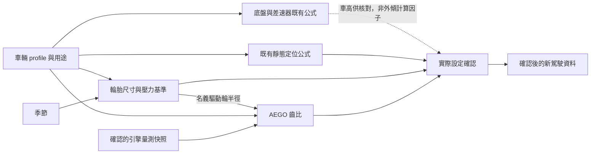

# 調校順序、計算依賴與實測回饋

## 上下文與此次範圍

本次延續 `codex/chassis-sevenlap`／PR #323。之前已完成量測導向 AEGO、實際設定確認、Integra 與 MX-5 的底盤／定位比較，以及[賽後分析回饋提案](tuning-post-race-feedback-proposal.md)。研究目標是方向合理、近似可用且沒有明顯退步；不以單車的極小圈速差追求通用最佳解。

MX-5 定位後 A/S/SD 的第 2～7 圈均值為 60.184334／60.096376／60.106614 秒；沒有支持原定位使先前底盤結果明顯失真的證據，也沒有證明各設定等效。自然頻率與驅動形式阻尼比例仍是研究候選，尚未取代產品公式。完整實作與證據見[索引](tuning-implementation-and-evidence-20260910.md)。

此次實作修正原「引擎量測與齒比 → 底盤 → 胎壓與定位 → 驗證」的強制頁面關卡。沒有新增賽事、變更物理倍率、修改 UDP 欄位或實作跨場分析；原始 capture 仍位於 ignored scratch。

## 工程依據與建議順序

三個領域會影響整車動態，但不代表每個計算都需要上一頁的數值。現實中的機械操作、公式的輸入依賴，以及為了控制變因而採取的實驗順序，應分開處理。

- Hoosier 的輪胎指南指出負外傾不足時胎壓需求可能不同，支持把輪胎工作狀態與定位一起驗證；不能把廠商針對特定胎款的壓力直接當成 FH6 常數。[NASA RCES Tire Setup Guidelines](https://www.hoosiertire.com/assets/NASA%20RCES%20-%20Tire%20Setup%20Guidelines.pdf)
- Öhlins 安裝說明要求安裝避震系統後重新核對輪胎定位。據此把「底盤平台／車高 → 定位確認」列為實務檢查順序；這不證明遊戲具有相同的外傾增益模型。[Öhlins automotive mounting instructions](https://www.ohlins.com/storage/9D9A9ED5049D4134D51AF4F8F0F9B88341CAC74B0FCE668939E9E0FB507E60F7/8121ce4b60c64cb792980c86a346f0f6/pdf/media/73064831d5a34ef2a1b35af38c382765/MI_FOV%201-2W00_FOV%203-4W50_1.pdf)
- Penske 的調校指南重視可重現基準、行程檢查及一次有目的的變動；其避震器手冊也說明輪胎、彈簧與阻尼共同工作，彈簧改變後需重新評估阻尼。前者是 sprint car 情境，不能照搬為所有 FR 車的倍率。[repeatable tuning process](https://www.penskeshocks.com/blog/sprint-car-shock-setup-guide-a-repeatable-tuning-process)、[adjustable manual](https://www.penskeshocks.com/hubfs/Resources/Manuals/Adjustable-Manual1.pdf)

以下六階段是根據上述原理與現有產品能力作出的設計選擇，並非聲稱賽車工程存在唯一固定順序。

|建議階段|內容與目的|實際存取條件|
|---|---|---|
|1 目標與資料|用途、改裝身分、車重配重、輪胎尺寸、可調範圍與單位|隨時可開|
|2 輪胎基準|起始冷胎壓、熱胎壓目標、尺寸與名義輪胎半徑|已載入有效車重與配重|
|3 底盤平台|彈簧／車高 → 防傾桿 → 阻尼；先建立可核對的機械基準|同上；不要求引擎量測|
|4 輪胎定位|Camber／Toe／Caster，並顯示前一步計算的車高供核對|同上；不要求先拜訪底盤頁|
|5 動力與傳動|差速器／扭力分配、引擎量測、AEGO 齒比|頁面與差速器僅需機械資料；引擎收集另需有效馬力，齒比另需完整量測|
|6 實際設定確認與驗證|核對遊戲實際設定，再使用確認後的新駕駛資料分析|目前整套驗證仍需有效引擎資料與齒比結果|

導覽與主選單共用 `tuningWorkflow.ts`，沒有「已拜訪上一頁」狀態。可以直接開定位或動力頁；這不代表已在遊戲套用任何設定。引擎快照失效時，輪胎／底盤／定位頁維持可用；若當時在整套驗證頁，才返回動力頁。車輛基本資料無效則返回目標與資料頁。

## 已實作的單向計算

`calculateWorkflowTuning` 在一次純函式呼叫中計算同一份 profile 的結果；數值函式仍集中於 `tuningMath.ts`。資料儲存的扭力 lb-ft 只在進入 solver 時轉成 N·m。頁面只顯示結果與單位，不另起計算 effect 回寫 profile。靜態快照排除 `dyno_curve/dyno_quality`，背景 polling 不會更換計算結果物件或清空已確認設定；實際 profile 欄位改變則撤銷引擎快照。

輪胎半徑是本次真正接入的上游計算值：先計算 `tires.gearingRadiusM`，再傳入共用齒比核心。FWD 使用前輪，RWD 使用後輪，AWD 沿用既有後輪慣例。它是名義幾何半徑，未由胎壓推導有效滾動半徑。既有 `calculateAEGOGearing` 公開介面與結果保持相容。

目前壓力與定位仍由既有 `calculateStaticTireAlignment` 共用函式產生，再分為兩個頁面。這是程式重用，不表示定位依賴冷胎壓。底盤內的阻尼目前也沒有讀取彈簧輸出；本次沒有為了排序而新增未經驗證的倍率或懸吊幾何公式。定位頁引用車高作檢查資訊，並不聲稱已用車高修正外傾。

缺失或非有限的量測 RPM、峰值 RPM 超過引擎上限、有效馬力缺失時，工作流的齒比結果為 `null`；機械估計依然可用，不把預設 8000 RPM 當成已完成量測。頁面內保留的舊 preset 也不能解除整套驗證關卡。

## 後續公式如何使用上游結果

新模型應接在明確的有向無環依賴上，不透過彼此監聽狀態來反覆修改輸入。例如自然頻率候選可依序使用：

1. 車重／配重與有來源的簧上比例，產生逐輪簧上質量 `m_s`。
2. 目標頻率及輪胎／用途先驗，計算 `k_w=(2πf)²m_s`；若已知且明確定義 `MR=彈簧位移/輪端位移`，再計算 `k_s=k_w/MR²`。
3. 阻尼模型消費前一步的輪端剛度：`c_crit=2√(k_w m_s)`，`c=ζc_crit`。此處需一致採 SI 單位；輪端阻尼係數換算到避震器端還需要幾何定義。
4. 只有取得遊戲滑桿與阻尼係數的校準映射後，才生成遊戲阻尼值。不能把滑桿 14.0 自動等同 ζ=0.7。

以上自然頻率與臨界阻尼關係是線性質量－彈簧－阻尼模型的結果，可參考 [MIT Engineering Dynamics 問題集](https://ocw.mit.edu/ans7870/2/2.14/s14/MIT2_14S14_Prob_Archive.pdf)；它們不是 FH6 遊戲滑桿校準結果。

這是未實作的擴充契約。MR、輪胎剛度、空力或阻尼滑桿映射未知時，保留可用的既有模型與來源標記，不要求玩家猜值，也不把同一物理效果重複算進不同階段。

實車動態可耦合，但一次公式評估仍可保持單向。若未來真的需要車高／空力／負載的聯立解，應在獨立 solver 中定義初值、範圍、容差、迭代上限及失敗回退，另行證明收斂；排序本身不是收斂證明。

## 接回賽後分析

依[回饋提案](tuning-post-race-feedback-proposal.md)，一次實測只產生下一個候選版本，不能回寫當次輸入或已確認設定。對比前凍結輪胎、底盤、定位、傳動與賽事條件；更改車高後提示重新核對定位，更改輪胎尺寸後更新齒比幾何，然後重新確認整套實際設定。

仍按圈速退步程度、穩定性、同路段滑移／行程、胎溫及控制輸入共同判斷。單場內多圈不是獨立重複；ANNA 輸入變化只代表閉環控制活動，不能直接讀成信心或最佳設定。無決定性差异時保留更簡單、變動更少的模型；±5% 訊號不足才考慮預先定義的 ±10% 對比，而非無限制搜尋。

## 驗證契約

- 導覽測試：沒有馬力／引擎量測仍可開機械頁；失效只限制依賴頁；無效車輛資料與頁碼回到安全入口。
- 算牌回歸：四用途、三驅動、四季節與既有函式逐項相等；引擎或季節改變不污染獨立結果；輪胎尺寸會影響齒比幾何；凍結輸入可重複計算且不被修改。
- 元件渲染：無引擎資料可立即顯示底盤，彈簧／車高優先，差速器只顯示適用軸；整套驗證保留資料門檻。

自動化與瀏覽器檢查驗證的是工作流及既有公式相容性，不是這個導覽順序會提高實際圈速。

2026-09-10 本地驗證：前端 99 files／704 tests；TypeScript／Vite build 通過；Python `tests/ scripts/tests/` 300 passed、9 deselected；Ruff check／format 通過，版本 11.45.17 一致。瀏覽器以記憶體內假資料檢查完整前端：1200 kg、50% 前重、0 hp、無遙測時可直接開啟定位、底盤、輪胎與差速器，整套驗證不可開啟；核對 Default、Modern、Elegant 的深／淺色代表畫面。未驗證新版流程的真實引擎收集或遊戲操作。測試 fixture 未讀寫真實車輛檔，測試服務與分頁已關閉。

第一次 Python 全套測試被畫面 fixture 占用 8001 而導致 sidecar 固定埠斷言失敗；關閉 fixture 後完整重跑通過，未更改斷言或放寬門檻。
