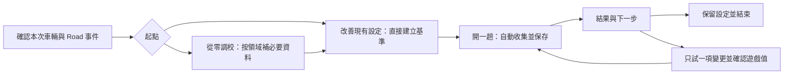

# 調校流程簡化與遙測輔助可行性

狀態：Road 設計基線；後續依啟用的實作目標完成第一版工作樹實作，見[Road 實作與驗證](road-workflow-implementation-20260910.md)。以下保留 2026-09-10 對 `codex/chassis-sevenlap`、HEAD `ffc728e` 的原始盤點及驗收設計，「目前」指提案時的基底；不得將本地實作驗證解讀為新增遊戲實測。

採用 `physics-tuning-math` 核對可量測性與公式依賴、`halfmoon-design-system` 規劃介面分層、`modular-refactoring` 整理資料與分析邊界。以下「目前」為原始碼檢查結果，「建議」為待交付設計，沒有把既有測試結果當成本提案的驗收。

## 建議採用的方向

Road 入口改為「確認車輛 → 開一趟 → 看下一步」。提供兩條路徑：預設改善現有設定，另外保留從零產生整套設定。觀察與比較不應先要求填完公式需要的所有欄位；賽事取向固定為 Road，不增加取向選擇。

移除一般流程中的季節補正與輪胎配方必選項，以本車、本次配置、本路況的熱狀態及動態觀測支援比較。這是減少對分類先驗的依賴，不是宣稱遙測能辨識季節或輪胎材質。胎壓本身仍需遊戲讀回；胎溫不能代填胎壓。

賽後以一個可解釋結論、一項候選變更和保留／回復路徑為主。原始四輪數值、事件流與研究圖表放到詳情。先降低判讀負擔，再用受控比較逐步提高建議可信度。

## 目前造成不便的原因

|現況與程式證據|使用者負擔／設計影響|
|---|---|
|[`Step1GoalSetup.tsx`](../frontend/src/features/tuning/components/Step1GoalSetup.tsx) 同頁呈現用途、季節、車重配重、驅動／配方／進氣、馬力扭力／檔數、8 個懸吊範圍值、6 個輪胎尺寸值|觀察現有設定也先看到大量算牌資料，玩家難以辨識此刻真正必需的項目|
|[`CarParamsContext.tsx`](../frontend/src/context/CarParamsContext.tsx) 對缺值補入 1500 kg、50%、Stock、輪胎尺寸與 Race／Full 等預設|「欄位有值」不等於已確認本次改裝；單純收合表單會把假設藏得更深|
|[`tuningMath.ts`](../frontend/src/utils/tuningMath.ts) 的季節分支只選擇 ±0.5 PSI，作用在部分冷胎壓算式；未使用氣溫、路溫或實測熱狀態|要求玩家選季節，只換來固定先驗偏移；不能稱為環境量測或輪胎校準|
|同檔的一般 solver 雖讀取 `tireType → getTireCoefficient → fGrip`，Road 分支未消費該係數；Road 靜態胎壓也不讀配方|Road 可直接取消配方必填，不必等待抓地估測器；應補 Road 輸出不受配方名稱影響的回歸驗證|
|[`tuningWorkflow.ts`](../frontend/src/features/tuning/tuningWorkflow.ts) 第 6 階段仍要求有效馬力、引擎量測與齒比結果|只想測輪胎或底盤也被整套驗證門檻限制|
|[`TuningView.tsx`](../frontend/src/features/tuning/TuningView.tsx) 的量測 key 包含整份靜態 profile；任一靜態欄位改變即清空引擎量測|即使只補懸吊範圍也可能重做引擎準備；應保留原始觀測，按依賴與配置變更判斷是否仍可使用|
|[`Step5TelemetryCalibration.tsx`](../frontend/src/features/tuning/components/Step5TelemetryCalibration.tsx) 累積即時建議、提供單項／批次採納；採納要求 `calibrationReady`|使用者要從瞬時訊號判讀因果，回到選單或完賽停止遙測後又不適合繼續處理建議；尚無持久化 A/B 比較閉環|
|[`tuningDiagnosis.ts`](../frontend/src/utils/tuningDiagnosis.ts) 已撤除若干單幀因果建議，但保留固定溫差分類、手動熱胎壓偏差等規則|觀測、啟發式規則、實測支持的改動仍需清楚區分；「confidence」不可被當成實驗證實率|

上述配方依賴結論僅指目前一般 Road 工作流，不能套用到 `tuningMath_dev`／其他 domain solver。引擎取樣已有有效時間、轉速覆蓋與換檔穩定門檻，可沿用其資料品質設計，不代表所有輪胎／底盤訊號已有同等品質檢查。

## 哪些輸入能省掉

官方 FH6 Data Out 定義提供車輛身分、驅動型式、引擎輸出、四輪胎溫、正規化滑移、行程、速度、位置與操控輸入；沒有季節、路溫／氣溫、輪胎配方、胎壓、車重／配重、調校滑桿值，也沒有 TrackOrdinal。每輪胎溫只有單一值，沒有內中外胎溫。依此可判斷哪些資訊可讀取，不能由欄位存在直接推論可辨識最佳調校。[官方封包文件](https://support.forza.net/hc/en-us/articles/51744149102611-Forza-Horizon-6-Data-Out-Documentation)

|資料|建議取得方式|應保留的限制|
|---|---|---|
|車型、PI、驅動型式|同車且時間持續前進的遙測自動取得；與舊檔不同時顯示差異|後端已有 `DrivetrainType`，一般前端 `TelemetryData` 型別尚未列出，仍需端到端接線；相同 PI 不保證相同零件|
|引擎上限、觀測功率／扭力與其轉速|沿用有效引擎掃描，展示實測來源與覆蓋度|單幀峰值或未到足夠負載的道路值不等於引擎最大能力；目前一般工作流仍使用 profile 馬力，不能只刪掉欄位|
|本次四輪熱狀態、滑移及行程曝光|有效行駛分段後自動摘要；逐輪保留缺值與觀測秒數|熱狀態接近不等於最佳溫度；較低滑移可能只是較慢；高行程不是直接觸底證據|
|車重、前重比例|只在生成依賴它們的公式初值時要求；沿用本配置已確認值|不建議用功率／加速度反推車重，坡度、阻力與傳動狀態使問題不足以辨識|
|前後輪胎尺寸、最大檔數|齒比生成時才要求已確認值；尺寸優先採遊戲資料|最高觀測檔位不等於最大檔數；名義尺寸不能由胎溫取得|
|冷胎壓、彈簧／車高範圍及可調性|只要求目前準備調整的項目；可沿用已確認配置|遙測讀不到。範圍未知時可觀察，但不得生成可能超出遊戲能力的絕對設定|
|完整實際設定|從零調校首次核對；局部改善只核對該次目標與變更群組，其餘記錄沿用／未知|局部快照不能冒稱整套核對；未知其他設定會限制因果結論|
|季節、配方名稱、主觀操控問題|一般入口不必填；作選填配置／事件註記|刪掉名稱輸入不會使環境或零件差異消失；系統仍要檢查比較條件|

靜態資料匯入可後續接上既有[畫面輸入可行性提案](tuning-screen-input-feasibility.md)的 OCR 草稿與單位覆核。它適合減少抄寫，但不應成為此版必備依賴。馬力／扭力的測量輸入替代需另驗證 solver 使用的是哪種輸出，優先先解除觀察路徑的輸入門檻。

舊 profile 保留數值，但沒有來源紀錄的欄位標為「沿用紀錄，尚未確認」，不能推定曾由遙測取得。首次確認後按配置保存，避免下次重新抄寫。原始量測永遠保留；例如只修正懸吊範圍，撤銷依賴它的底盤候選確認，不直接刪除引擎觀測。輪胎尺寸改變則重算齒比幾何；車輛／動力配置改變或不明時，引擎觀測保留供查閱但標為需重測。保留檔案與允許繼續算牌是兩個不同狀態。

## 季節與輪胎配方的替代方案

### 季節：改為本次熱狀態與條件相容性

1. 改善現有設定且進入胎壓比較時，才讀回遊戲目前冷胎壓作 A；只觀察時不要求填胎壓。不重新施加季節補正，也不強迫改成公式起始壓力。
2. 從零產生時，建議新增明確的「無季節補正」模式，季節偏移為 0，標為初始估計；不要把 Summer 預設偽裝成自動偵測。舊季節模式保留於進階／舊快照，公式版本必須分開。
3. 一般實測收集四輪溫度隨時間、相近路段的溫度變化及暖胎階段。對照 A/B 的起始與代表性熱狀態；進入新路況後建立新觀測，不持續沿用舊分類。
4. 顯示「溫度仍在上升」「熱狀態可比較」「熱狀態差異較大」「資料不足」；門檻用版本化觀測規則，需經重播與跨車測試，不能先寫死通用最佳溫度。

若 A/B 正在比較胎壓，改壓造成的後續胎溫變化可能是效果的一部分。匹配起始條件，保留全程與同圈序結果；暖胎後窗口只作補充，不能為了讓兩組溫度相等而刪掉候選的熱效應。短賽本來就可能沒有穩定熱區間，不應強迫暖胎完成才呈現整場結果。

取消 ±0.5 PSI 屬公式行為改變，需要相容與回歸驗證；它本身不等於完成遙測補正。精確熱胎壓仍只能由遊戲讀回，放進階選填；一般路徑不以達到固定 `targetPhot` 作為成功條件。

### 配方：改為配置關聯的觀測紀錄

Road 可移除配方選擇，保留「本次輪胎未更換」的配置確認及選填名稱。紀錄實際溫度分布、同路段速度／操控／滑移的關係；不用猜 Stock 或 Slick，更不產生虛構的輪胎分類機率。移除這個輸入不改變現有 Road 公式；未知配方也不應另填 Stock，再標成遊戲已確認。

不建議把最大橫向加速度除以 g 當作配方係數。這只是本次車輛與操駕達到的加速度；坡度、路面、速度、空力、載荷轉移與駕駛沒有逼近極限等因素都未被分離。官方滑移欄位也是正規化訊號，不是完整輪胎曲線。上述不可辨識性是由現有量測條件作出的工程判斷。

若未來發展輪胎模型辨識，應另建立固定條件測試與跨車留出驗證；本次比較助手不依賴此研究完成。

## 使用者實際看到的流程

保留既有六個領域頁面作詳細設定入口，新增三段任務導覽。每段只顯示當前動作與缺少的必要資料，沒有強制拜訪順序。

|畫面|主內容與主要操作|收合內容|
|---|---|---|
|準備|車名／配置狀態、本次 Road 事件、改善現有設定或從零建立；主要按鈕「開始基準測試」|目前用不到的引擎／輪胎尺寸／懸吊範圍與單位細節|
|測試|「正在記錄」「已取得可用行駛」「還缺同路段重測」等明確狀態；停止後保存不完整原因|逐輪原始通道、品質細節與進階收集|
|結果|結論、比較資格、這次改了什麼、下一個動作；最多三項與判定直接相關的指標|全圈、局部圖表、事件、方法與來源|

首次選定測試事件與駕駛／輔助方式後沿用；只有車輛、配置或條件改變才提示重新確認。FH6 沒有 TrackOrdinal，路線幾何匹配也不能證明天氣、賽事規則或交通相同，因此事件註記與未知狀態仍要保存。

Road 內的環道與衝刺依事件結構比較：環道保留全圈並區分起跑圈，衝刺以整趟及共同路段比較，不硬套七圈或暖胎後圈窗口。完整時間需標示遊戲回報／人工核對／取樣估計來源；缺完賽時間不能由部分遙測捏造正式成績。

資料來源用「已量測／遊戲已確認／沿用紀錄／估計／未知」文字標示；即時連線健康與性能結論分開。狀態文字不靠紅綠色單獨表達，不把無資料顯示成正常。

結果必須在完賽、選單、斷線與重啟後可讀。建立下一次候選依據的是已封存報告，不要求車子仍在行駛；開始下一次收集才重新要求正確車輛與新遙測。採納只建立新草稿，套用遊戲並確認後才能綁定下一場資料。

## 比即時診斷更簡單、客觀的輔助方法

### 以 A/B 比較為主，方向推測為輔

預設先保存當前 A；玩家願意改善時，系統提出一個有明確驗證問題的 B。已有同配置、同事件的合格 A 可重用，避免每次重跑所有前置作業。A→B 只提供描述性的方向，不宣稱已證明設定因果或等效。

需要更強證據時，再引導一次 A 回訪，或安排跨場重複與順序平衡。兩個 A 只能初步顯示漂移，不能穩健估計自然變異。不得將一場的多圈、多個路段或大量封包視為獨立場次。

單項變更是降低操作成本及方便解釋的產品選擇，不能辨識所有參數交互作用。需要研究交互作用時仍用進階試驗設計；固定條件分組與隨機化的角色可參考 [NIST 區集設計](https://www.itl.nist.gov/div898/handbook/pri/section3/pri332.htm)，單因素方法的限制見 [NIST OFAT](https://www.itl.nist.gov/div898/handbook/pri/section2/pri212.htm)。A→S→SD→A 保留為研究範本，不作一般使用者的最低操作要求。

### 下一項候選怎麼來

|可用證據|系統可提供的下一步|不能跳過的判斷|
|---|---|---|
|只有第一場 A|找重現位置與資料缺口，保存基準；沒有充分線索時直接建議維持|不能由單幀高胎溫推導降壓、單幀滑移推導 ARB|
|同位置、相近速度與操控條件下重複出現警訊|提出具名假設和單一候選，說明要比較哪個結果；多個成因時標為探索|「值得試」不是「已證明方向正確」；路肩、碰撞、操控差異需標記，無欄位時不能聲稱已排除|
|A 與 B 只有單一目標參數不同|比較整體表現、相關局部現象與代價|目標變更可能連帶影響其他通道；不得只選有利指標|
|沒有可驗證的方向，使用者仍選擇測試某項|提供有界、可回復的單項探索，或停止保留 A|探索參數及幅度由可調能力與已驗證規則限定，不以「自動最佳化」包裝|

以胎壓為例：只需讀回要測的前／後軸冷胎壓，凍結 A，產生 B 的原值／候選／差值與遊戲刻度。幅度必須來自已核對的合法範圍與版本化試驗規則；沒有依據時不生成數字。A/B 用時間、可比條件下滑移曝光與熱變化驗證，而不是逼近一個假定熱胎壓。另一方向候選從凍結 A 產生，避免連續乘倍率造成累積漂移。

一次只改一個參數；若前後彈簧或彈簧與阻尼依規則一起變更，必須明示為「設定組合比較」，不能繼續標單因素。整套模型替換留在進階入口。

### 結論契約

先判斷資料／條件，再比較主指標與代價。Road 以時間與場間重現性優先，局部滑移和控制活動作解釋；即使在 Road，滑移減少也可能只是入彎更慢，不能單獨當成改善。ANNA 輸入活動不能寫成信心。

|使用者看到的結論|證據要求與表達|主要動作|
|---|---|---|
|暫時保留候選|單次比較方向正向且未見明確代價，但重複不足；明示待驗證|保留本次選擇，或回訪 A|
|建議保留候選|相容的跨場重複支持方向，超過事前定義的實用差異／不確定範圍，沒有已定義的重大代價|保留並結束；限本配置與事件|
|建議回復基準|出現可重現退步或重大代價，證據足夠；否則僅稱本次表現較差|建立回復 A 的設定草稿|
|差異不足，維持基準|差值小或自然變化尚未辨識，追加測試不值得|保留較少改動的 A；不是證明兩者等效|
|有取捨|時間與一致性／局部動態出現相反結果|依已選改善目標保留，或查看兩項取捨|
|資料不足／條件不同|缺關鍵通道、路線不合、設定變更多於計畫、熱狀態／駕駛方式不相容|指出一個最必要的補採動作；單場原始摘要仍可讀|

不建立一個把圈速、胎溫、滑移混成 0～100 的總分。閾值由版本化規則及合格重複資料產生，不能要求玩家猜「允許誤差」才能開始；進階才允許明確覆寫。第一版若無法可靠估計不確定度，只提供描述性結論，不顯示虛構信賴度。

示意結果文案（不是實測報告）：

> 差異不足，建議保留基準。這次只更改前冷胎壓；候選平均時間略短，但尚無足夠重複場次判斷是否超出自然變化。若願意多測一次，下一步回復 A 並重跑同一事件。

## 實作前必須補的資料能力

既有[賽後回饋提案](tuning-post-race-feedback-proposal.md)的資料契約可沿用，不再新建另一套概念。此次增加「局部確認」「本次熱狀態」與「候選來源」；同時重新核實下列缺口仍存在。

|入口|目前核實的問題|新流程的最低要求|
|---|---|---|
|[`race_recorder.py`](../backend/race_recorder.py)|0.1 秒降採樣、50000 樣本上限；`record` 優先將 CurrentLap 當圈號|圈號使用 LapNumber；圈時計獨立保存；限額／中斷與缺口寫入品質收據|
|[`telemetry_sqlite.py`](../backend/telemetry_sqlite.py)|依值大小猜測加速度／控制輸入單位，可能把小值變成零；ANG 仍有乘除角度係數路徑|明確來源 adapter 與單位；歷史資料不能補回已遺失訊號；分指標降級|
|[`sessionDebriefMath.ts`](../frontend/src/features/analysis/sessionDebriefMath.ts)|缺胎溫補 180；≥0.95 的逐輪樣本計為 bottom_out_count；以樣本平均為主|缺值保持未知；時間加權；連續近端事件與實際觸底分開；不得套用通用 Optimal 標籤|
|[`AnalysisView.tsx`](../frontend/src/features/analysis/AnalysisView.tsx)、[`LapDeltaCanvas.tsx`](../frontend/src/features/analysis/LapDeltaCanvas.tsx)|目前主要比較同場不同圈；圖上樣本索引比例標為 Lap Distance|先接設定版本與跨場摘要；局部分析完成真實路徑對齊後才用「同路段」結論|
|[`useTelemetry.ts`](../frontend/src/hooks/useTelemetry.ts)|已有 decoded 封包訂閱與顯示插值兩條路徑|收集使用實到封包，不能把畫面插值當新增測量；只將低頻摘要放入 React state|
|[`Step5TelemetryCalibration.tsx`](../frontend/src/features/tuning/components/Step5TelemetryCalibration.tsx)|設定、事件及確認主要在元件 state；沒有持久化比較工作階段|不可變設定版本、報告封存、可恢復場次、離線結果操作；局部確認與整套確認分開|

10 Hz 可用於部分慢變摘要，但不保證能重建短事件；較高頻的研究錄製是選用能力，不能以提高頻率代替單位／圈界修正。未知資料只限制依賴它的結論，不能因缺齒比而鎖住輪胎觀察。

建議對既有契約補充：

- `VehicleSnapshot`：配置修訂與欄位來源；身分沿用遙測、同 PI 改裝由使用者聲明。預設值不升格成已確認值。
- `SetupSnapshot`：`confirmationScope`、確認欄位、沿用／未知欄位、目標變更、合法範圍與單位；局部與全套狀態不可互換。
- `RaceSummary`：逐輪熱狀態、起始條件、時間權重、通道覆蓋及缺口；沒有單一「抓地係數」。
- `ComparisonReport`：指標各自的比較資格、獨立場數、描述／重複支持的證據層級、結論與理由；保存方法版本。
- `TuningFeedbackProposal`：來源為已驗證規則／探索假設／使用者指定；引用凍結 A 和報告；採納只建立 B 草稿。

物理設定推導仍集中於 `tuningMath.ts`／`tuningDiagnosis.ts`；跨場摘要與對齊走獨立離線分析模組。UDP 主迴圈不加入同步寫檔、模型擬合或路徑投影；未來檔案 API 沿用專案安全路徑邊界。既有檔與研究 JSONL 經不同 adapter，明示來源品質。

## 交付順序與驗收

|交付|使用者可感受到的成果|範圍與完成條件|
|---|---|---|
|1 輸入簡化|可直接觀察現有設定；只在生成某領域候選時補必要資料|Road 移除季節與配方必選；來源／未知可見；觀察不依賴引擎。季節中性模式有版本及回歸驗證|
|2 資料與可恢復基準|一鍵記錄，完賽後仍有結果，換頁／重啟不丟 A|沿用原提案 P0，修正圈界、單位、缺值及持久化；局部確認可用，但不冒稱整套完成|
|3 最小比較助手|只顯示改動、比較資格與保留／回復／補測；玩家不用自行拼圖表|沿用 P1 跨場摘要；限定 Road 同事件 A/B，無空間對齊前不作局部因果建議；只提供有依據的候選幅度|
|4 熱狀態與局部解釋|自動指出哪些路段／熱變化支持或限制結果|沿用 P2；相近情境與資料曝光透明；不同取樣率、坡道／路肩等條件不得被錯誤等同|

交付 1 可獨立減少輸入；交付 2＋3 才能稱為完整的最小比較助手，不能只換文案就宣稱完成自動客觀調校。自動辨識輪胎材質、通用最佳胎壓、由滑移反解全車、研究模型全域升格與遊戲自動套用均不在此第一版範圍。

驗收情境：

1. 新車、沒有馬力／扭力／齒比資料：能開始觀察；需要生成彈簧時才提示車重／範圍，生成齒比才提示引擎與幾何。不能把未確認 1500 kg／Stock／Race 當自動讀取。
2. 同車重複使用：恢復已確認配置與 A；只填本次變更項。切車、同 PI 宣告換零件、換胎或單位改變時保持來源與失效範圍正確。
3. 缺四輪胎溫之一、小控制輸入、正負 ANG、大缺口、倒退時間、延遲末圈：保留未知／未完成，不出現假正常、錯誤圈號或假事件數。
4. A/B 路線不同、熱起始差異、駕駛方式不同或多項設定變更：分別降級，指出具體缺口；仍可看各場完整摘要。
5. 一場 B 偶然較快：只能描述本次方向；不能以圈數或封包數提高獨立樣本量。相反局部結果不得被合成分數掩蓋。
6. 完賽無新遙測、返回選單、換頁或重啟：能查看報告及建立回復草稿；新場仍要求確認與新資料，舊資料不能重新驗證新設定。
7. 最小改動流程可停止保留 A，不強迫七圈或 A→S→SD→A。資料不足時只給一個最有用的補測動作，允許結束。
8. UI 以新手任務測試確認「能辨識下一步／知道改了哪一項／能回復 A」；記錄首次準備時間、手填欄位與重填次數、無協助完成率。先量現版基準再定改善門檻，不假報節省比例。

效能與資料驗收用有來源的 fixture、純函式測試與獨立場次回放；最後再用真實遊戲驗證。現有 Integra／MX-5 材料可作歷史回歸，但舊場次控制限制保留，不能重新包裝為新流程的實機驗收。

## 本輪交付與仍待驗證的選擇

最初評估階段完成可行性、依賴盤點、畫面流程與分階段驗收。後續實作階段的產品行為、測試、合成資料 UI 驗證及尚待實機驗證項目另記於[實作紀錄](road-workflow-implementation-20260910.md)。

建議直接採用「改善現有設定」為預設、範圍限定 Road、單次 A/B 只出描述性方向。熱狀態相容門檻、各參數候選步幅、跨場不確定度及 Road 的代價門檻，仍須由後續實測／重播校準；它們是工程待驗項，不轉嫁成玩家必填數字。
