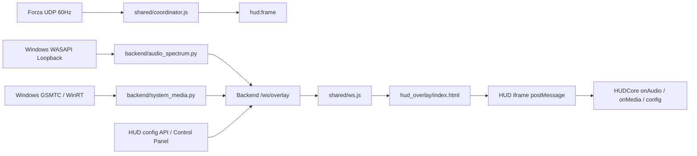

# Forza Horizon 6 HUD 儀表樣式開發與擴充規範規格書 (HUD Development Guide)

本規範規格書旨在為 Forza Horizon 6 Custom HUD 計畫的貢獻者與 Agent 提供統一的儀表開發標準與擴充指南。透過標準化的 `HUDCore` 註冊引擎與動態 HUD 掃描機制，任何新增的 HUD 樣式均能在不改動底層通訊、Launcher 或控制面板既有流程的前提下，流暢對接全功能遙測數據與 UI 控制項。

---

## 🏛 1. 系統架構概覽 (Architecture Overview)

FH6 Custom HUD 採用原生 HTML5 Canvas + JavaScript 多層分離與解耦架構：

```mermaid
graph TD
    UDP[Forza 60Hz UDP Telemetry] --> Backend[Python Backend / telemetry_listener.py]
    Backend --> WS[WebSocket Server / Overlay API]
    WS --> ControlPanel[OverlayView.tsx / Control Panel (3x2 Grid)]
    ControlPanel --> StyleAPI[GET /api/hud/styles]
    StyleAPI --> ControlPanel
    ControlPanel --> BC[BroadcastChannel: horizon_tuner_hud_channel]
    BC --> Host[hud_overlay/index.html (Launcher Host)]
    Host --> StyleAPI
    Host -- postMessage / iframe src --> IFrame[HUD IFrame (hud_overlay/<style_name>/index.html)]
    IFrame --> HUDCore[hud_overlay/shared/hud-core.js Engine]
    HUDCore --> Style[Registered Style Hooks (onInit, onFrame, onAudio, onMedia, onElementsChange, onAnimate, onScale)]
    HUDCore --> TelemetryCards[hud_overlay/shared/telemetry-cards.js (Central Cluster)]
```

### 關鍵目錄與職責分工：
- **`hud_overlay/index.html` (Launcher Host)**：負責與 Tauri 視窗、控制面板進行廣播通訊，透過 `/api/hud/styles` 動態建立 HUD URL mapping，並嵌入當前選定的 HUD IFrame。新增 HUD 不應再修改 Launcher 內的靜態 `HUDS` 字典。
- **`backend/main.py` 的 `/api/hud/styles`**：掃描內建 `/hud` 與使用者 `/hud_user` 目錄，回傳有效 HUD 的 `id`、來源與 URL prefix，供控制面板和 Launcher 共用。
- **`hud_overlay/shared/hud-base.css`**：標準 HUD 視窗佈局、賽車字型宣告（`ForzaFont`, `ForzaGear`）與全螢幕無邊框容器定位。
- **`hud_overlay/shared/hud-core.js`**：HUD 樣式註冊中心 (Registry) 與生命週期事件監聽器。支援發光強度、自訂色彩、縮放計算與 `hud:reload` / `hud:destroy` 動態訊息。
- **`hud_overlay/shared/telemetry-cards/`**：畫面中央對稱遙測 Cluster（G-Force 雷達、四角懸吊行程、輪胎滑移角與胎溫、油門煞車波形、馬力扭力圖）。
- **`hud_overlay/<style_name>/index.html`**：每個有效 HUD 樣式的入口。內建樣式可持續增加，且可包含一般單一樣式或像 unified/multi-theme HUD 一樣的多模式儀表；不可假設 HUD 數量固定。

---

## ⚙️ 2. `HUDCore` 註冊引擎 API 規格書 (API Specification)

所有 HUD 樣式必須呼叫 `HUDCore.registerStyle(id, definition)` 進行聲明式註冊。

### 語法 (Syntax)
```javascript
HUDCore.registerStyle(id, {
    containerId: 'myHudContainer',
    scaleMultiplier: 0.8,
    onInit: function(payload) { ... },
    onElementsChange: function(elements) { ... },
    onFrame: function(data, payload) { ... },
    onAudio: function(data) { ... },
    onMedia: function(data) { ... },
    onAnimate: function() { ... },
    onScale: function(scale) { ... } // 可選；需要自訂縮放副作用時才提供
});

// 註冊後必須呼叫 init 激活該樣式
HUDCore.init(id);
```

### 參數與鉤子說明 (Hooks Specification)

| 鉤子 / 屬性 | 型別 | 說明 |
| :--- | :--- | :--- |
| `containerId` | `string` | **[必填]** 該 HUD 的主 Gauge DOM 容器 ID（例如 `'simpleContainer'`）。`HUDCore` 將自動控制其 `zoom` 縮放與 `showGauge` 顯隱。 |
| `scaleMultiplier` | `number` | **[必填]** 基礎縮放乘數。應根據 HUD 的原始畫布、預期構圖與使用場景校準；360px ~ 400px 僅適合作為窄幅儀表的參考，不是所有 HUD 的硬性尺寸。 |
| `onInit(payload)` | `function` | 當 HUD 載入或收到初始化配置時呼叫。`payload` 包含 `isMetric` 等單位資訊。 |
| `onElementsChange(elements)` | `function` | 當玩家在控制面板勾選/取消 HUD 元素時呼叫。`elements` 物件包含：`showGauge`, `showMotionEffect`, `showTeleSuspension`, `showTeleTires`, `showTeleAttitude`, `showTelePedals`, `showPowerTorque` 等。 |
| `onFrame(data, payload)` | `function` | **[核心]** 60Hz UDP 數據更新時呼叫。優先使用 runtime 提供的 canonical telemetry 與 `payload` 單位設定；`data` 可包含 `rpm`, `speed`, `gear`, `susp_fl`, `slip_fl`, `TireTemp` 等欄位，`payload` 可包含 `isMetric`, `redlineRpm`, `lockup` 等資訊。HUD 不應重新定義共用的單位或檔位語意。 |
| `onAudio(data)` | `function` | **[選填]** 收到 Overlay WebSocket 的 `hud:audio` 狀態時呼叫。`data` 包含 `spectrum`（32 段頻帶，HUD 端應 clamp 至 0~1）、`vu_left`、`vu_right`、`has_audio` 與 `success`。適合製作音訊視覺化；不要在此 hook 內直接進行完整重繪。 |
| `onMedia(data)` | `function` | **[選填]** 收到 Overlay WebSocket 的 `hud:media` 狀態時呼叫。`data` 包含 `title`、`artist`、`status`、`has_media` 與 `success`。適合更新電台／歌曲文字或媒體狀態燈。 |
| `onAnimate()` | `function` | 當玩家點擊 **Launch HUD Overlay**、刷新或啟動時呼叫。應在內部觸發該儀表專屬的 Sweep 掃表動畫。 |
| `onScale(scale)` | `function` | **[可選]** 當玩家調整 HUD 縮放比例時呼叫。`scale` 為最終計算出的 `zoom` 數值；若 HUD 只需要標準容器縮放，可省略此 hook，`HUDCore` 會直接套用至 `containerId`。 |

### 動態 CSS 變數支援 (Injected CSS Variables)
`HUDCore` 會自動將控制面板設定注入為最頂層的 CSS 變數：
- `--hud-glow-intensity`：發光強度 ($0.0 \sim 2.0$)
- `--hud-custom-color`：自訂色彩 HEX 或預設樣式色彩
- `--tc-font-scale`、`--tc-corners-scale`、`--tc-gradar-scale`：中央遙測卡片的字體、角落卡片與 G-Force radar 縮放倍率
- `--tc-live-map-scale`、`--tc-live-map-opacity`：Live Map 的縮放倍率與透明度
- `--tc-corner-offset-x`、`--tc-corner-offset-y`：中央遙測卡片的位移調整

實際可用變數以 `hud_overlay/shared/telemetry-cards/manager.js` 與共用卡片模板為準；不要假設只有單一 `--tc-elem-scale` 變數。

---

## 🎨 3. 新增 HUD 樣式步驟教學 (Step-by-Step Template)

若您想建立名為 `custom_dash` 的新儀表樣式：

### 步驟 1：建立目錄與 HTML 檔案
於 `hud_overlay/custom_dash/index.html` 建立標準模板：

```html
<!DOCTYPE html>
<html>
<head>
    <meta charset="UTF-8">
    <title>Custom Dash HUD</title>
    <!-- 1. 引入共享 Base 樣式 -->
    <link rel="stylesheet" href="../shared/hud-base.css">
    <style>
        /* 專屬 HUD CSS 樣式：注意右下角儀表容器不可寫死 position: absolute; bottom/right */
        .custom-dash-container {
            width: 400px;
            height: 300px;
            pointer-events: none;
        }
        canvas { display: block; width: 400px; height: 300px; }
    </style>
</head>
<body>
    <!-- 2. 共享中央遙測掛載點（若要 iframe 內自有卡片才需要；Launcher host 已有全域掛載點） -->
    <div id="teleCardsMount"></div>

    <!-- 3. 標準根視窗與儀表容器 -->
    <div class="hud-root-wrapper">
        <div class="hud-gauge-container custom-dash-container" id="customDashContainer">
            <canvas id="customDashCanvas" width="400" height="300"></canvas>
        </div>
    </div>

    <!-- 4. 若使用 iframe 內的共用卡片，才引入此模組；HUDCore 本身仍需引入 -->
    <script type="module" src="../shared/telemetry-cards.js"></script>
    <script src="../shared/hud-core.js"></script>

    <script>
        (function() {
            var canvas = document.getElementById('customDashCanvas');
            var ctx = canvas ? canvas.getContext('2d') : null;

            // 5. 註冊並激活新樣式
            HUDCore.registerStyle('custom_dash', {
                containerId: 'customDashContainer',
                scaleMultiplier: 1.0, // 依 HUD 的實際構圖與 viewport 校準

                onInit: function(payload) {
                    console.log('Custom Dash HUD Initialized');
                },

                onElementsChange: function(elements) {
                    var c = document.getElementById('customDashContainer');
                    if (c) c.style.display = elements.showGauge === false ? 'none' : 'block';
                },

                onFrame: function(data, payload) {
                    // 渲染 60Hz 數據
                    if (!ctx) return;
                    ctx.clearRect(0, 0, 400, 300);
                    // 繪製轉速、時速與檔位...
                },

                onAnimate: function() {
                    // 執行專屬掃表動畫
                }
            });

            // 6. 激活
            HUDCore.init('custom_dash');
        })();
    </script>
</body>
</html>
```

### 步驟 2：確認動態 HUD 掃描條件
目前不需要也不應在 `hud_overlay/index.html` 維護靜態 `HUDS` 對照地圖。只要 HUD 目錄位於內建 `/hud` 或使用者 `/hud_user` 根目錄，且包含有效的 `index.html`，backend 的 `/api/hud/styles` 就會掃描並回傳該樣式。

Launcher 與控制面板會使用回傳的 `urlPrefix` 組合出 HUD URL。這樣可以同時支援內建與使用者 HUD，也避免把 `hud` 或 `hud_user` prefix 重複拼接。若新增 HUD 後沒有出現在選單，應先檢查目錄名稱、`index.html`、API 回傳與 author metadata，而不是直接加入另一份靜態 mapping。

### 步驟 3：建立 `author.json` 作者元數據
在您的 HUD 目錄下建立 `hud_overlay/custom_dash/author.json`：
```json
{
  "author": "Your Name",
  "description": "A brief description of your custom dash."
}
```
控制面板會在選單切換時動態 `fetch` 載入此檔案，並快取於記憶體中避免重複請求。

### 步驟 4：確認控制面板與 HUD 專屬設定
一般 HUD 不需要修改 `OverlayView.tsx` 的 union type 或手動加入 `<option>`；控制面板會使用 `/api/hud/styles` 的結果動態建立選單。

若 HUD 具有多主題、額外選項或需要特殊的設定資料，才建立專屬的設定 contract 與 UI。例如 unified/multi-theme HUD 可以在 `OverlayView.tsx` 顯示專屬選項，並將設定交給 backend config、Launcher 與 BroadcastChannel；這些邊界都必須接受同一份設定的 normalization 與 legacy fallback。

新增或修改 HUD 時，應確認以下設定路徑仍使用相同的欄位語意：

1. backend overlay config API；
2. 控制面板的 runtime state；
3. Launcher 的初始載入與 `hud:config` / `hud:reload` 訊息；
4. HUDCore 的 `onInit`、`onElementsChange` 與 `onFrame` payload。

---

## 🛰 4. 額外資料來源與可繼承實作模式 (Non-standard Sources & Reusable Patterns)

`hud:frame` 是 HUD 的標準 60Hz 遙測來源，但不是儀表能使用的全部資料。對於電台、音訊、主機狀態或其他 HMI 輸入，應先確認是否能沿用既有的 Overlay 通道與共用設定，再考慮在每個 HUD 中自行開 WebSocket 或輪詢。現有 VFD 與 Advanced 已驗證以下幾種可直接繼承的模式。

### 4.1 資料通道總覽



| 類型 | 來源與入口 | 更新方式 | 可用資料與注意事項 |
| :--- | :--- | :--- | :--- |
| HUD 設定 | `GET /api/overlay/config`、Overlay WebSocket 的 `hud:config` | 初始化、控制面板變更時 | `scale`、`glowIntensity`、`customColor`、`useDefaultColors`、`elements` 及樣式專屬欄位。`HUDCore` 會同步到 `window._currentFullConfig`、`window._currentCustomColor` 等全域狀態。 |
| 系統音訊 | `backend/audio_spectrum.py` 的 Windows WASAPI Loopback | `/ws/overlay` 推送 `hud:audio`；約 60Hz 廣播，音訊擷取執行緒約 30Hz 更新快取 | `spectrum` 為 32 段頻帶，另有 `vu_left`、`vu_right`、`has_audio`、`success`；VFD 端會將頻帶與 VU 值 clamp 至 0~1。只在 `success` 且資料有效時更新狀態；沒有音訊時要保留衰減或靜音 fallback。 |
| 系統媒體 | `backend/system_media.py` 的 Windows GSMTC（先嘗試 `winsdk`，再退回 PowerShell WinRT 查詢） | `/ws/overlay` 推送 `hud:media`，約每 1 秒一次；Backend 內有 0.5 秒快取 | `title`、`artist`、`status`（`playing` / `paused` / `none`）、`has_media`、`success`。Windows 媒體工作階段不存在或沒有權限時，應回到空狀態。 |
| 共用衍生資料 | `shared/coordinator.js` | 隨每個 `hud:frame` 一起傳送 | `redlineRpm`、`sessionMaxima`、`lockup`、單位轉換後的 `speed` / `power` / `torque` 等。這些是已驗證的共用計算，不要在各 HUD 重新推導出不同版本。 |
| HUD 樣式探索 | `GET /api/hud/styles` | Launcher 啟動或重新載入樣式時 | Backend 會掃描內建與使用者 HUD 目錄。自訂樣式只要提供 `index.html`，即可被動態加入清單；同名使用者樣式會覆寫內建樣式。 |

實作對照位置：[`shared/ws.js`](shared/ws.js)、[`shared/hud-core.js`](shared/hud-core.js)、[`shared/coordinator.js`](shared/coordinator.js)、[`backend/audio_spectrum.py`](../backend/audio_spectrum.py)、[`backend/system_media.py`](../backend/system_media.py)、[`vfd/index.html`](vfd/index.html) 與 [`advanced/index.html`](advanced/index.html)。

### 4.2 系統媒體與音訊視覺化

系統媒體與音訊的共用模式是「Backend 負責取得資料，HUD 只保存最新狀態並在自己的渲染迴圈繪圖」。`hud_overlay/index.html` 先把 `shared/ws.js` 收到的事件轉送到 iframe，`HUDCore` 再將 `hud:audio` 與 `hud:media` 分派給樣式的 `onAudio` / `onMedia` hook；因此新 HUD 不需要再建立第二條 WebSocket。現有 VFD 是此模式的完整參考實作。

可沿用的最小模式如下：

```javascript
var audioState = {
    spectrum: new Array(32).fill(0),
    vu_left: 0,
    vu_right: 0,
    has_audio: false
};
var mediaState = { title: '', artist: '', status: 'none', has_media: false };

HUDCore.registerStyle('custom_radio', {
    containerId: 'customRadioContainer',

    onAudio: function (data) {
        if (!data || data.success !== true || !Array.isArray(data.spectrum)) return;
        if (data.spectrum.length !== 32) return;

        audioState.has_audio = data.has_audio === true;
        audioState.vu_left = Math.max(0, Math.min(1, data.vu_left || 0));
        audioState.vu_right = Math.max(0, Math.min(1, data.vu_right || 0));
        for (var i = 0; i < 32; i++) {
            var sample = Math.max(0, Math.min(1, data.spectrum[i] || 0));
            // 先平滑輸入，避免 30Hz 音訊資料在 60Hz 畫面上抖動
            audioState.spectrum[i] = audioState.spectrum[i] * 0.3 + sample * 0.7;
        }
    },

    onMedia: function (data) {
        if (!data || data.success !== true) {
            mediaState = { title: '', artist: '', status: 'none', has_media: false };
            return;
        }
        mediaState = data;
    },

    onFrame: function (data, payload) {
        // 只更新遙測快照；完整繪圖交給 requestAnimationFrame
    }
});

function renderLoop() {
    drawSpectrum(audioState.spectrum, audioState.vu_left, audioState.vu_right);
    drawMedia(mediaState.title, mediaState.artist, mediaState.status);
    requestAnimationFrame(renderLoop);
}
requestAnimationFrame(renderLoop);
```

現有 VFD 實作額外驗證了幾個可泛化的細節：

- 使用 `peakHoldVals` / `peakHoldTicks` 做峰值保持與緩慢下降，避免柱狀圖只剩快速閃爍。
- Backend 音訊暫時不可用時，讓 `spectrum` 按比例衰減，而不是停留在最後一幀。
- 媒體文字先判斷 `status === 'playing'`、過濾 HorizonTuner 自己的視窗標題，再經 `sanitizeVFDText()` 轉成 14-segment 字型可顯示的 ASCII；超過可視格數後才啟用 marquee 滾動。
- 若只需要一次性的狀態查詢或除錯，可使用下列 API；正常 HUD 渲染仍應使用 Overlay WebSocket 推送，避免每個樣式自行輪詢並重複啟動服務。

```javascript
var backendOrigin = window.location.port
    ? 'http://' + window.location.host
    : 'http://127.0.0.1:8001';

async function loadSystemStateOnce() {
    var media = await fetch(backendOrigin + '/api/overlay/system_media').then(function (r) { return r.json(); });
    var audio = await fetch(backendOrigin + '/api/overlay/audio_spectrum').then(function (r) { return r.json(); });
    return { media: media, audio: audio };
}
```

### 4.3 調色盤、發光與靜態／動態繪製層

自訂顏色不是單一 `fillStyle` 的替換，而是所有層次共用的 palette 契約。`HUDCore` 已從 `config` 注入 `customColor`、`useDefaultColors` 與 `glowIntensity`，並同步到 `window._currentCustomColor`、`window._currentUseDefaultColors` 及 CSS 變數。Simple、Advanced 與 VFD 都以不同畫面風格驗證了同一個原則：DOM、Canvas、警示色與 glow 都必須由同一份 palette 產生。

建議將樣式的顏色集中為 `primary`、`accent`、`dim`、`hot`、`glow` 五個語意角色。自訂主色只覆寫可品牌化的 `primary`／`accent`／`glow`；`hot` 和 `amber` 等安全語意色維持獨立，才能保留紅線與警示辨識度。Canvas 色彩可由 `hexToRgba()` 產出不同透明度，DOM 則透過樣式專屬 CSS 變數同步使用。

對於 Canvas，還應切分靜態與動態層。Advanced 的兩張 Canvas 代表通用作法：配色、紅線位置、最大刻度或 Sweep 狀態改變時，以 dirty flag 重繪靜態層；每一幀只重畫指針、讀數與其他活動元素。這能顯著降低高解析度 HUD 的重繪成本。

### 4.4 動態紅線區與換檔警示

紅線資料應優先採用共用的 `payload.redlineRpm`。它由 `shared/coordinator.js` 根據車輛的 `EngineMaxRpm` 計算，所有新 HUD 都應以此作為共通起點：

```javascript
var maxRpm = raw.EngineMaxRpm || 7000;
var redlineRpm = Math.max(0, maxRpm - 1000);
```

同一份紅線資料可依儀表幾何選擇不同實作，而不是重複推導另一個 RPM 門檻：

| 視覺模型 | 已驗證做法 | 適用情況 |
| :--- | :--- | :--- |
| 連續弧線 | 將 `redlineRpm / maxRpm` 映射為角度，再把弧線尾段改為警示色。 | 簡潔的類比錶、單一 progress arc。 |
| 分段弧線／格狀條 | 先將 RPM 映射為 segment；紅線落在段落內時，在精確位置切開普通色與警示色。 | 多段 LED、條狀轉速表與非整千轉紅線，能避免整段跳色。 |
| 離散警示層 | 以 `redlineRpm - warningSpan` 做預警區，紅線後再配合油門或時間條件閃爍 SHIFT。 | VFD／數位儀表等需要將「接近紅線」與「必須換檔」分開呈現的 HMI。 |
| 資產圖層 | 由車種／最大 RPM mapping 選取對應的紅線圖片或序列影格。 | 重視原作視覺還原、且資產本身已烘焙紅線位置的樣式。 |

第一種做法出現在 Simple，第二種出現在 Advanced，第三種由 VFD 使用黃線加油門門檻，第四種則存在於多個 sprite HUD。新設計應先選擇視覺模型，再重用同一個 `payload.redlineRpm`；只有資產已固定紅線位置時才採用 mapping，並要把 mapping 與 fallback 寫清楚。

### 4.5 加速度驅動的位移與動態模糊

Simple、Advanced 與 VFD 都實作了相同的 motion-effect 骨架：由 `accel_x`／`accel_y` 換算 G 值、套用 dead zone 與上限、以 lerp 平滑成位移及 blur，再只在數值差異超過門檻時更新容器的 `transform` 和 `filter`。差別僅在各樣式選擇的位移幅度與視覺強度。

```javascript
var gX = clamp(-data.accel_x / 9.81, -2.5, 2.5);
var gY = clamp( data.accel_y / 9.81, -2.5, 2.5);
if (Math.abs(gX) < 0.1) gX = 0;
if (Math.abs(gY) < 0.1) gY = 0;

state.x += (gX * offsetPerG - state.x) * 0.2;
state.y += (gY * offsetPerG - state.y) * 0.2;
var magnitude = Math.hypot(gX, gY);
var targetBlur = magnitude > 0.8
    ? Math.min(maxBlurPx, (magnitude - 0.8) * blurPerG)
    : 0;
state.blur += (targetBlur - state.blur) * 0.2;
```

實作時要由 `elements.showMotionEffect` 控制整個效果；關閉時清除 `transform`、`filter` 與平滑狀態。更新 DOM 前採用約 0.05px 的差異門檻，能避免 60Hz 寫入沒有視覺影響的樣式值。新的 HUD 應把 `offsetPerG` 和 `blurPerG` 設為常數或專屬設定，而非在多個繪圖函式內散落魔術數字。

### 4.6 可恢復的資產預載與啟動排程

只要 HUD 依賴圖片或 sprite，就應把「資產就緒」當作生命週期狀態處理，而不是把 `drawImage()` 直接放進 `onFrame`。`gt7`、`nfs15`、`mw2005` 與 `shift_tacho` 已驗證的模式是：頁面載入時建立 `Image` 物件並計數，完成後設為 `isReady`；若動畫在資產尚未備妥時觸發，則以 `sweepPending` 延後一次。若 Canvas 依賴自訂字型，則另外等待 `document.fonts` 完成後再標記靜態層為 dirty。

```javascript
var isReady = false;
var sweepPending = false;
var loaded = 0;
var keys = Object.keys(assetMap);

keys.forEach(function (key) {
    var image = new Image();
    image.onload = image.onerror = function () {
        images[key] = image;
        loaded++;
        if (loaded !== keys.length) return;

        isReady = true;
        if (sweepPending) {
            sweepPending = false;
            triggerSweep();
        }
    };
    image.src = assetMap[key];
});

function onAnimate() {
    if (isReady) triggerSweep();
    else sweepPending = true;
}
```

`onerror` 必須和 `onload` 一樣結算完成，否則遺失單一檔案就會讓 HUD 永遠停在未就緒狀態。這個模式同時適用於少量靜態圖層與 `nfs15` 這類大量序列影格；差別只在 asset map 的規模，不在渲染流程。

### 4.7 DOM、Canvas 與共用 Cluster 的責任分層

`simple` 是最適合直接繼承的混合式範例：Canvas 處理轉速弧線、指針和 glow；DOM 處理速度、檔位、LC／LOCK badge 與 CSS transition。這能避免每一幀重新量測／繪製文字，也讓一般狀態切換沿用 CSS。

實作原則如下：

1. 連續幾何、遮罩、漸層與發光留在 Canvas；文字、圖示、badge、可存取元素留在 DOM。
2. 以快取值避免無效 DOM 寫入，例如 `simple` 只在速度改變時重建數字 span。
3. 將 `payload.lockup`、`payload.lcState` 這類離散狀態直接映射成 class，而非改寫 Canvas 的每一個像素。
4. Canvas palette 與 DOM CSS 變數要從同一個 `customColor`／`useDefaultColors` 狀態產生，避免兩個層次顏色不同步。

中央遙測 Cluster 由外層 `hud_overlay/index.html` 初始化；因此像 `simple` 一樣只依賴 host-level Cluster 的 HUD，不必在 iframe 內重複引入 `telemetry-cards.js`。只有 HUD 需要獨立載入或擁有自己的卡片時，才建立本地掛載點並明確呼叫 `TelemetryCardsManager.init(document.getElementById('teleCardsMount'))`。

### 4.8 資料攝取、獨立渲染迴圈與衍生狀態

複合 HMI 應參考 `drift`：`onFrame` 只驗證／轉換輸入並更新最新狀態，固定的 `requestAnimationFrame` 迴圈則負責繪製。這讓遙測、音訊或設定更新不會彼此爭用完整重繪，也可以自然地處理平滑與短暫 UI 狀態。

```javascript
function onFrame(data) {
    latest.speed = data.speed_kmh || data.speed || 0;
    latest.rpm = data.rpm || 0;

    var speedPlane = Math.hypot(data.vel_x || 0, data.vel_z || 0);
    var targetAngle = speedPlane > 0.5
        ? Math.atan2(data.vel_x || 0, data.vel_z || 0) * 180 / Math.PI
        : 0;
    latest.driftAngle = clamp(targetAngle, -90, 90);
}

function renderLoop() {
    displayAngle = lerp(displayAngle, latest.driftAngle, 0.25);
    renderHud(latest, displayAngle);
    requestAnimationFrame(renderLoop);
}
```

這個模式的泛用性在於，它能把原始輸入轉為可讀的語意狀態，例如 Drift 的 `FLOW`／`RISK`，或把踏板輸入跨越門檻轉成一次性的 popup／badge。衍生計算應集中定義輸入欄位、平滑係數和門檻；相同指標不要在多個 HUD 各自推導不同版本。

### 4.9 車種範圍與資產校準表

當儀表外觀隨最大轉速或車種而變化時，`fm4ui` 的 `rpm_bands` 是比大量 `if` 更穩定的做法。每一列 metadata 同時描述可用條件、對應錶面與 RPM 轉換率，渲染端只需選出一列後用同一組資料畫刻度、紅線和指針。

```javascript
var rpmBands = [
    { minimum: 12000, face: 'rpm_12100', frameRate: 0.01500 },
    { minimum: 8000,  face: 'rpm_8000',  frameRate: 0.02690 },
    { minimum: 5000,  face: 'rpm_4600',  frameRate: 0.039875 }
];

function selectBand(maxRpm) {
    return rpmBands.find(function (band) {
        return maxRpm >= band.minimum;
    }) || rpmBands[rpmBands.length - 1];
}
```

此表格也適用於不同解析度的背景、不同單位的刻度與車種專屬 shift-light 設定。若資產本身定義了紅線，應把來源和 mapping 寫在同一張表；若沒有，則仍以 `payload.redlineRpm` 為統一基準。

目錄名稱與 `HUDCore` registry ID 原則上應一致。現有 `fm4ui` 是例外：Backend 探索 ID 是目錄名，但頁面內註冊／啟用的是 `fm4_re`。若刻意使用不同名稱，`registerStyle()` 與 `HUDCore.init()` 必須成對，並在 `author.json` 或文件中說明。

### 4.10 其他樣式參考

下列樣式已有可參考的做法，但高度綁定特定視覺資產或不值得再建立另一套共用抽象，保留作為設計參考即可：

| 樣式 | 可參考項目 |
| :--- | :--- |
| `gt7` | 以圖片保留車款風格，再用 Canvas 覆蓋輪胎溫度色階、油門／煞車填充與動態增壓範圍；大畫布以 `ctx.translate()` 容納負座標。 |
| `nfs15` | 359 張轉速序列與 19 張紅線影格的索引式渲染，以及以 `lastGear` 觸發一次性換檔閃光。 |
| `mw2005` | 全畫面圖片圖層合成，將指針獨立以 `ctx.translate()`／`ctx.rotate()` 疊加。 |
| `shift_tacho` | 固定門檻的 7 段 Shift Light 與圖示 indicator array；ABS／TCS 目前沒有資料來源，應視為 placeholder。 |

### 4.11 設定欄位的接線驗證

控制面板中存在設定欄位，不代表 HUD 已經消費它。以目前程式碼為準，VFD 會讀取 `vfdVuOffset`；`vfdAudioOffset` 雖存在於設定與控制面板，但目前未被 `vfd/index.html` 使用。`driftProfile` 會被 Drift HUD 的 `onInit` 接收並保存，但現有 `applyProfileLayout()` 尚未實際改變幾何或 CSS。新增指南內容時應區分「已接通並可觀察的功能」與「尚未接線的擴充點」。

### 4.12 直接繼承這些模式時的檢查清單

- 先使用 `onAudio` / `onMedia` 接收推送，避免在每個 iframe 重複連線；直接 API 只用於初始化、一次性查詢或除錯。
- Hook 只更新快照與 dirty flag；Canvas 完整繪圖放到 `requestAnimationFrame`，並在 `onFrame` 與 Overlay 狀態更新之間避免互相觸發重繪。
- 對外部資料檢查 `success`、陣列長度、數值範圍與缺省值；資料中斷時要能顯示空狀態或平滑衰減。
- 優先沿用 `payload.redlineRpm`、`payload.sessionMaxima`、`payload.lockup` 與共用單位轉換，不要在樣式內建立第二套物理或紅線推導。
- 新增了 `onAudio`、`onMedia` 或其他非標準欄位後，請在 `author.json` 的 description 與本指南中留下資料來源、更新頻率和 fallback 行為。

---

## 步驟 5. 版面與佈局對齊規範 (Layout & Alignment Rules)

1. **右下角邊距對齊 (Bottom-Right Alignment)**：
   - 除了設計上必須居中置底 (`align-self: center; transform-origin: bottom center;`) 或有特定指定位置的情況外，其餘儀表容器**嚴禁寫死 `position: absolute; bottom/right`**。
   - 容器必須維持 relative/flex 靜態定位，統一由 `.hud-root-wrapper` (flex padding: 30px, `transform-origin: bottom right`) 約束對齊，確保與螢幕邊界 100% 齊平。
2. **視覺尺寸等比例校準 (Scale Multipliers Calibration)**：
    - 各儀表的 `scaleMultiplier` 必須根據原始畫布、預期 viewport 與視覺構圖校準。窄幅儀表可將 360px ~ 400px 作為參考；寬幅中央 HMI、全螢幕或特殊比例 HUD 應保留自己的設計尺寸，不能為了符合固定寬度而壓縮構圖。
    - 應利用 `HUDCore` 已內建的 **`hud:set-scale`** 廣播訊息，動態調整縮放比例，以適應不同解析度的螢幕。標準情況由 HUDCore 對 `containerId` 套用最終 zoom；只有需要同步調整內部 Canvas、字體或其他資源時，才在 HUD 定義 `onScale(scale)`。可參考 `GT7 HUD`。

---

## 步驟 6. 60Hz 渲染與效能防護守則 (Performance Rules)

為確保在高影格率賽車情境下 HUD 不發生卡頓，請嚴格遵守以下規則：

1. **純 DOM / Canvas 語意更新，避免深拷貝 (No Deep Copy in onFrame)**：
   - 在 `onFrame` 內嚴禁進行 `JSON.parse(JSON.stringify(data))` 或高開銷陣列操作。
2. **圖像與 Sprite 靜態預載 (Image Preloading)**：
   - 針對序列切片或 Sprite 圖像（如數字、檔位、轉速弧條），必須於頁面載入時建立 `Image` 物件陣列靜態預載，在 `onFrame` 內直接呼叫 `ctx.drawImage`，嚴禁每幀建立 DOM 物件。
3. **適度使用 `requestAnimationFrame`**：
   - 定時 Sweep 掃描動畫必須透過 `requestAnimationFrame` 更新，並在動畫結束時及時解除標記 (`sweepActive = false`)。
