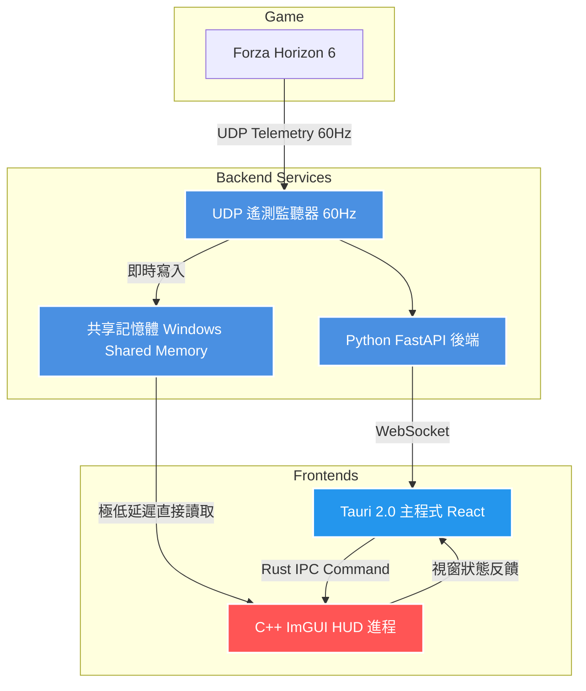

# FH6-HorizonTuner 雙前端混合架構設計研究報告
## ── Tauri 控制中心 + 原生 ImGUI 高性能 Overlay

本報告研究一種更為複雜且具備極致性能的**雙前端混合架構 (Hybrid Frontend Architecture)**。在該架構中，主應用程式利用 **Tauri** 提供強大的數據分析與調校功能，同時解耦出一個獨立的 **Dear ImGui (C++/D3D11)** 原生子進程，專職負責在遊戲置頂（Overlay）渲染超低延遲、高更新率的 HUD 儀表板。

---

## 1. 架構設計動機與分工

在賽車遙測輔助系統中，不同功能對於「渲染延遲」與「開發效率」的要求有著本質的差異：

*   **Tauri 主專案前端 (控制與分析中心)**：
    *   *職責*：負責車輛調校輔助、完整遙測歷史數據分析、車庫資料庫管理、甩尾手把輔助（Drift Stick Assist）配置、變速箱齒輪比優化等。
    *   *優勢*：使用 React + TypeScript，配合豐富的 Web 生態系（如 Recharts 圖表庫），非常適合處理複雜的業務邏輯、歷史數據視覺化與設定存檔。
*   **Dear ImGui 子進程 (高性能 HUD Overlay)**：
    *   *職責*：專注於在遊戲畫面上置頂渲染時速表、轉速針、G力儀等實時 HUD 元件。
    *   *優勢*：作為原生 C++/D3D11 應用，擁有極致的記憶體與 GPU 效率。渲染管道完全與 Windows DWM 和瀏覽器 Webview 解耦，能實現 144Hz 以上、毫秒級的實時刷新，消除指針動畫的微小抖動（Micro-stuttering）。

---

## 2. 系統架構拓撲圖 (Architecture Topology)

以下為雙前端混合架構的數據流與控制流拓撲關係：

---

## 3. 關鍵技術實現方案

### 🔑 A. 進程間通訊 (IPC) 與數據傳遞
雙前端的解耦帶來了多進程通訊的挑戰，為確保實時遙測數據以 60Hz 以上無延遲傳遞給 ImGUI，我們設計了雙通道通訊機制：

1.  **控制通道 (Tauri ➔ ImGUI)**：
    *   *傳輸內容*：UI 開關狀態（隱藏/顯示 HUD）、樣式設定（切換 Altezza TRD 或 Defi 風格）、Widget 位置變更。
    *   *實現方式*：Tauri Rust 核心在啟動 ImGUI 子進程時，透過標準輸入輸出 (**stdin/stdout**) 或本地 **Named Pipe (命名管道)** 發送輕量級 JSON 指令。
2.  **數據通道 (FastAPI ➔ ImGUI)**：
    *   *傳輸內容*：時速、轉速、踏板深淺、車身 Yaw 角等實時遙測變數。
    *   *實現方式一 (Windows 共享記憶體 - 推薦)*：
        Python 後端將接收到的 324 載荷解包後，即時寫入一個 Windows Memory Mapped File。C++ ImGUI 進程在渲染迴圈中直接讀取該內存區塊。由於不經過網路協議疊與序列化，傳輸延遲趨近於 **0 毫秒**。
    *   *實現方式二 (本地 UDP 廣播)*：
        Python 的遙測監聽器在收到遊戲數據後，除了自己處理外，直接複製一份 UDP 封包轉發至本地另一個 Port（例如 `127.0.0.1:20450`），由 ImGUI 進程獨立監聽解析。

### 🖥️ B. 滑鼠穿透與焦點管理
*   **實作原理**：
    ImGUI Overlay 視窗平時必須保持 `WS_EX_TRANSPARENT`（滑鼠穿透）與 `WS_EX_NOACTIVATE`（不獲取焦點），確保玩家點擊畫面能直接操作遊戲。
*   **狀態切換**：
    當玩家在 Tauri 主介面中點擊「編輯 HUD」時，Tauri 透過控制通道發送指令，ImGUI 子進程在接收到指令後，動態修改視窗樣式（移除 `WS_EX_TRANSPARENT`），使玩家能在遊戲畫面上直接拖曳、縮放 ImGUI 繪製的 HUD Widget；設定完成後，Tauri 通知其恢復穿透狀態。

### 🎨 C. 資源加載與著色器動畫
*   **資源管理**：
    所有從原版提取出的 PNG 圖檔資源被歸檔於一個共享的資源資料夾下。ImGUI 子進程在初始化時，使用 D3D11 著色器資源視圖 (`ID3D11ShaderResourceView`) 將這些 PNG 檔案一次性加載入 GPU 顯存。
*   **指針旋轉繪製**：
    ImGUI 透過 `ImDrawList::AddImageQuad` 直接在螢幕特定位置繪製轉速錶盤與指針。指針的旋轉可在 C++ 中利用簡單的 2D 三角函數旋轉頂點，直接提交給 D3D 渲染，完全不佔用 Webview 的 CPU 運算資源。

---

## 4. 雙前端混合架構優缺點評估

| 架構指標 | 方案一：純 Tauri (React+CSS) 繪製 | 方案二：Tauri + ImGUI 混合雙前端 (本方案) |
| :--- | :--- | :--- |
| **渲染延遲 (Latency)** | 中等 (受到 Webview 渲染幀率同步限制) | **極低 (原生 D3D11 直接組成渲染)** |
| **系統資源消耗** | 較高 (瀏覽器渲染引擎消耗較多 CPU/GPU) | **極低 (C++ 原生程式，內存佔用 < 20MB)** |
| **UI 開發難度** | 極低 (使用 React, CSS, 拖拉組件極快) | 中等 (需使用 C++ 與 ImGUI API 繪製 Widget) |
| **全螢幕相容性** | 易在部分 D3D12 全螢幕遊戲中被覆蓋 | **相容性較佳 (原生 Overlays 更易穩定置頂)** |
| **進程維護複雜度** | 極低 (單一 Tauri 進程與網頁) | 較高 (需維護 Python、Tauri、ImGUI 三個進程) |

## 5. 接手 Agents 開發實作路徑

若接手的 Agents 決定採用此混合架構，建議的實作路線如下：

1.  **C++ HUD 骨架搭建**：
    *   在 `tools/ForzaHUD_RE` 下建立一個輕量級的 C++ 專案，整合 `imgui`、`imgui_impl_dx11` 與 `imgui_impl_win32`。
    *   使用 DirectComposition 建立一個透明置頂的 Window。
2.  **共享內存傳輸實現**：
    *   在 Python `telemetry_listener.py` 中，使用 Python 的 `mmap` 模組建立一個名為 `Local\\FH6Telemetry` 的共享內存。
    *   C++ 進程使用 `OpenFileMappingW` 讀取該記憶體，並在 ImGUI 渲染迴圈中以 60Hz 速度輪詢更新數據。
3.  **Tauri 控制通道對接**：
    *   在 Tauri 的 Rust 端，利用 `std::process::Command` 啟動 C++ HUD 執行檔，並持有其 `stdin`，將前端 React 發送的 UI 座標與樣式設定實時管道寫入 C++ 進程。
