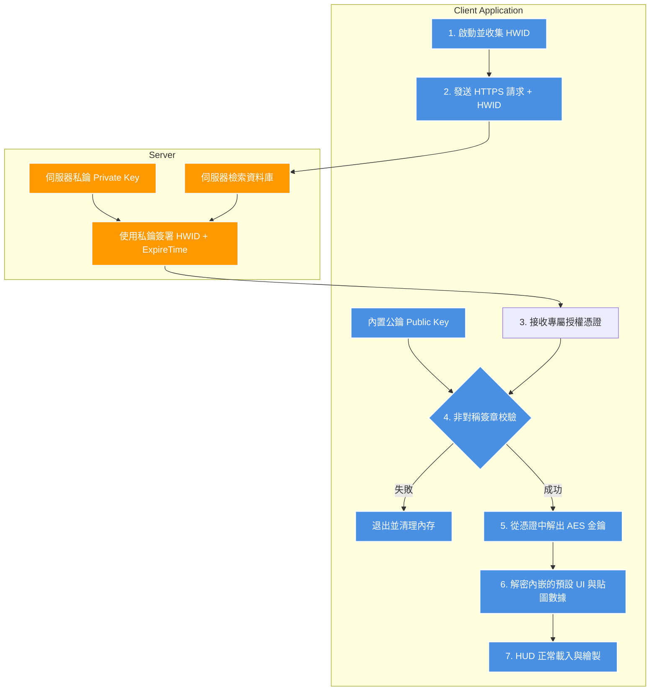

# 軟體授權驗證機制防護與安全設計研究報告

本報告針對逆向工程中發現的 `ForzaHUD` 原有授權缺陷進行安全剖析，並提出一套更為穩妥、抗篡改且難以被本地 Bypass 的現代化授權驗證系統設計方案。

---

## 1. 原 ForzaHUD 授權機制破綻剖析

原專案在授權保護上採用了較為傳統且脆弱的設計，導致其極易在幾分鐘內被安全研究人員攻破。其核心缺陷如下：

### ❌ 缺陷一：傳輸層未加密與缺乏抗篡改保護 (No Transport Integrity)
* **現象**：使用不安全的明文 HTTP 協議，且請求的 JSON 中沒有加入 HMAC 簽章或非對稱加密校驗。
* **漏洞**：這使得攻擊者只需編輯 `hosts` 檔案，便能將伺服器域名重導向至本機 `127.0.0.1`，並用一個簡單的 Mock API 直接回傳 `{"access": true}` 即可完成本機繞過。

### ❌ 缺陷二：簡單的 Boolean 狀態判斷 (Trivial Control Flow)
* **現象**：授權成功與否僅依賴一個二值變數 (Boolean `0` 或 `1`)。
* **漏洞**：在二進位層面，這表現為一個簡單的狀態讀取函數（如 `FUN_14001aa30`）。逆向人員只需修改一個位元組的機器碼（如將 `mov al, [rcx+0x68]` 改為 `mov al, 1`），便能一勞永逸地破解整個驗證機制。

### ❌ 缺陷三：功能資源與授權解耦 (Decoupled Assets)
* **現象**：所有付費資源（如貼圖、預設值）本就完整存在於本地硬碟上，驗證只是作為顯示與隱藏的前端開關。
* **漏洞**：這使得攻擊者可以直接將資源提取出來，移轉至其他未受保護的開關框架（如我們目前規劃的 Tauri + React 整合方案）中直接加載。

---

## 2. 穩妥且難以被攻破的安全授權系統架構

為了防止上述繞過手段，我們設計了一套**「非對稱加密簽章 + 數據解密綁定」**的雙重防護架構。

### 🛡️ 設計核心一：基於非對稱加密 (ECDSA/RSA) 的授權文件驗證
不再單純依賴伺服器回傳 `true`/`false`，而是讓伺服器回傳一份**經過數位簽章的授權聲明**。

1. **生成階段**：
   伺服器使用**私鑰 (Private Key)** 對使用者的「硬體標識符 (HWID) + 授權過期時間」進行加密雜湊簽章，生成金鑰檔案。
2. **驗證階段**：
   客戶端（HUD 程式）內置**公鑰 (Public Key)**。每次啟動時，客戶端使用公鑰對授權文件進行簽章驗證：
   $$\text{Verify}(\text{Signature}, \text{HWID} + \text{ExpireTime}, \text{PublicKey}) == \text{True}$$
3. **安全防護效果**：
   由於私鑰只保存在伺服器端，攻擊者**完全無法自行偽造或搭建 Mock 伺服器**來回傳通過校驗的授權文件，從而徹底杜絕了本地 DNS 劫持與 hosts 轉向的漏洞。

### 🛡️ 設計核心二：數據與解密金鑰綁定 (Cryptographic Binding) ─ 解決 Patch 漏洞
為了防止逆向人員直接 patch 彙編碼中的跳轉分支，我們必須將**「授權通過」與「功能正常執行」在物理上綁定在一起**。

* **實現方式**：
  不要把 HUD 的關鍵預設坐標（Presets）、甚至貼圖的二進位數據以明文方式放在硬碟中。
  1. 將這些進階 Preset 設定檔在打包時以 AES-256 加密。
  2. 其解密密鑰 (AES Key) 並不儲存在本地，而是必須從授權文件中衍生（例如透過 KDF 算法由數位簽章中衍生），或者由伺服器在驗證 HWID 成功後動態下發到內存。
  3. 如果沒有通過驗證，程式就拿不到解密金鑰，Presets 在內存中便是一堆亂碼，程式自然會崩潰。此時即便逆向人員 Patch 了跳轉指令，程式也只會因為讀取不到正確的 Preset 數據而閃退，**使純粹的代碼 Patch 徹底失效**。

---

## 3. 安全授權系統拓撲關係



---

## 4. 概念性實作程式碼 (C++)

以下為抗篡改授權校驗的關鍵程式碼設計範例，展示了如何將簽章驗證與數據解密結合：

```cpp
#include <iostream>
#include <vector>
#include <string>
#include <openssl/evp.h>
#include <openssl/pem.h>

// 內置的公鑰（用來驗證伺服器發回的數位簽章，不可被替換）
const std::string PUBLIC_KEY_PEM = 
    "-----BEGIN PUBLIC KEY-----\n"
    "MIIBIjANBgkqhkiG9w0BAQEFAAOCAQ8AMIIBCgKCAQEA0t...\n"
    "-----END PUBLIC KEY-----\n";

// 驗證憑證簽章
bool VerifyLicense(const std::string& raw_data, const std::vector<unsigned char>& signature) {
    BIO* bio = BIO_new_mem_buf(PUBLIC_KEY_PEM.data(), -1);
    EVP_PKEY* pkey = PEM_read_bio_PUBKEY(bio, nullptr, nullptr, nullptr);
    BIO_free(bio);

    if (!pkey) return false;

    EVP_MD_CTX* md_ctx = EVP_MD_CTX_new();
    EVP_VerifyInit_ex(md_ctx, EVP_sha256(), nullptr);
    EVP_VerifyUpdate(md_ctx, raw_data.data(), raw_data.size());
    
    // 執行數位簽章校驗
    int result = EVP_VerifyFinal(md_ctx, signature.data(), signature.size(), pkey);
    
    EVP_MD_CTX_free(md_ctx);
    EVP_PKEY_free(pkey);

    return result == 1; // 只有簽章完全匹配才回傳 true
}

void LoadSecurePresets(const std::vector<unsigned char>& encrypted_presets, const std::vector<unsigned char>& signature) {
    std::string hwid = GetSystemHWID();
    std::string expected_data = hwid + "|Expiry:2026-12-31";

    // 1. 驗證授權憑證是否由我們的伺服器私鑰簽署，且 HWID 是否吻合
    if (!VerifyLicense(expected_data, signature)) {
        std::cerr << "授權驗證失敗！無法加載 HUD 資源。" << std::endl;
        exit(-1);
    }

    // 2. 利用簽章資料作為種子衍生 AES 解密密鑰
    std::vector<unsigned char> aes_key = DeriveAESKeyFromSignature(signature);

    // 3. 解密 UI 預設值數據
    std::string decrypted_json = DecryptAES256(encrypted_presets, aes_key);
    
    if (decrypted_json.empty() || decrypted_json[0] != '{') {
        // 如果解密金鑰錯誤，解出來的會是亂碼，JSON 解析必會崩潰，從而使 Patch 繞過失效
        std::cerr << "Preset 解密錯誤，程式崩潰。" << std::endl;
        exit(-1);
    }

    // 4. 正常加載 HUD 與 UI 繪製
    InitHUDWidgets(decrypted_json);
}
```

## 5. 移交結論
本設計報告已歸檔至 `tools/ForzaHUD_RE/security_licensing_design.md`。其他 Agents 在為主專案 `FH6-HorizonTuner` 規劃未來的收費或認證系統時，應評估本報告推薦的 **「非對稱數位簽章 + 核心 Presets 密鑰綁定」** 架構，以提供高品質的安全防護。
